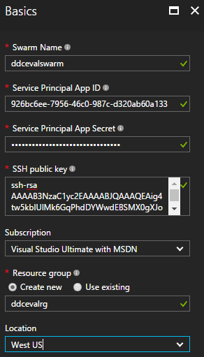
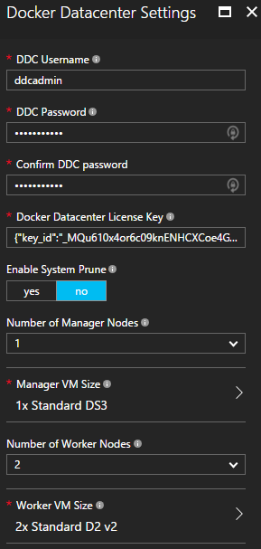
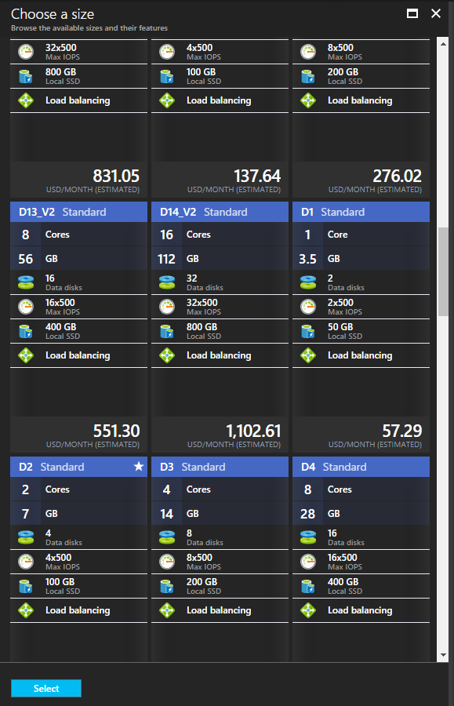
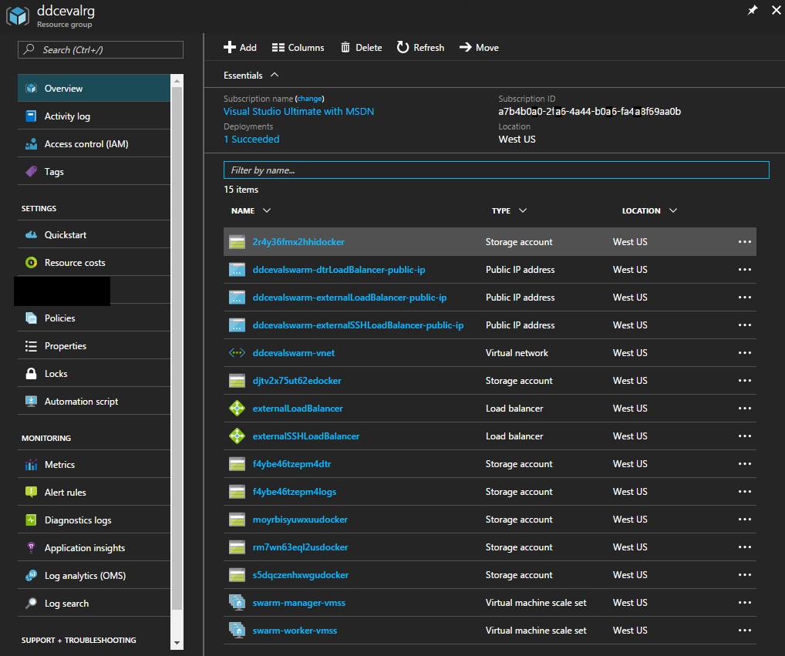
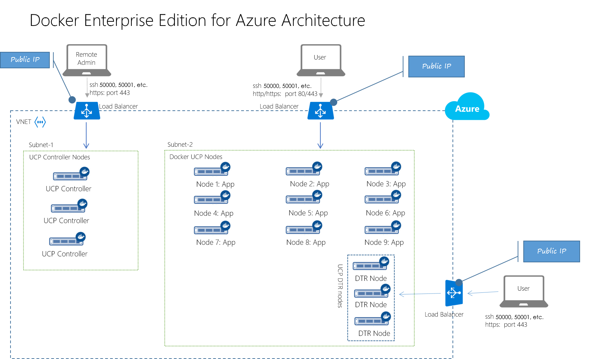
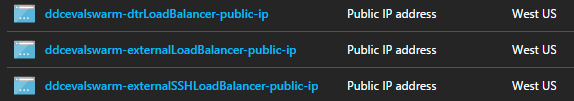
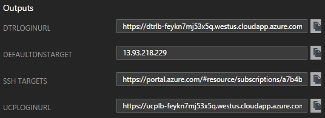

Deploy Docker Enterprise Edition for Azure (Standard/Advanced) quickly
to the Azure cloud by using the [Azure portal](https://portal.azure.com).
The deployment workflow creates multiple nodes with Docker EE, and it installs
highly available versions of
[Universal Control Plane (UCP)](https://docs.docker.com/datacenter/ucp/2.1/guides/)
and [Docker Trusted Registry (DTR)](https://docs.docker.com/datacenter/dtr/2.2/guides/).
For more info, see
[Docker Enterprise Edition](https://www.docker.com/enterprise-edition).

> **Note**: You may see references to the earlier brand name, "Docker Datacenter"
> and "DDC". These names are equivalent with Docker Enterprise Edition for Azure.

## Prerequisites for deploying Docker EE for Azure

-   A [Docker Enterprise Edition](https://store.docker.com/editions/enterprise/docker-ee-trial?tab=description)
    license. You can get a 30-day free trial subscription from the
    [Docker Store](https://store.docker.com/editions/enterprise/docker-ee-trial?plan=free-trial&plan=free-trial&tab=description).
    For questions on licenses, contact
    [sales@docker.com](mailto:sales@docker.com).
-   An Azure account with sufficient privileges for creating resource groups,
    like the [Visual Studio Ultimate with
    MSDN](https://msdn.microsoft.com/en-us/subscriptions/aa336858.aspx)
    subscription.
-   Service Principal access credentials, which you can generate by following
    the steps in [Docker for Azure Setup and
    Prerequisites](https://docs.docker.com/docker-for-azure/#configuration).
-   An SSH public/private key pair, which you can generate by following the
    steps in
    [How to create and use an SSH public and private key pair for Linux VMs in Azure](https://docs.microsoft.com/en-us/azure/virtual-machines/linux/mac-create-ssh-keys)].
    Save the public and private keys in a convenient location,
    like in the same directory as the Docker license, and be sure to remember
    the password for the key pair.

## Provision the Docker EE cluster on Azure

1.  In a web browser, go to the [Azure portal](https://portal.azure.com).
2.  Click **+New**.
    The Marketplace blade opens.
3.  In the search box, type "Docker EE", and press Enter.
4.  In the search results, click **Docker EE for Azure (Standard/Advanced)**.
    The product description blade opens.
5.  At the bottom of the blade, click **Create**. The Create Docker EE for
    Azure blade opens.
6.  In the Basics pane, fill in the required fields.
    - Copy the **Service Principal** values from the shell that you used
    to run `create-sp-azure`.
    - Copy the **SSH public key** value from the key file that you saved
    when you ran `ssh-keygen` or similar tool.
    - For this example, the **Swarm Name** is "ddcevalswarm" and the
    **Resource group** name is "ddcevalrg", but you're free to choose
    your own values.

    When you're done, the form will be similar to this:

    

7.  Click **OK**. The Docker EE Settings blade opens.

8.  In the Settings blade, fill in the required fields. When you're done, the
    form will be similar to this:

    

    The **DDC Username** and **DDC Password** fields are for logging in to the
    UCP and DTR user interfaces. They're not used for SSH access.

    Be sure to select the size of the virtual machines for the manager nodes
    and worker nodes. For example, click **Worker VM Size** to open the Choose
    a Size blade, and click **View all** to browse all of the compute offerings.
    Azure has a wide range of computing power options, and the pricing
    calculator estimates the monthly cost for each option.

    

    > **Note**: It's possible to select more compute than your Azure subscription
    > permits. If you exceed your limit, the Summary blade in the next step will
    > notify you, and you can return to the Settings blade to select different VM
    > sizes, or you can add more capacity to your subscription. For more info, see
    > [Resource Manager core quota increase requests](https://docs.microsoft.com/en-us/azure/azure-supportability/resource-manager-core-quotas-request).

9.  Click **OK**. The Summary blade opens, and Azure validates the settings
    that you've entered. If some of your settings don't pass validation, you
    can go back to earlier steps and fix them.

    > **Tip**: At the bottom of the blade, click **Download template and parameters**
    > to save the generated Azure Resource Manager (ARM) template to your
    > local machine. For more info, see
    > [Create your first Azure Resource Manager template](https://docs.microsoft.com/en-us/azure/azure-resource-manager/resource-manager-create-first-template).

10. Click **OK**. The Purchase blade opens and displays the terms of use. If
    you agree, click **Purchase**. The Azure Dashboard opens, and a tile shows
    **Deploying Docker EE for Azure**. When your resources are deployed, after
    a few minutes, a blade opens for the deployed resource group.

    

## What's in the new resource group?

Everything you need to run Docker EE is deployed, and the resource group
collects it all in one place. The ARM template defines the architecture
as shown in the following diagram.



Here are some of the resources that are included in the resource group.

-   **Public IP addresses:** You connect to UCP and DTR by pointing your
    browser at the corresponding load balancers. Also, you can SSH to
    manager nodes.

    

-   **Node scale sets:** Virtual machine scale sets for the manager and worker
    nodes. For more info, see [What are virtual machine scale sets in Azure?](https://docs.microsoft.com/en-us/azure/virtual-machine-scale-sets/virtual-machine-scale-sets-overview)
-   **Virtual network:** Click the virtual network resource, which has a name
    similar to `ddcevalswarm-vnet`, to examine its architecture. In the left pane,
    click **Diagram** to see the network diagram.
-   **Storage:** The Docker EE deployment sets up Azure storage for your images.
    The storage account has a name similar to `f4ybe46tzepm4dtr`.
    The DTR user interface enables viewing details, on the Settings > Storage
    page.

## View the UCP and DTR interfaces

Manage Docker EE by connecting your web browser to the UCP and the DTR
load balancers.

1.  In the left pane of the resource group blade, click **Deployments**.
    The Deployments blade opens, showing your Docker EE for Azure deployment.
    Click the deployment with a name similar to
    `docker.dockerdatacenterdocker-datacenter-20170413151533`
    to open the Deployment Details blade.

    

2.  In the **Output** section, copy the URL in **UCPLOGINURL** and
    paste it into a web browser. The UCP login page opens. To login, use the
    DDC username and password you entered in the Settings blade.

3.  Copy the URL in **DTRLOGINURL** and paste it into a new tab in the
    web browser. The DTR interface page opens.

## Connect to a manager node with SSH

In addition to managing Docker EE with the user interface, you can
connect to a manager node by using SSH. You need the private key that
corresponds with the public key that you provided when you created the Docker EE
deployment. When you `ssh` to a manager node, login with the username "docker",
not the username you entered in the Settings blade, which is for UI.

```bash
$ ssh docker@ucplb-feykn7mj53x5q.westus.cloudapp.azure.com -p 50000 -i private-key.rsa
Enter passphrase for key 'private-key.rsa':
Welcome to Docker!
swarm-manager000000:~$
```

> **Note**: In Azure, the first Docker EE manager node maps the default
> SSH port 22 to port 50000. Subsequent manager nodes map to port 50001, 50002,
> and so on.


In the manager node, you can run `docker` commands, like pulling an image and
starting a containerized application.

## Set up the DTR certificate authority

To pull and push images to Docker Trusted Registry from a local
machine, you need to establish trust between the local Docker daemon and DTR on
Azure. Establish a trust relationship by registering the DTR certificate on
the local machine. Follow the steps in
[Configure your Docker Engine](https://docs.docker.com/datacenter/dtr/2.2/guides/user/access-dtr/).

Get the certificate from `https://<dtr-url>/ca`, which is
available through the URL of the DTR load balancer. The certificate's URL
looks like `https://dtrlb-feykn7mj53x5q.westus.cloudapp.azure.com/ca`.

> **Note**: Be sure to restart the Docker daemon on the local machine after
> you've installed the certificate, or you'll get X.509 errors when you
> try `docker login`.

## Create an image repository in DTR for Azure

When the certificate authority on your local machine is set up, you can push an
image into the registry on Azure. Images live in a repository, so you need to
create a repository in DTR to register images.

1.  In a web browser, navigate to the DTR Repositories page, which has a URL
    similar to `https://dtrlb-feykn7mj53x5q.westus.cloudapp.azure.com/repositories`.
2.  Click **New repository** and enter a repository name.
3.  Click **Scan on push** to enable security scanning on pushed images.
4.  Click **Save** to create the repository.

## Push an image to DTR for Azure

The DTR repository is ready to receive images, and you can push images to it,
in the same way that you push images to [Docker Store](https://store.docker.com/).

1.  On the local machine, login to the DTR repository by using a
    `docker login` command similar to this:

    ```bash
    $ docker login dtrlb-feykn7mj53x5q.westus.cloudapp.azure.com
    ```

    When you're prompted for the username and password, you can use the values
    that you entered in the Settings blade, or you can create new users in the
    DTR user interface, and sign in with those credentials.
2.  Pull an image, like `golang:1.7`.

    ```bash
    $ docker pull golang:1.7
    ```

3.  Tag the image for the remote repository. The command is similar to this:

    ```bash
    $ docker tag golang:1.7 dtrlb-feykn7mj53x5q.westus.cloudapp.azure.com/ddcadmin/azuretest:golang1.7
    ```

4.  Push the tag to the remote repository.

    ```
    $ docker push dtrlb-feykn7mj53x5q.westus.cloudapp.azure.com/ddcadmin/azuretest:golang1.7
    ```

5.  In the DTR user interface, navigate to the Repositories page and click on your
    repository. The Details page opens.
6.  Click **Images**. Your image appears in the list, and if you selected
    **Scan on push** when you created the repository, the scan is in progress.

## Docker EE component versions

Docker Enterprise Edition for Azure is based on the following stack:

-   Linux kernel 4.9.11-moby
-   Docker UCP 2.1.1
-   Docker Trusted Registry 2.2.3
-   Docker Engine 17.03.0-ee-1

## Next steps

For more info on deploying Docker Enterprise Edition for Azure, see:

-   [Docker Enterprise Edition Trial at Docker Store](https://store.docker.com/editions/enterprise/docker-ee-trial?tab=description)
-   [Docker EE for Azure (Standard/Advanced) in Azure Marketplace](https://azuremarketplace.microsoft.com/en-us/marketplace/apps/docker.dockerdatacenter)
-   [Deploying Docker EE on Azure and solving common issues](https://blogs.msdn.microsoft.com/azure4fun/2017/04/15/deploying-docker-ee-on-azure-solving-common-issues/)
-   [Video: Hands-On - Provisioning Docker Enterprise Edition on Azure](https://www.youtube.com/watch?v=e1H0hNe0PnQ)
