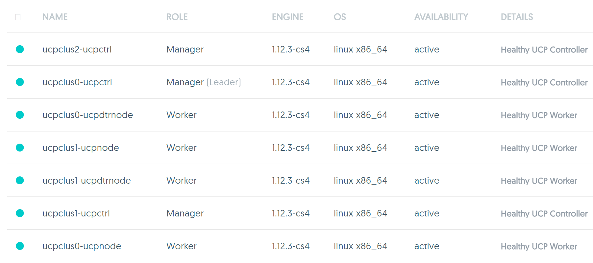
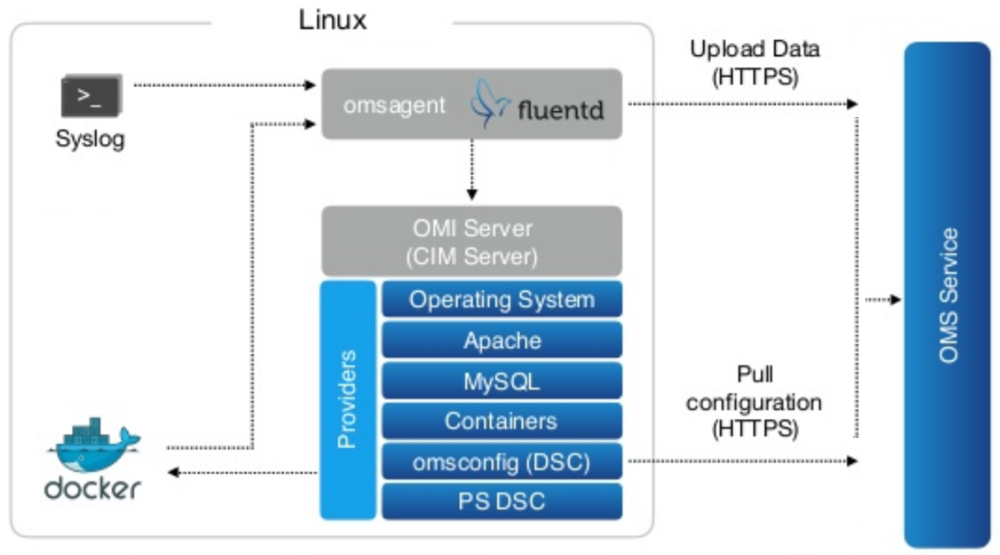

 Azure Docker DataCenter Templates for the to-be GAed (Now GAed) Docker DataCenter with  ucp:2.0.0-Beta4 (native Swarm with Raft) / now GAed as ucp:2.0.1 and dtr:2.1.0-Beta4 (now GAed as dtr:2.1.1) for Azure initially based on the "legacy" Docker DataCenter 1.x Azure MarketPlace Gallery Templates (1.0.9). Please change parameter DDC Version from default ucp-2.0.1_dtr-2.1.1 to ucp-2.0.0-beta4_dtr-2.1.0-beta4 in the GUI to use Beta4 with the right beta license. For ucp-2.0.1_dtr-2.1.1 GAed, Trial license would suffice. 
 
 * This project is hosted at: [https://github.com/Azure/azure-dockerdatacenter](https://github.com/Azure/azure-dockerdatacenter) and page @ [https://azure.github.io/azure-dockerdatacenter/](https://azure.github.io/azure-dockerdatacenter/)


Table of Contents
=================

   * [Azure Docker Datacenter](#azure-docker-datacenter)
      * [Deploy and Visualize](#deploy-and-visualize)
      * [Topologies](#topologies)
         * [The Minimal Topology (Minimum 3 Worker Manager Nodes for valid Raft HA and minimum 2 worker nodes with 2 extra for DTR and Replica)](#the-minimal-topology-minimum-3-worker-manager-nodes-for-valid-raft-ha-and-minimum-2-worker-nodes-with-2-extra-for-dtr-and-replica)
      * [Reporting bugs](#reporting-bugs)
      * [Patches and pull requests](#patches-and-pull-requests)
      * [<del>Pre-Req and or</del> Optional](#pre-req-and-or-optional)
         * [Fluentd usage](#fluentd-usage)
      * [Optional Usage of Azure Container Registry](#optional-usage-of-azure-container-registry)
         * [Create ACR](#create-acr)
         * [Create Service Principal tag image and push to ACR](#create-service-principal-tag-image-and-push-to-acr)

### Azure Docker Datacenter

* Azure Docker DataCenter Templates for the to-be GAed Docker DataCenter with  **~~ucp:2.0.0-Beta4~~** **~~ucp:2.0.0~~** **ucp:2.0.1**(native Swarm with Raft) and **~~dtr:2.1.0-Beta4~~** **~~dtr:2.1.0~~** **dtr:2.1.1** initially based on the "legacy" Docker DataCenter 1.x Azure MarketPlace Gallery Templates (1.0.9).  Read about this [DDC version features blog](https://blog.docker.com/2016/11/docker-datacenter-adds-enterprise-orchestration-security-policy-refreshed-ui/).
* For Raft, please view [Docker Orchestration: Beyond the Basics](http://events.linuxfoundation.org/sites/events/files/slides/Docker_Orchestration-Aaron_Lehmann.pdf) By Aaron Lehmann at the [ContainerCon, Europe](http://events.linuxfoundation.org/events/containercon-europe/program/slides) - Berlin, October 4-9, 2016.
and [Swarm Raft Page](https://docs.docker.com/engine/swarm/raft/).
*  Apps may leverage [swarm mode orchestration on engine 1.12](https://docs.docker.com/engine/swarm/).
* Please see the [LICENSE file](https://github.com/Azure/azure-dockerdatacenter/blob/master/LICENSE) for licensing information. 
 * **Docker DataCenter License as used as-is (~~parameterized or~~ to be uploaded license - lic file) in this project for ~~UCP 2.0.0 Beta4~~ ~~ucp:2.0.0~~ ucp:2.0.1 and ~~DTR 2.1.0 Beta4~~ ~~dtr:2.1.0~~ dtr:2.1.1 can ~~only be obtained presently for the private beta~~ now be obtained as standard Trial License for Docker DataCenter 2.0 from [docker Store/hub](https://store.docker.com/bundles/docker-datacenter). ~~Please refer to [this post](https://forums.docker.com/t/docker-datacenter-on-engine-1-12-private-beta/23232/1) in the docker forum for beta details~~.** Please sign up [here](https://goo.gl/UTG895) for GA Waiting list.
* This project has adopted the [Microsoft Open Source Code of Conduct](https://opensource.microsoft.com/codeofconduct/). For more information, see the [Code of Conduct FAQ](https://opensource.microsoft.com/codeofconduct/faq/) or contact [opencode@microsoft.com](mailto:opencode@microsoft.com) with any additional questions or comments.
* This project is hosted at: https://github.com/Azure/azure-dockerdatacenter
* **This repo is initially based on the "legacy" [Docker DataCenter 1.x Azure MarketPlace Gallery Templates (1.0.9)](https://gallery.azure.com/artifact/20151001/docker.dockerdatacenterdocker-datacenter.1.0.9/Artifacts/mainTemplate.json)**
 * **Uses the 14.04 LTS Images as per docker MarketPlace offer for the above**.
* **Uses the new public tar.gz from ~~[here](https://packages.docker.com/caas/ucp-2.0.0-beta1_dtr-2.1.0-beta1.tar.gz)~~ ~~[here](https://s3.amazonaws.com/packages.docker.com/caas/ucp-2.0.0-beta3_dtr-2.1.0-beta3.tar.gz)~~ ~~[here](https://packages.docker.com/caas/ucp-2.0.0-beta3_dtr-2.1.0-beta3.tar.gz)~~ ~~[here](https://packages.docker.com/caas/ucp-2.0.0-beta4_dtr-2.1.0-beta4.tar.gz)~~ ~~[Now GAed here](https://packages.docker.com/caas/ucp-2.0.0_dtr-2.1.0.tar.gz)~~ ~~[Now GAed and with ucp:2.0.1 here](https://packages.docker.com/caas/ucp-2.0.1_dtr-2.1.0.tar.gz)~~ [Now GAed and with ucp:2.0.1 and dtr:2.1.1 here](https://packages.docker.com/caas/ucp-2.0.1_dtr-2.1.1.tar.gz) for changes using the Raft Protocol and Auto HA for private beta (to be GAed DDC) and native swarm mode orchestration on MS Azure. DDC ~~Private Beta docs are [here](https://beta.docker.com/docs/ddc) and~~ GA Guides are [here](https://docs.docker.com/datacenter/)**
* New [Go-based Linux CustomScript Extension being used](https://github.com/Azure/custom-script-extension-linux) 
* Uses the [Docker CS 1.12 Engine support for OMS Linux Agents](https://github.com/Microsoft/OMS-Agent-for-Linux/releases)
* Latest [docker-compose](https://github.com/docker/compose/releases) and [docker-machine](https://github.com/docker/machine/releases) available.
* Dashboard URL
 http://|UCP Controller Nodes LoadBalancer Full DNS IP name|.|region of the Resource Group|.cloudapp.azure.com
 
   * The Above is the FQDN of the LBR or Public IP for UCP Controller or Managers

http://|DTR worker Nodes LoadBalancer Full DNS IP name|.|region of the Resource Group|.cloudapp.azure.com

   * The Above is the FQDN of the LBR or Public IP for DTR
* All passwords have been disabled in the nodes and one can only use public rsa_id to ssh to the nodes.

#### Deploy and Visualize
<a href="https://portal.azure.com/#create/Microsoft.Template/uri/https%3A%2F%2Fraw.githubusercontent.com%2FAzure%2Fazure-dockerdatacenter%2Fmaster%2Fazuredeploy.json" target="_blank"></a>

<a href="http://armviz.io/#/?load=https%3A%2F%2Fraw.githubusercontent.com%2FAzure%2Fazure-dockerdatacenter%2Fmaster%2Fazuredeploy.json" target="_blank">   </a> 

#### Topologies

A Minimal Fresh topology with minimum 3 Worker Managers, minimum 2 worker nodes, one DTR with local storage and another as replica would look like the following



##### The Minimal Topology (Minimum 3 Worker Manager Nodes for valid Raft HA and minimum 2 worker nodes with 2 extra for DTR and Replica)
 As from [https://resources.azure.com](https://resources.azure.com) 
 

 
#### Reporting bugs

Please report bugs  by opening an issue in the [GitHub Issue Tracker](https://github.com/Azure/azure-dockerdatacenter/issues)

#### Patches and pull requests

Patches can be submitted as GitHub pull requests. If using GitHub please make sure your branch applies to the current master as a 'fast forward' merge (i.e. without creating a merge commit). Use the `git rebase` command to update your branch to the current master if necessary.

#### ~~Pre-Req and or~~ Optional
**OMS Setup is optional and the OMS Workspace Id and OMS Workspace Key can either be kept blank or populated post the steps below.**

[Create a free account for MS Azure Operational Management Suite with workspaceName](https://login.mms.microsoft.com/signin.aspx?signUp=on&ref=ms_mms)

* Provide a Name for the OMS Workspace.

* Link your Subscription to the OMS Portal.

* Depending upon the region, a Resource Group would be created in the Sunscription like "mms-weu" for "West Europe" and the named OMS Workspace with portal details etc. would be created in the Resource Group.

* Logon to the OMS Workspace and Go to -> Settings -> "Connected Sources"  -> "Linux Servers" -> Obtain the Workspace ID like <code>ba1e3f33-648d-40a1-9c70-3d8920834669</code> and the "Primary and/or Secondary Key" like <code>xkifyDr2s4L964a/Skq58ItA/M1aMnmumxmgdYliYcC2IPHBPphJgmPQrKsukSXGWtbrgkV2j1nHmU0j8I8vVQ==</code>

* Add The solutions "Agent Health", "Activity Log Analytics" and "Container" Solutions from the "Solutions Gallery" of the OMS Portal of the workspace.

* While Deploying the DDC Template just the WorkspaceID and the Key are to be mentioned and all will be registered including all containers in any nodes of the DDC auto cluster.

* Then one can login to https://OMSWorkspaceName.portal.mms.microsoft.com and check all containers running for Docker DataCenter and use Log Analytics and if Required perform automated backups using the corresponding Solutions for OMS.

 * Or if the OMS Workspace and the Machines are in the same subscription, one can just connect the Linux Node sources manually to the OMS Workspace as Data Sources
 
 * New nodes to be added to the cluster as worker needs to follow the [Docker Instructions for OMS](https://github.com/Microsoft/OMS-Agent-for-Linux/blob/master/docs/Docker-Instructions.md) manually.

* All Docker Engines in this Azure DDC autocluster(s) are automatically instrumented via ExecStart and Specific DOCKER_OPTIONS to share metric with the OMS Workspace during deployment as in the picture below.


##### Fluentd usage



#### Optional Usage of Azure Container Registry

Credits : [Ahmet's Blog](https://ahmetalpbalkan.com/blog/azure-container-registry/), [New Azure cli 2.0 Preview](https://github.com/Azure/azure-cli/).
* Please visit the [Azure Container Registry](https://azure.microsoft.com/en-us/services/container-registry/) Page.
* Please refer to the [Documentation](https://docs.microsoft.com/en-us/azure/container-registry/).

##### Create ACR
* Create Dockerized new Azure cli
 * <code> $ docker run -dti -v ${HOME}:/home/azureuser --restart=always --name=azure-cli-python azuresdk/azure-cli-python </code>
* Login to Azure from the cli docker instance
 * <code> $ docker exec -ti azure-cli-python bash -c "az login && bash" </code>
 * Please view output below. Subscription Id, Tenant Id and names are representational.
  * To sign in, use a web browser to open the page https://aka.ms/devicelogin and enter the code XXXXX to authenticate.
```json
[
{
    "cloudName": "AzureCloud",
    "id": "123a1234-1b23-1e00-11c3-123456789d12",
    "isDefault": true,
    "name": "Microsoft Azure Subscription Name",
    "state": "Enabled",
    "tenantId": "12f123bf-12f1-12af-12ab-1d3cd456db78",
    "user": {
      "name": "ab@company.com",
      "type": "user"
    }
  }
]
  ```
  
* create a resource group via new azure cli from inside the container logged into azure 
 * <code> bash-4.3# az group create -n acr -l southcentralus </code>
```json
{
  "id": "/subscriptions/123a1234-1b23-1e00-11c3-123456789d12/resourceGroups/acr",
  "location": "southcentralus",
  "managedBy": null,
  "name": "acr",
  "properties": {
    "provisioningState": "Succeeded"
  },
  "tags": null
}
```

* Create the acr instance
 * <code> bash-4.3# az acr create -n acr12345 -g acr -l southcentralus </code>
  * Subscription Id, App Id, registry Name, Login Server are representational
  * ACR is available presently in eastus, westus and southcentralus
```json
Create a new service principal and assign access:
  az ad sp create-for-rbac --scopes /subscriptions/123a1234-1b23-1e00-11c3-123456789d12/resourcegroups/acr/providers/Microsoft.ContainerRegistry/registries/acr12345 --role Owner --password <password>

Use an existing service principal and assign access:
  az role assignment create --scope /subscriptions/123a1234-1b23-1e00-11c3-123456789d12/resourcegroups/acr/providers/Microsoft.ContainerRegistry/registries/acr12345 --role Owner --assignee <app-id>
{
  "adminUserEnabled": false,
  "creationDate": "2016-12-09T03:45:14.843041+00:00",
  "id": "/subscriptions/123a1234-1b23-1e00-11c3-123456789d12/resourcegroups/acr/providers/Microsoft.ContainerRegistry/registries/acr12345",
  "location": "southcentralus",
  "loginServer": "acr12345-microsoft.azurecr.io",
  "name": "acr12345",
  "storageAccount": {
    "accessKey": null,
    "name": "acr123456789"
  },
  "tags": {},
  "type": "Microsoft.ContainerRegistry/registries"
}
```
##### Create Service Principal tag image and push to ACR

* Subscription Id, App Id, registry Name, Login Server are representational
* <code> bash-4.3# az ad sp create-for-rbac -scopes /subscriptions/123a1234-1b23-1e00-11c3-123456789d12/resourcegroups/acr/providers/Microsoft.ContainerRegistry/registries/acr12345 --role Owner --password bangbaM23# </code>
```json
Retrying role assignment creation: 1/24
Retrying role assignment creation: 2/24
{
  "appId": "ab123cd5-b1ab-1234-abab-a2bcd90abcde",
  "name": "http://azure-cli-2016-12-09-03-46-57",
  "password": "bangbaM23#",
  "tenant": "12f123bf-12f1-12af-12ab-1d3cd456db78"
}
```

* Login <code>$ docker login -u ab123cd5-b1ab-1234-abab-a2bcd90abcde -p bangbaM23# acr12345-microsoft.azurecr.io</code>
* Pull a public image <code>$ docker pull dwaiba/azureiot-nodered </code>
* Tag for new ACR <code> $ docker tag dwaiba/azureiot-nodered acr12345-microsoft.azurecr.io/ab123cd5-b1ab-1234-abab-a2bcd90abcde/azureiot-nodered:latest</code>
* Push to ACR <code> $ docker push acr12345-microsoft.azurecr.io/ab123cd5-b1ab-1234-abab-a2bcd90abcde/azureiot-nodered:latest </code>
* Run it <code>$ docker run -dti -p 1880:1880 -p 1881:1881 acr12345-microsoft.azurecr.io/ab123cd5-b1ab-1234-abab-a2bcd90abcde/azureiot-nodered:latest</code>


