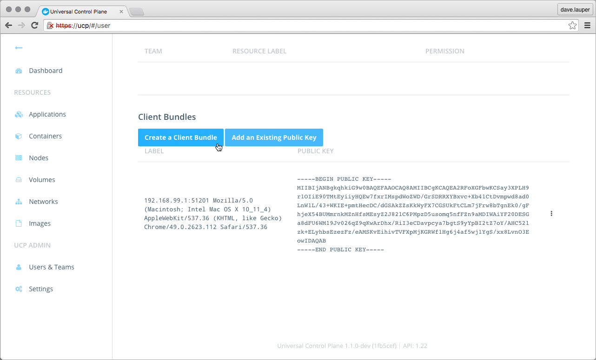

Docker UCP secures your cluster with role-based access control, so that only
authorized users can perform changes to the cluster.

For this reason, when running docker commands on a UCP node, you need to
authenticate your request using client certificates. When trying to run docker
commands without a valid certificate, you get an authentication error:

```markdown
$ docker ps

An error occurred trying to connect: Get https://ucp:443/v1.22/containers/json: x509: certificate signed by unknown authority (possibly because of "crypto/rsa: verification error" when trying to verify candidate authority certificate "UCP Client Root CA")
```

There are two different types of client certificates:

* Admin user certificate bundles: allow running docker commands on the
Docker Engine of any node,
* User certificate bundles: only allow running docker commands through a UCP
controller node.

## Download client certificates

To download a client certificate bundle, **log into UCP**, and navigate to your
**profile page**.



Click the **Create a Client Bundle** button, to download the certificate bundle.


## Use client certificates

Once you've downloaded a client certificate bundle, you can use it to
authenticate your requests.

Navigate to the directory where you downloaded the bundle, and unzip it. Then
run the `env.sh` script to start using the client certificates.

```bash
$ unzip ucp-bundle-dave.lauper.zip
$ cd ucp-bundle-dave.lauper
$ eval $(<env.sh)
```

The env.sh script updates the `DOCKER_HOST` and `DOCKER_CERT_PATH`
environment variables to use the certificates you downloaded.

From now on, when you use the Docker CLI client, it includes your client
certificates as part of the request to the Docker Engine. You can now use the
`docker info` command to see if the certificates are being sent to the Docker
Engine.

```markdown
$ docker info

Containers: 11
Nodes: 2
 ucp: 192.168.99.100:12376
  └ Status: Healthy
 ucp-node: 192.168.99.101:12376
  └ Status: Healthy
Cluster Managers: 1
 192.168.99.104: Healthy
  └ Orca Controller: https://192.168.99.100:443
  └ Swarm Manager: tcp://192.168.99.100:3376
  └ KV: etcd://192.168.99.100:12379
```


## Download client certificates using the REST API

You can also download client certificate bundles using the UCP REST API. In
this example we use `curl` for making the web requests to the API, and
`jq` to parse the responses.

To install these tools on an Ubuntu distribution, you can run:

```bash
$ sudo apt-get update && sudo apt-get install curl jq
```

Then you get an authentication token from UCP, and use it to download the
client certificates.

```bash
# Create an environment variable with the user security token
$ AUTHTOKEN=$(curl -sk -d '{"username":"<username>","password":"<password>"}' https://<ucp-ip>/auth/login | jq -r .auth_token)
# Download the client certificate bundle
$ curl -k -H "Authorization: Bearer $AUTHTOKEN" https://<ucp-ip>/api/clientbundle -o bundle.zip
```

## Where to go next

* [Deploy an app from the UI](../applications/deploy-app-ui.md)
* [Deploy an app from the CLI](../applications/deploy-app-cli.md)