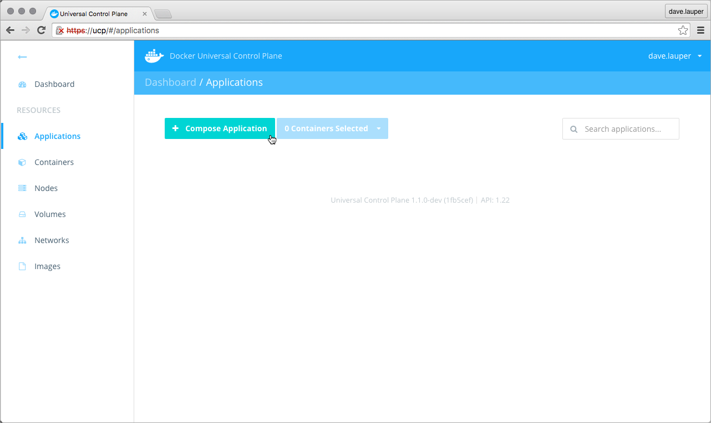
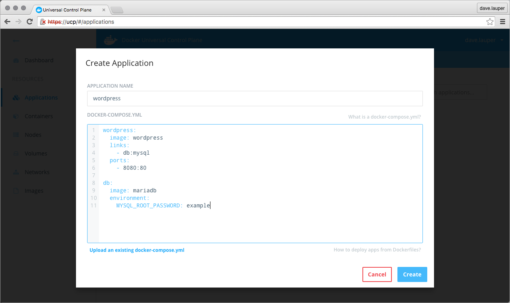
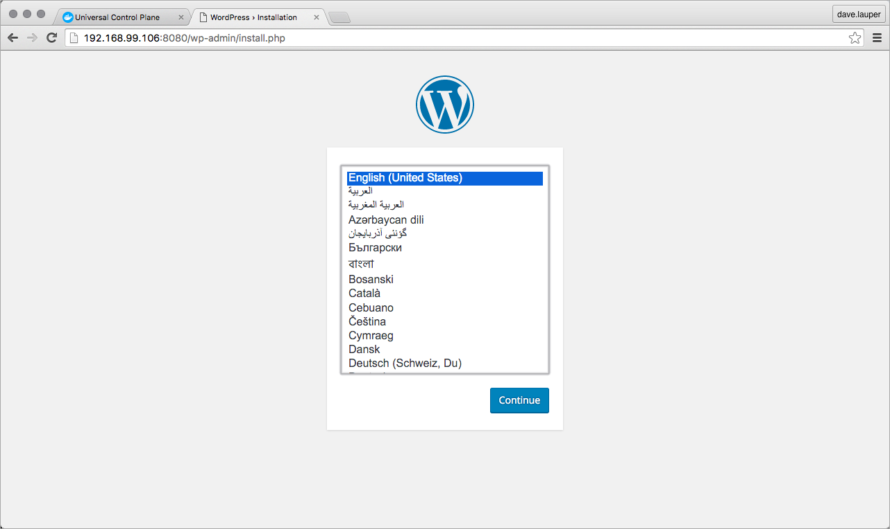
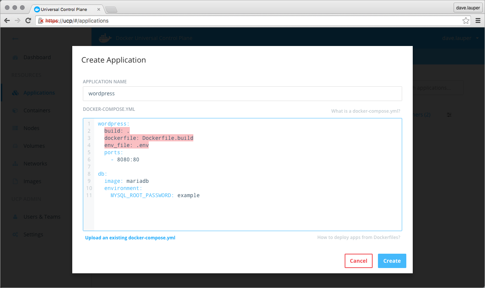

With Docker Universal Control Plane you can deploy applications from the
UI. You can define your application on the UI, or import an existing
docker-compose.yml file.

In this example, we're going to deploy a WordPress application.

## Deploy WordPress

On your browser, **log in** to UCP, and navigate to the **Applications** page.
There, click the **Compose Application** button, to deploy a new application.



The WordPress application we're going to deploy is composed of two services:

* wordpress: The container that runs Apache, PHP, and WordPress.
* db: A MariaDB database used for data persistence.

<!-- would be better if this was a docker-compose v2 file-->

```yml
wordpress:
  image: wordpress
  links:
    - db:mysql
  ports:
    - 8080:80

db:
  image: mariadb
  environment:
    MYSQL_ROOT_PASSWORD: example
```

Copy-paste the application definition to UCP, and name it 'wordpress'.
You can also upload a docker-compose.yml file from your machine, by clicking on
the 'Upload an existing docker-compose.yml' link.



Click the **Create** button, to create the WordPress application.

Once UCP deploys the WordPress application, you can
**click on the wordpress_wordpress_1** container, to see its details.


In the container details page, search for the **Ports** the container is
exposing.


In this example, WordPress can be accessed at `192.168.99.106:8080`.
Navigate to this address in your browser, to start using the WordPress app you
just deployed.




## Limitations

There are some limitations when deploying application on the UI. You can't
reference any external files, so the following Docker Compose keywords are not
supported:

* build
* dockerfile
* env_file



To overcome these limitations, you can
[deploy your apps from the CLI](deploy-app-cli.md).

Also, UCP doesn't store the compose file used to deploy the application. You can
use your version control system to persist that file.

## Where to go next

* [Deploy an app from the CLI](deploy-app-cli.md)