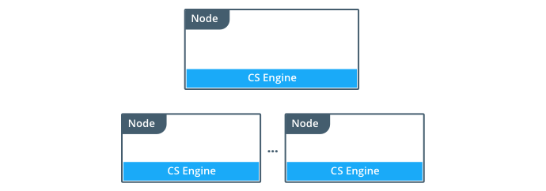
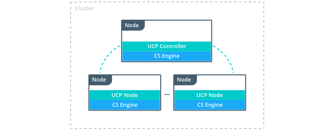
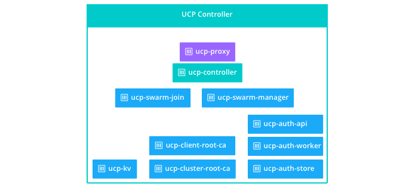

UCP is a containerized application, so the first step to install UCP is
installing the Commercially Supported (CS) Docker Engine on all the nodes that
are going to be part of the cluster.

After CS Docker Engine is installed, you install UCP, and join as many
nodes as you want to the cluster.

## Architecture

A UCP cluster has two types of nodes:

* Controller: manages the cluster and persists the cluster configurations.
* Node: run your containers.

### UCP controller node

When you install Docker UCP on a node, the following containers are started.

| Name                | Description                                                                                                                                                |
|:--------------------|:-----------------------------------------------------------------------------------------------------------------------------------------------------------|
| ucp-proxy           | A TLS proxy. It allows secure access to the local Docker Engine.                                                                                           |
| ucp-controller      | The UCP application. It uses the key-value store for persisting configurations.                                                                            |
| ucp-swarm-manager   | Provides the clustering capabilities. It uses the key-value store for leader election, and keeping track of cluster members.                               |
| ucp-swarm-join      | Heartbeat to record on the key-value store that this node is alive. If the node goes down, this heartbeat stops, and the node is removed from the cluster. |
| ucp-auth-api        | The centralized API for identity and authentication used by UCP and DTR.                                                                                   |
| ucp-auth-worker     | Performs scheduled LDAP synchronizations and cleans data on the ucp-auth-store.                                                                            |
| ucp-auth-store      | Stores authentication configurations, and data for users, organizations and teams.                                                                         |
| ucp-kv              | Used to store the UCP configurations. Don't use it in your applications, since it's for internal use only.                                                 |
| ucp-cluster-root-ca | A certificate authority to sign the certificates used when joining new nodes, and on administrator client bundles.                                         |
| ucp-client-root-ca  | A certificate authority to sign user bundles. Only used when UCP is installed without an external root CA.                                                 |

### UCP node

When you join a node to a Docker UCP cluster, the following containers are
started.

| Name           | Description                                                                                                                                                |
|:---------------|:-----------------------------------------------------------------------------------------------------------------------------------------------------------|
| ucp-proxy      | A TLS proxy. It allows secure access to the local Docker Engine.                                                                                           |
| ucp-swarm-join | Heartbeat to record on the key-value store that this node is alive. If the node goes down, this heartbeat stops, and the node is dropped from the cluster. |

## Volumes

Docker UCP uses these named volumes for persisting data:

| Node       | Volume name                 | Location on host (/var/lib/docker/volumes/) | Description                                                                                                    |
|:-----------|:----------------------------|:--------------------------------------------|:---------------------------------------------------------------------------------------------------------------|
| all        | ucp-client-root-ca          | ucp-client-root-ca/_data                    | The certificate and key for the UCP root CA. Do not create this volume if you are using your own certificates. |
| all        | ucp-cluster-root-ca         | ucp-cluster-root-ca/_data                   | The certificate and key for the Swarm root CA.                                                                 |
| all        | ucp-controller-client-certs | ucp-controller-client-certs/_data           | The UCP Controller Swarm client certificates for the current node.                                             |
| all        | ucp-controller-server-certs | ucp-controller-server-certs/_data           | The controller certificates for the UCP controllers web server.                                                |
| controller | ucp-kv                      | ucp-kv/_data                                | Key value store persistence.                                                                                   |
| all        | ucp-kv-certs                | ucp-kv-certs/_data                          | The Swarm KV client certificates for the current node (repeated on every node in the cluster).                 |
| all        | ucp-node-certs              | ucp-node-certs/_data                        | The Swarm certificates for the current node (repeated on every node in the cluster).                           |

If you don’t create these volumes before when installing UCP, they are created with
the default volume driver and flags.

## High-availability support

For load balancing and high-availability, you can install multiple controller
nodes and join them to create a cluster.
[Learn more about high availability](high-availability/set-up-high-availability.md).

## Where to go next

* [System requirements](installation/system-requirements.md)
* [Plan a production installation](installation/plan-production-install.md)