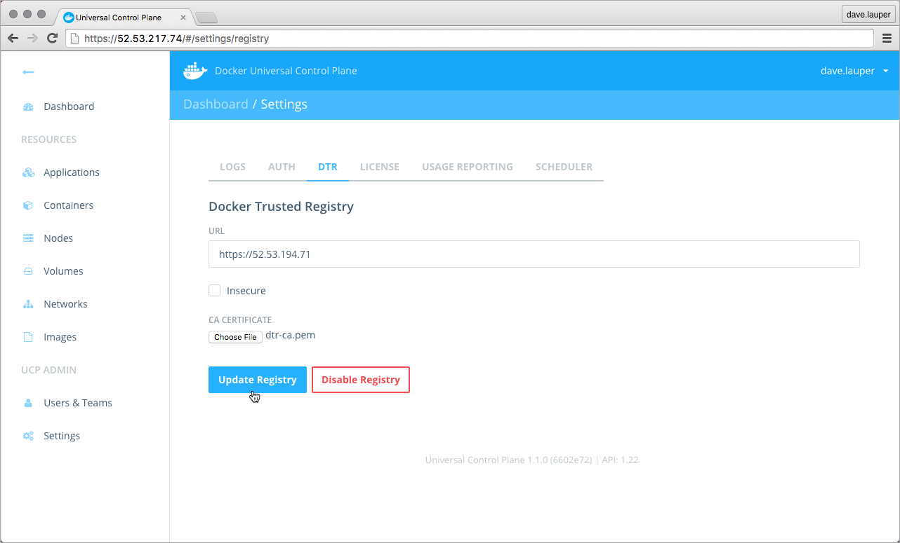
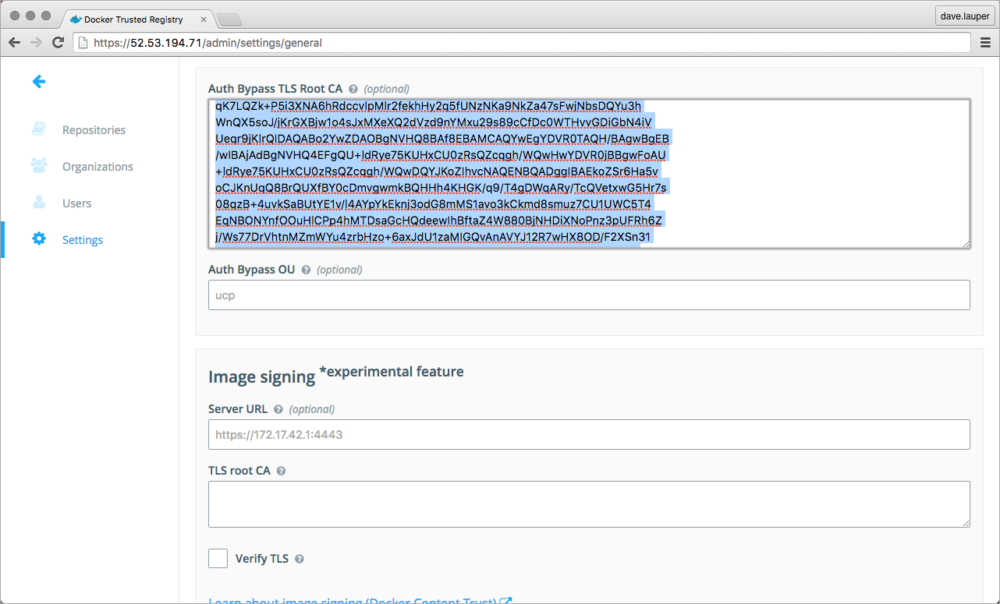

You can integrate UCP with Docker Trusted Registry (DTR). This allows you to
securely store and manage the Docker images that are used in your UCP cluster.

At an high-level, there are three steps to integrate UCP with DTR:

* Configure UCP to know about DTR,
* Configure DTR to trust UCP,
* Configure the Docker Engine running on each UCP node to trust DTR.

When this is done, you can use a [UCP client bundle](../access-ucp/cli-based-access.md)
to push and pull your private images to a UCP node, without running the
`docker login` command.

You can also pull images from the UCP web UI, without having to
provide your credentials.

## Prerequisites

To integrate UCP with DTR, you need to have UCP and DTR installed, and make sure
the two can communicate.

## Step 1. Get the UCP CA certificate

Before starting the configuration, you need to get the cluster root CA
certificate used internally by UCP:

1.  Log in with **ssh** on a UCP controller node.
2.  Get the UCP cluster CA certificate.

    Run the `docker/ucp dump-certs` command:

    ```bash
    $ docker run --rm --name ucp \
      -v /var/run/docker.sock:/var/run/docker.sock \
      docker/ucp dump-certs --cluster --ca
    ```

    This command prints a certificate block like this:

    ```none
    -----BEGIN CERTIFICATE-----
    MIIFJDCCAwygAwIBAgIIDAApo7wvQCIwDQYJKoZIhvcNAQENBQAwHjEcMBoGA1UE
    AxMTVUNQIENsdXN0ZXIgUm9vdCBDQTAeFw0xNjA2MDEyMTMzMDBaFw0yMTA1MzEy
    ...
    xMOixABCUI3jx6k38yAHTO8Q+gyiqj41M/QjrwbyFJD9k69sG6MknguZAMcRwmBs
    3Fjz0e6mRK7qfXsSLGZH/3+iCV5heXz8
    -----END CERTIFICATE-----
    ```

3.  Save the result on your local machine.

    Copy the resulting certificate to the `ucp-cluster-ca.pem` file,
    and store it on your local machine.

## Step 2. Get the DTR CA certificate

Now, get the root CA certificate used by DTR:

1. Log into the **DTR web UI**, and navigate to the **Settings** screen.
2. In the **Domain** section, click the **Show TLS settings** link.
3. Copy the content of the **TLS CA** field.

    

4. Save the result on your local machine.

    Copy the DTR CA certificate to the `dtr-ca.pem` file, and store
    it on your local machine.


## Step 3. Integrate UCP with DTR

Configure UCP to know about DTR:

1. Log into the **UCP web UI**, navigate to the **Settings page**, and click
the **DTR** tab.
2. In the **URL** field, add the URL of your Docker Trusted Registry.
3. Don't set the Insecure option.

    If you enable the Insecure option, UCP automatically trusts the domain name
    you've configured. All the traffic between UCP and DTR is encrypted, but
    vulnerable to man-in-the-middle attacks.

4. Upload the `dtr-ca.pem` file.

    If your Docker Trusted Registry is configured to use a certificate issued
    by a third-party root CA, you can skip this step, because UCP will trust
    the CA that issued the certificate.

    If you've not configured your DTR installation to use a certificate issued
    by a third-party root CA, or configured it to use internal or self-signed
    certificates, you must upload the `dtr-ca.pem` file.

5. Click the **Update Registry** button to save the changes.




## Step 4. Configure DTR to trust UCP

In this step, you configure DTR to trust the UCP cluster root CA. This way,
requests to DTR that present a certificate issued by the UCP cluster root CA
are authorized:

1. Log into the **DTR web UI**, and navigate to the **Settings page**.
2. In the **Auth Bypass TLS Root CA** field, paste the content of the
`ucp-cluster-ca.pem` file.
3. Click the **Save** button to save the changes.




## Step 5. Configure UCP Docker Engines

If your Docker Trusted Registry is configured to use a certificate issued by
a third-party root CA, you can skip this step, because Docker Engines will
trust the CA that issued the certificate.

If you've not configured your DTR installation to use a certificate issued
by a third-party root CA, or configured it to use internal or self-signed
certificates, you must configure the Docker Engine on each UCP node of the
cluster, to trust the DTR CA.

For each UCP node, copy the `dtr-ca.pem` file to
`/etc/docker/certs.d/$DTR_DOMAIN_NAME/ca.crt`. As an example, you can use scp
for this:

```bash
$ scp dtr-ca.pem $USER@$UCP_HOST:/etc/docker/certs.d/$DTR_DOMAIN_NAME/ca.crt
```

## Step 6. Test the integration

The best way to confirm the integration, is to pull and push images from a UCP
node to a private DTR repository.

1. Create a test repository on DTR.

    Navigate to the **DTR web UI**, and create a new **hello-world** repository
    so that you can push and pull images. Set it as **private**, and save
    the changes.

    

2. Use a [UCP client bundle](../access-ucp/cli-based-access.md) to run docker
commands in the UCP cluster.

3.  Pull an image from Docker Hub:

    ```bash
    $ docker pull hello-world
    ```

4.  Retag the image:

    ```bash
    $ docker tag hello-world:latest $DTR_DOMAIN_NAME/$USERNAME/hello-world:1
    ```

5.  Push the image from the UCP node to your private registry:

    ```bash
    $ docker push $DTR_DOMAIN_NAME/$USERNAME/hello-world:1
    ```

6.  Validate that your image is now stored on DTR.

    When successfully pushing the image you should see a result like:

    ```none
    The push refers to a repository [dtr/username/hello-world]
    5f70bf18a086: Pushed
    33e7801ac047: Pushed
    1: digest: sha256:7d9e482c0cc9e68c7f07bf76e0aafcb1869d32446547909200db990e7bc5461a size: 1930
    ```

    You can also check that the tag exists on the DTR web UI.

    

## Troubleshooting

When UCP or DTR are misconfigured, you get errors when pushing and pulling
images from a UCP node to a private DTR repository.

When UCP can't communicate with DTR, you see:

```none
$ docker push dtr/username/hello-world:1

The push refers to a repository [dtr/username/hello-world]
5f70bf18a086: Image push failed
33e7801ac047: Preparing
unauthorized: authentication required
```

In this case, check that UCP is properly configured and that it can communicate
with DTR.

When one of the components is misconfigured, and doesn't trust the root CA
certificate of the other components, you see an error like:

```none
$ docker push dtr/username/hello-world:1

The push refers to a repository [dtr/username/hello-world]
Get https://dtr/v1/_ping: x509: certificate signed by unknown authority
```

## Where to go next

* [Monitor your cluster](../monitor/monitor-ucp.md)
* [Troubleshoot your cluster](../monitor/troubleshoot-ucp.md)