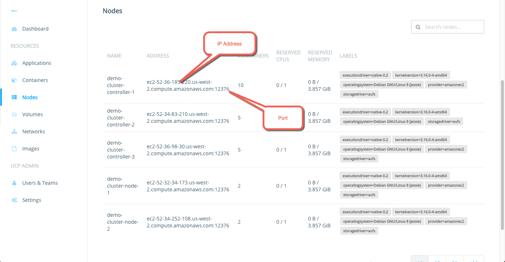
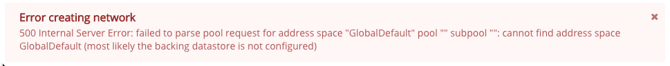

Along with host and bridge networks, Docker Engine lets users create container
overlay networks. These networks span multiple hosts running Docker Engine.
Launching a container on one host, makes the container available to all hosts in
that container network. Another name for this capability is multi-host networking.

This page explains how to use the `engine-discovery` command to enable
multi-host container networks on your UCP installation. The end result is a complete
configuration on all nodes within your UCP deployment.

## About container networks and UCP

You create a container network using the Docker Engine client or the UCP
administration console. Container networks are custom networks you create using
the `overlay` network plugin driver. You must configure container networking
explicitly on UCP. Once you have your UCP installation running but before you
start using it, you enable container networks.

Enabling container networking is a process. First, you run the
`engine-discovery` subcommand on the node. This subcommand configures the Engine
daemon options (`DOCKER_OPTS`) for the cluster key-value store. The options
include the IP address of each UCP controller and replica. Once you have run the
subcommand, you then restart the node's Engine daemon for the changes to take
effect.

Because the Engine daemon options rely on you already having the IP addresses of
the controller and replicas, you run `engine-discovery` after you have installed
these key nodes. You should enable networking on the controller first and then
the replicas. Once these are configured, you run the subcommand on each worker
node.

After you've configured discovery, you can create a container through UCP the
application or the Engine CLI. To create a network using the Engine CLI, open a
command line on any UCP node and do the following:

```
$ docker network create -d overlay my-custom-network
```

## Automatic Configuration

As of UCP 1.1 and Docker Engine 1.11, discovery is automatically configured
when a node is installed or joined to the UCP cluster. Depending on your
engine's configuration, this may require a restart to take effect. The output
of the install and join operations will inform you if automatic configuration
succeeded or if configuration was attempted but a restart will be required.

If you are running Docker Engine 1.10, proceed to the manual configuration.

## Manual Configuration

Some setups will require manually setting up engine configuration.

### Get each node host IP address

To continue with this procedure, you need to know the host address values you
used on each controller or node. This is the address used with the `install` or
`join` subcommands to identify a node. Host addresses are used among the UCP
nodes for network communication.

1. Log into your UCP dashboard as a user with `admin` privileges.

2. Click **Nodes** on the dashboard.

    A page listing the installed UCP nodes appears.

    

3. Use the **ADDRESS** field to record the host IP address for each node.

    Make sure you do not include the port number, just the IP address.


### Enable the networking feature

If you followed the prerequisites, you should have a list of the host-address
values you used with `install` to create the controller, the replicas, and
`join` each node. In this step, you enable the networking feature on all your
controller node, your replicas nodes (if you are using high availability), and
the worker nodes.

Do this procedure on one node at a time:

* begin with the controller
* continue onto doing all replicas
* finish with the worker nodes

Do this procedure on one node at a time because if you restart all the
controller daemons at the same time, you can increase the startup delay. This is
because `etcd` needs to start and establish quorum before the daemons can fully
recover.

To enable the networking feature, do the following.

1.  Log into the host running the UCP controller.

2.  Review the `engine-discovery` help.

    ```bash
    $ docker run --rm docker/ucp engine-discovery --help
    ```

3.  Leave the UCP processes running.

4.  Run the `engine-discovery` command.

    The command syntax is:

    ```bash
    $ docker run --rm -it --name ucp \
      -v /var/run/docker.sock:/var/run/docker.sock \
      docker/ucp engine-discovery
      --controller <private IP> [--controller <private IP> ]
      --host-address [<private IP>]
    ```

    If you are using high availability, you must provide the controller and all
    the replica's by passing multiple `--controller` flags. when you configure
    network. The command installs discovery on a UCP installation
    with a two controllers (a primary and a replica).

    ```bash
    $ docker run --rm -it --name ucp \
      -v /var/run/docker.sock:/var/run/docker.sock docker/ucp engine-discovery \
      --controller 192.168.99.106 --controller 192.168.99.116 \
      --host-address 192.168.99.106
      INFO[0000] New configuration established.  Signaling the daemon to load it...
      INFO[0001] Successfully delivered signal to daemon
    ```

    The `host-address` value is the external address of the node you're
    operating against. This is the address other nodes when communicating with
    each other across the communication network.

    If you specify the `--host-address` flag without an IP, the command attempts
    to discover the address of the current node.  If the command cannot discover
    the address, it fails and prompts you to supply it:

    ```bash
    FATA[0000] flag needs an argument: -host-address
    ```

5.  Restart the Engine `daemon`.

    The Engine `daemon` is a OS service process running on each node in your
    cluster.  How you restart a service is operating-system dependent. Some
    examples appear below but keep in mind that on your system, the restart
    operation may differ. Check with your system administrator if you are not
    sure how to restart a daemon. Some example restarts include the following,
    keep in mind your installation may be different:

    **Ubuntu**:

    ```bash
    $ sudo service docker restart
    ```

    **Centos/RedHat**:

    ```bash
    $ sudo systemctl daemon-reload
    $ sudo systemctl restart docker.service
    ```

6.  Review the Docker logs to check the restart.

    The logging facilities for the Engine daemon is installation dependent. Some
    example review operations include the following, keep in mind your
    installation may be different:

    **Ubuntu**:

    ```bash
    $ sudo tail -f /var/log/upstart/docker.log
    ```

    **Centos/RedHat**:

    ```bash
    $ sudo journalctl -fu docker.service
    ```

7.  Verify that you can create and remove a custom network.

    ```bash
    $ docker network create -d overlay my-custom-network
    $ docker network ls
    $ docker network rm my-custom-network
    ```

8. Repeat steps 2-6 on the replica nodes in your cluster.

9. After enabling networking on the controllers and replicas, repeat steps 2-6 on
the remaining nodes in the cluster.

### Adding new nodes and replicas

Once your UCP installation is up and running, you may need to add a new worker
node or a new replica node. If you add a new worker node, you must run
`engine-discovery` on the node after you `join` it to the cluster. If you need
to add a replica, you need:

1. Re-run network configuration process on the controller to add the replica..
2. Run network configuration process  on the new replica.
3. Run network configuration process again on all your nodes.

This will update the Engine's `daemon` configuration to include the new
`replica`. Keep in mind that this process can add downtime to your UCP
production installation. You should plan accordingly.

## Troubleshoot container networking

This section lists errors you can encounter when working with container networks
and UCP.

### Create: failed to parse pool request for address

```bash
$ docker network create -d overlay my-custom-network
Error response from daemon: failed to parse pool request for address space "GlobalDefault" pool "" subpool "": cannot find address space GlobalDefault (most likely the backing datastore is not configured)
```

If you attempt the same operation from UCP's web administration, you receive
the same error.



If you have not configured multi-host networking using the `engine-discovery`
command, the Docker client returns these errors. Check the Engine daemon
configuration and make sure you have properly configured it.

### daemon configuration errors

The `engine-discovery` command works by modifying the start configuration for
the Docker daemon. The tool stores the configuration the
`/etc/docker/daemon.json` file on the node.  To view the configuration:

```
$ sudo cat /etc/docker/daemon.json
{
  "cluster-advertise": "10.0.11.78:12376",
  "cluster-store": "etcd://10.0.11.78:12379,10.0.11.149:12379,10.0.26.238:12379",
  "cluster-store-opts": {
    "kv.cacertfile": "/var/lib/docker/discovery_certs/ca.pem",
    "kv.certfile": "/var/lib/docker/discovery_certs/cert.pem",
    "kv.keyfile": "/var/lib/docker/discovery_certs/key.pem"
}
```

If you have trouble with discovery, try these troubleshooting measures:

*   Review the daemon logs to ensure the daemon was started.
*   Add the `-D` (debug) to the Docker daemon start options.
*   Check your Docker daemon configuration to ensure that `--cluster-advertise` is set properly.
*   Check your daemon configuration `--cluster-store` options is point to the
key-store `etcd://CONTROLLER_PUBLIC_IP_OR_DOMAIN:PORT` on the UCP controller.
*   Make sure the controller is accessible over the network, for example `ping CONTROLLER_PUBLIC_IP_OR_DOMAIN`.
A ping requires that inbound ICMP requests are allowed on the controller.
*   Stop the daemon and start it manually from the command line.

    ```bash
    $ sudo /usr/bin/docker daemon -D --cluster-advertise eth0:12376 --cluster-store etcd://CONTROLLER_PUBLIC_IP_OR_DOMAIN:12379 --cluster-store-opt kv.cacertfile=/var/lib/docker/discovery_certs/ca.pem --cluster-store-opt kv.certfile=/var/lib/docker/discovery_certs/cert.pem --cluster-store-opt kv.keyfile=/var/lib/docker/discovery_certs/key.pem
    ```

Remember to restart the daemon each time you change the start options.

## Where to go next

* [Integrate with DTR](dtr-integration.md)
* [Set up high availability](../high-availability/set-up-high-availability.md)
