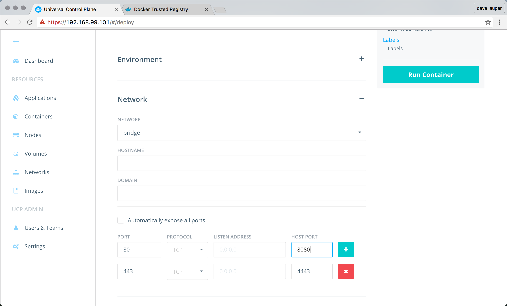
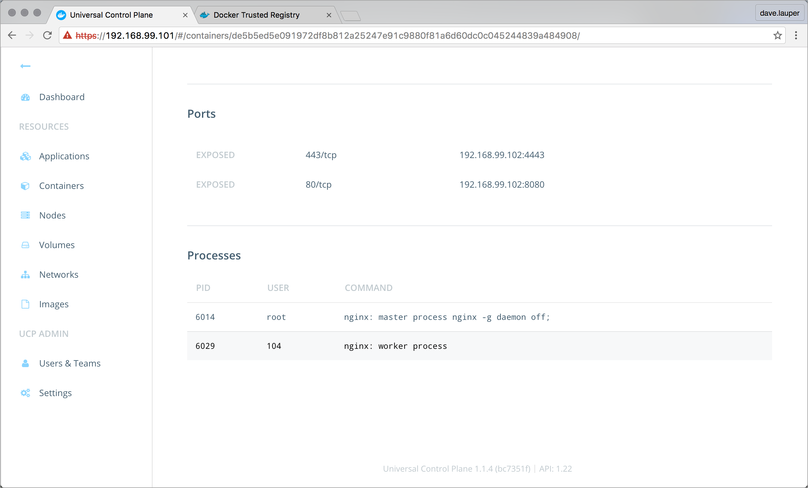
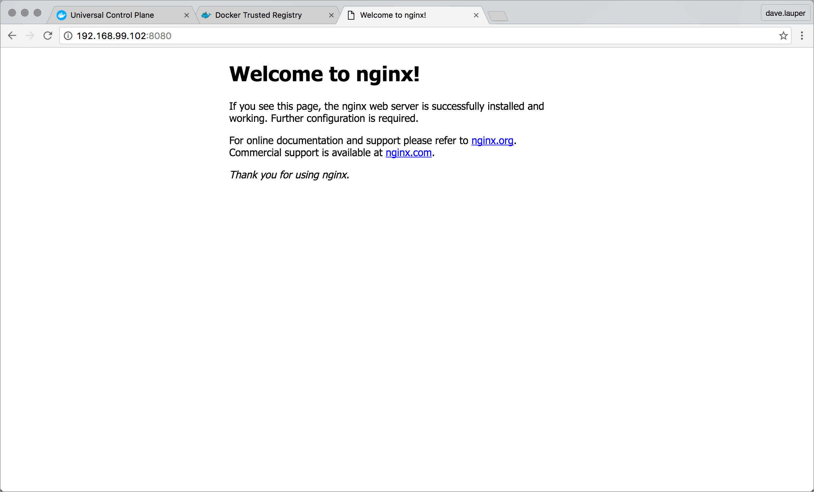

---
redirect_from:
- /ucp/install-sandbox-2/
title: Evaluate DDC in a sandbox deployment
description: Learn how to push Docker images to your private registry and deploy them to your cluster.
keywords: Docker Datacenter, registry, orchestration
---

This tutorial assumes that you have
[installed and configured](install-sandbox.md) a two-node Docker Datacenter
installation including both UCP and DTR using the instructions
[here](install-sandbox.md). If you haven't done this, we can't promise that this
tutorial workflow will work exactly the same.

In the second half of this tutorial, we walk you through a typical deployment
workflow using your sandbox installation of DDC as if it was a production
instance installed on your organization's network.


Over the course of this tutorial, we will:

- Create a repository in DTR
- Set up certificates or set insecure flag
- Pull a Docker image, tag it and push it to your DTR repo.
- Use UCP to deploy the image to a node


## Step 1: Set --insecure registry or set up DTR trust and log in

First, we set up a security exception that allows a the Docker-machine hosts
used in your UCP cluster to push images to and pull images from DTR even though
the DTR instance has a self-signed certificate. For a production deployment,
you would
[set up certificate trust](configuration/dtr-integration/)
between UCP and DTR, and
between DTR and your Docker Engine/docker-trusted-registry/repos-and-images/,
but for our sandbox deployment we can skip this.

> **Warning**:
> These steps produce an insecure DTR connection. Do not use these
configuration steps for a production deployment.
{:.warning}

To allow the Docker Engine to connect to DTR despite it having a self-signed
certificate, we specify that there is one insecure registry that we allow
the Engine instance to connect to. We add this exception by editing the
configuration file where docker-machine stores the host's configuration details.

1. Edit the file found at `~/.docker/machine/machines/node1/config.json` using
your preferred text editor.

   For example

   ```none
   $ vi ~/.docker/machine/machines/node1/config.json
   ```

2. Locate `InsecureRegistry` key in `EngineOptions` section, and add your DTR
instance's IP between the brackets, enclosed in quotes.

   For example

   ```
   "InsecureRegistry": ["192.168.99.101"],
   ```

3. Save your changes to the file and exit.

4. Run the command `docker-machine provision node1` to update `node1`'s
configuration with the new `InsecureRegistry` setting.

5. Repeat this process for `node2`.

   Because UCP runs a `docker pull` from DTR for each node in its cluster,
   you must make this security exception for all nodes in the cluster.

This allows you to push docker images to, and pull docker images from, the
registry.


## Step 2: Create an image repository in DTR

In this step, we create an image repository in DTR that you will be able to
push Docker images to. Remember a Docker image is a combination of code and
filesystem used as a template to create a container.

1. In your web browser, go to the DTR web UI.

   If you need help finding the URL for this host, you can use
   `docker-machine ls` to find the IP for `node2` where you installed DTR.

2. Log in to DTR using your administrator credentials.

3. Navigate to the **Repositories** screen and click **New Repository**.

4. In the repository name field, enter `my-nginx`.

5. Click **Save**.

## Step 3: Pull an image, tag and push to DTR

1. In your terminal, make sure `node1` is active using `docker-machine ls`.

   This is the node that you configured the security exception for, and if you
   are connecting to a Docker Engine without this exception you can't
   push to your DTR instance.

   If necessary, use `docker-machine env` to make `node1` active.

   ```none
   $ eval "$(docker-machine env node1)"
   ```

2. Pull the latest Nginx image

   ```
   $ docker pull nginx:latest
   ```

   Because you aren't specifying a registry as part of the `pull` command,
   Docker Engine locates and downloads the latest `nginx` image from Docker
   Cloud's registry.

3. Log in to your DTR instance on `node2` using the `docker login` command and
the DTR instance's IP address.

   ```none
   docker login $(docker-machine ip node2)
   ```

   Enter your administrator username and password when prompted.

4. Tag the `nginx` image you downloaded.

   Use the IP of your DTR instance to specify the repository path, and the tag.

   ```none
   $ docker tag nginx:latest $(docker-machine ip node2)/admin/my-nginx:official
   ```

5. Push the tagged image to your DTR instance.

   ```none
   $ docker push $(docker-machine ip node2)/admin/my-nginx:official
   ```

You now have a copy of the official Nginx Docker image available on your
sandbox DTR instance.

## Step 4: Pull your image from DTR into UCP

UCP does not automatically pull images from DTR. To make an image from DTR
appear in UCP, you use the UCP web UI to perform a `docker pull`. This `pull`
command pulls the image and makes it available on all nodes in the UCP cluster.

1. From the UCP dashboard, click **Images** in the left navigation.

2. Click **Pull Image**.

3. Enter the full path to the image that you just pushed to your DTR instance.

    For the example path in this demo use `<dtr-ip>/admin/my-nginx:official`

4. Click **Pull**.

    UCP contacts the DTR host, and pulls the image on each node in the cluster.

## Step 5. Deploy a container from the UCP web interface

UCP allows you to deploy and manage "Dockerized" applications in production. An
application is built using Docker objects, such as images and containers, and
Docker resources, such as volumes and networks.

UCP deploys and manages these objects and resources using Engine API calls to
the Engine daemons running on the nodes. For example, the `run` action may
deploy an image in a Docker container. That image might define a service such as
an Nginx web server or a database like Postgres.

A UCP administrator initiates Engine actions using the UCP dashboard or the
Docker Engine CLI. In this step, you deploy a container from the UCP dashboard.
The container runs an Nginx server, so you need to launch the `nginx` image
inside of it.

1. Log in to the UCP **Dashboard**.

2. Click **Containers** from the left navigation.

   The system displays the **Containers** page.

   > **Tip**: UCP runs some containers that support its own operations called
   "system" containers. These containers are hidden by default.

3. Click **+ Deploy Container**.

   Deploy the simple `nginx` container you just pulled, using specific
   values for each field. If you already know what you're doing, feel free to
   explore once you've completed this example.

4. Enter the path to the `nginx:official` image you just pulled in the
**image name** field.

   This should something like `<dtr-ip>/admin/my-nginx:official`

   An image is a specific build of software you want to run. The software might
   be a stand-alone application, or component software necessary to support a
   complex service.

5. Enter `nginx_official` for the container name.

   This name just identifies the container on your network.

6. Click **Network** to expand the networking settings.

   A Docker container is isolated from other processes on your network and has
   its own internal network configuration. To access the service inside a
   container, you need to expose the container's port, which maps to a port on
   the node. The node is hosting an instance of Docker Engine, so its port is
   called the **Host Port**.

7. Enter `443` in the **Port** field and enter `4443` the **Host Port** field.

   We're mapping port 443 in the container to a different port on the host
   because your UCP instance is already serving the web interface on port 443.

8. Click the plus sign to add another **Port**.

9. For this port, enter `80` in the **Port** field, and enter `8080` in the
**Host Port** field.

   When you are done, your dialog should look like this:

   

10. Click **Run Container** to deploy the container.


## Step 6. View a running service

At this point, you have deployed a container and you should see the container
status is `running`. Recall that you deployed an Nginx web server. That server
comes with a default page that you can view to validate that the server is
running. In this step, you open the running server.

1. Navigate back to the **Containers** page.

2. Click the **nginx_official** container.

    

    The system displays the container's details and some operations you can run
    on the container.

3. Scroll down to the ports section.

    Look for an IP address with port `8080` for the server.

4. Copy the IP address to your browser and paste the information you copied.

    You should see the welcome message for nginx.

    


## Explore UCP

At this point, you've completed the guided tour of a UCP installation. You've
learned how to create a UCP installation by creating two nodes and designating
one of them as a controller. You've pushed an image to Docker Trusted Registry
and used that image to run a container in the cluster managed by UCP.

In a real UCP production installation, UCP admins and operators are expected to
do similar work every day. While the applications they launch will be more
complicated, the workflow will be very similar to what you've just learned.

Take some time to explore UCP some more. Investigate the documentation for other
activities you can perform with UCP.

## Where to go next

* [UCP architecture](architecture.md)
* [UCP system requirements](installation/system-requirements.md)
