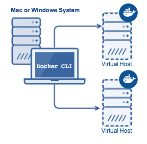
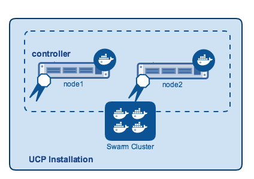
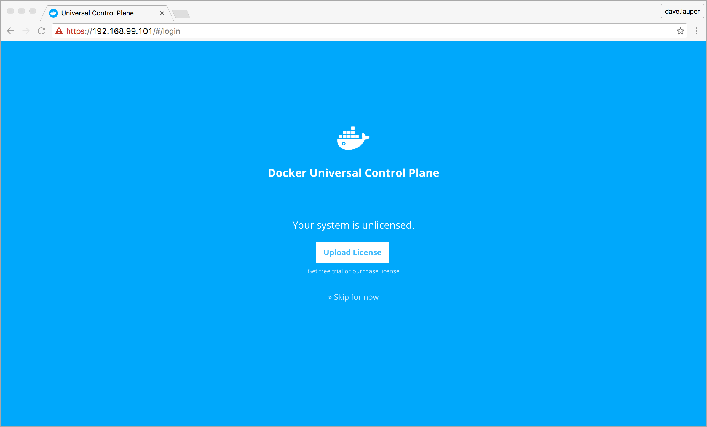
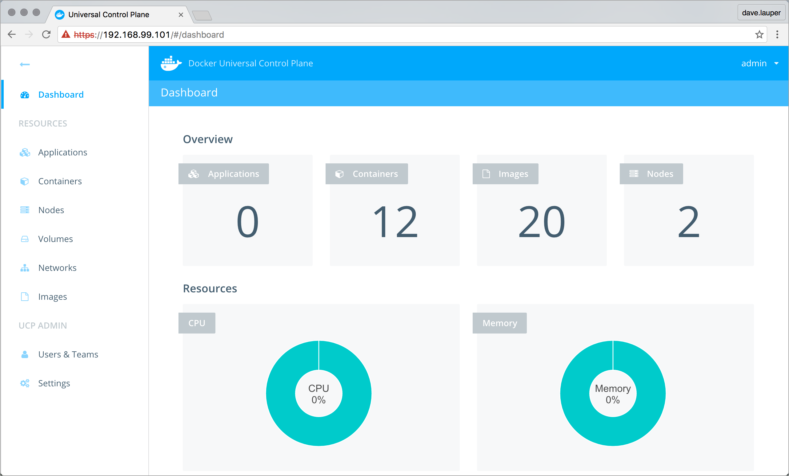
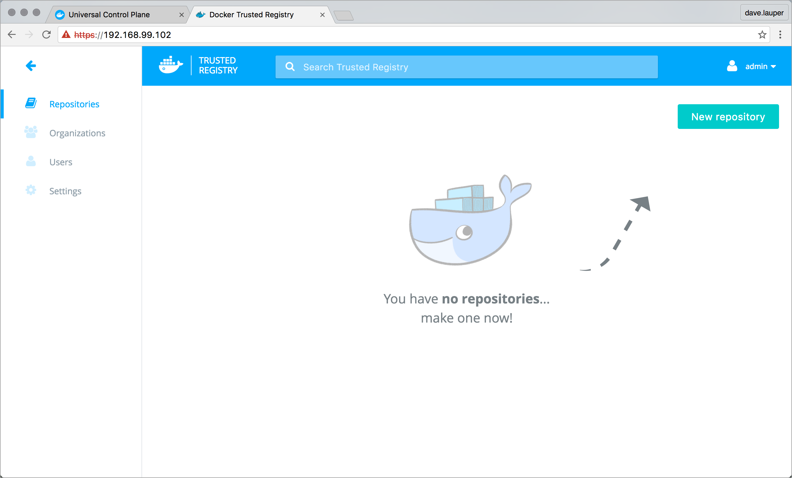

---
redirect_from:
- /ucp/evaluation-install/
- /ucp/install-sandbox/
title: Install DDC in a sandbox for evaluation
description: Learn how to get a 30-day trial of Docker Datacenter up and running.
keywords: Docker Datacenter, orchestration, trial
---

This page introduces Docker Datacenter (also known as DDC): a combination of
Docker Universal Control Plane (UCP) and Docker Trusted Registry (DTR), and
walks you through installing it on a local (non-production) host or sandbox.
Once you've installed, we also give you a guided tour so you can evaluate its
features.

The instructions here are for a sandbox installation on Mac OS X or Windows
systems. If you're an experienced Linux user, or if you want more detailed
technical information, you might want to skip this evaluation and go directly to
[Plan a production installation](installation/plan-production-install.md) and
then to [Install UCP for production](installation/install-production.md).

> **Note**: This evaluation installs using the open source software version of
Docker Engine inside of a VirtualBox VM which runs the small-footprint
`boot2docker.iso` Linux. This configuration is **not** a production
configuration.

## Introduction: About this example

In this tutorial, we use Docker's provisioning tool - Docker Machine - to
create two virtual hosts. These two hosts are VirtualBox VMs running a small
footprint Linux image called `boot2docker.iso`, with the open source version of
Docker Engine installed.



A UCP installation consists of an UCP controller and one or more hosts. We
install UCP on one host, then join the second node to UCP as a swarm member. The
two VMs create a simple swarm cluster with one controller, which by default
secures the cluster via self-signed TLS certificates.



DDC's second component is DTR, which must be installed on a host that's a member
of the UCP swarm. So next, we install DTR on that second node.

Once you've installed UCP and DTR, use this [tutorial](install-sandbox-2.md) to deploy a
container through UCP, and explore the user interface.

<!-- >**Note**: The command examples in this page were tested for a Mac OS X
environment. If you are in another, you may need to change the commands to use
the correct ones for you environment. -->

>**Note**: The command examples in this page were tested for a macOS environment.
If you are in another, you may need to adjust to use analogous commands for your environment.

## Verify the prerequisites

This example requires that you have:

* [Docker Toolbox installed](/toolbox/overview/)
(contains Docker Machine and Docker Engine)
* A free Docker ID account

## Step 1: Provision hosts with Engine

In this step, you provision two VMs for your UCP sandbox installation. One
will run UCP and one will be used to run containers, so the host specifications
will be slightly different.

In a production environment you would use enterprise-grade hosts instead
of local VMs. These nodes could be on your company's private network or
in the cloud. You would also use the Commercially Supported (CS Engine) version
of Docker Engine required by UCP.

Set up the nodes for your evaluation:

1. Open a terminal on your computer.

2.  Use Docker Machine to list any VMs in VirtualBox.

    ```none
    $ docker-machine ls

    NAME         ACTIVE   DRIVER       STATE     URL                         SWARM
    default    *        virtualbox   Running   tcp://192.168.99.100:2376
    ```

3.  Create a VM named `node1` using the following command.

    ```none
    $ docker-machine create -d virtualbox \
      --virtualbox-memory "2500" \
      --virtualbox-disk-size "5000" node1
    ```

    When you create your virtual host you specify the memory and disk size
    options. UCP requires a minimum of 3.00 GB disk space and runs best with a
    minimum of 2 GB of memory.

4.  Create a VM named `node2` using the command below.

    ```none
    $ docker-machine create -d virtualbox \
      --virtualbox-memory "2500" \
      --virtualbox-disk-size "5000" node2
    ```

5.  Use the `docker-machine ls` command to list your hosts.

    ```none
    $ docker-machine ls

    NAME      ACTIVE   DRIVER       STATE     URL                         SWARM   DOCKER    ERRORS
    default   -        virtualbox   Stopped                                       Unknown
    node1     -        virtualbox   Running   tcp://192.168.99.100:2376           v1.12.1
    node2     -        virtualbox   Running   tcp://192.168.99.101:2376           v1.12.1
    ```
    At this point, both nodes are in the `Running` state and ready for UCP installation.

## About the ucp tool

To install UCP, use the Docker CLI to pull and run the `docker/ucp`
image, which contains a bootstrapper tool designed to make UCP easier
to install than many enterprise-grade applications. The `ucp` tool runs
`docker run` commands to `install` a UCP controller or `join` a node to a UCP
controller.

The general format of these commands is `docker run --rm -it docker/ucp` with
one or more subcommands, which are discussed later in this document. For this
tutorial, we use the `-i` option for "interactive" install mode, but
you can run these commands without `-i` (unattended) in production.

Regardless of how you use the `docker/ucp` tool, the default install supplies
default options for both data volumes and the certificate authority (CA). In a
production installation you can also optionally:

* use the high availability feature
* customize the port used by the UCP web application
* customize the port used by the Swarm manager
* create your own data volumes
* use your own TLS certificates

You can learn more about these when you
[plan a production installation](installation/plan-production-install.md).

## Step 2. Install the UCP controller

In this step, you install the UCP controller on the `node1` you provisioned
earlier. A controller serves the UCP application and runs the processes that
manage an installation's Docker objects.

In a production installation, a system administrator can set up UCP's high
availability feature, which allows you to designate several nodes as controller
replicas. This way if one controller fails, a replica node is ready to take its
place.

For this sandbox installation, we don't need high availability, so a single
host for the controller works fine.

1. Open a terminal on your computer if you don't have one open already.

2. Connect the terminal environment to the `node1` you created.

   a. Use the `docker-machine env` command to get the settings.

   ```none
   $ docker-machine env node1

   export DOCKER_TLS_VERIFY="1"
   export DOCKER_HOST="tcp://192.168.99.100:2376"
   export DOCKER_CERT_PATH="/Users/ldr/.docker/machine/machines/node1"
   export DOCKER_MACHINE_NAME="node1"
   # Run this command to configure your shell:
   # eval $(docker-machine env node1)
   ```

   b. Run the `eval` command found in the final line to set your environment.

   ````
   $ eval $(docker-machine env node1)
   ````

   Running this `eval` command sends the `docker` commands in the following
   steps to the Docker Engine on `node1`.

   c. Verify that `node1` is the active environment.

   You can do this by running `docker-machine ls` and checking that there is
   an `*` (asterisk) in the `ACTIVE` field next to `node1`.

3.  Start the `ucp` tool to install interactively.

    ```none
    $ docker run --rm -it \
      -v /var/run/docker.sock:/var/run/docker.sock \
      --name ucp docker/ucp install -i \
      --swarm-port 3376 --host-address $(docker-machine ip node1)
    ```

    > **Note**: If you are on a Windows system, your shell can't
    resolve the `$(docker-machine ip node1)` variable. Instead, edit the command
    supplied to replace it with the actual IP address.

    The first time you run the `ucp` tool, the `docker run` command pulls the
    UCP bootstrapper image from Docker Cloud. The tool downloads the packages it
    needs, and verifies that your system will support a UCP installation.

4. Enter a password for UCP when prompted, and then confirm it.

    The system prompts you for Subject alternative names (SANs). In this
    sandbox, you've already provided the IP address and the `ucp` tool
    discovered this for you and shows it in the controller list.

5. Press enter to proceed using the list the `ucp` tool provided.

    UCP requires that all clients, including the Docker Engine, use a Swarm TLS
    certificate chain signed by the UCP Swarm Root CA. You can provide the
    certificate system with subject alternative names or SANs, which allow you
    to set up individual "leaf certificates."

    When it completes, the `ucp` tool prompts you to log in into the UCP web
    interface and gives you its location. You do this in the next step so
    you can install a license.

## Step 3. License your installation

In this step, you get a license, log in to the UCP web interface and install
the license. Docker allows you to run an evaluation version of UCP with a single
controller and node for up to 30 days.

[Learn how to get a trial license](installation/license.md).

In your terminal window you should have instructions on how to access the UCP
web UI. It should look like this:

```none
INFO[0056] Login as "admin"/(your admin password) to UCP at https://192.168.99.100:443
```

In your browser navigate to that IP address, and upload your trial license.



## Step 4. Join a node

In this step, you join your `node2` to the controller using the `ucp join`
command. In a production installation, you'd do this step for each node
you want to add.

1. Open a terminal on your computer if you don't already have one open.

2. Connect the terminal environment to the `node2` you provisioned earlier.

   1. Use `docker-machine env` command to get the settings command for `node2`.

   ```none
   $ docker-machine env node2

   export DOCKER_TLS_VERIFY="1"
   export DOCKER_HOST="tcp://192.168.99.101:2376"
   export DOCKER_CERT_PATH="/Users/ldr/.docker/machine/machines/node2"
   export DOCKER_MACHINE_NAME="node2"
   # Run this command to configure your shell:
   # eval $(docker-machine env node2)
   ```

   b. Run the `eval` command to set your environment.

   ```
   $ eval $(docker-machine env node2)
   ```

    Running this `eval` command sends the `docker` commands in the following
    steps to the Docker Engine on `node2`.

3.  Run the `docker/ucp join` command.

    > **Note**: If you are on a Windows system, your shell can't
    resolve the `$(docker-machine ip node2)` variable. Instead, edit the command
    supplied to replace it with the actual IP address.

    ```none
    $ docker run --rm -it \
      -v /var/run/docker.sock:/var/run/docker.sock \
      --name ucp docker/ucp join -i \
      --host-address $(docker-machine ip node2)
    ```

    The `join` command pulls several images, then prompts you for the URL of the
    UCP Server.

4. Enter the URL of the UCP server to continue.

5. Press `y` when prompted to continue and join the node to the swarm.

6. Enter the admin username and password for the UCP server when prompted.

   The installer continues and prompts you for SANs. In this sandbox, you've
   already provided the IP address and the `ucp` tool discovered this for you
   and shows it in the controller list.

7. Press `enter` to proceed without providing a SAN.

   The installation is complete when you see the message
   `Starting local swarm containers`.

8. Log in to UCP with your browser and confirm that the new node appears.

   


## Step 5: Install Docker Trusted Registry

Next, we install Docker Trusted Registry (DTR). DTR provides a secure
location to store your organization's Docker images. Images are used by UCP to
run containers that make up a service. By providing a secure connection between
DTR and UCP, you can verify that your production services contain only signed
code produced by your own organization.

1. First, make sure you know the IP addresses of both your UCP and DTR nodes.
You can find this easily by running `docker-machine ls`.

2. Run the `docker-machine env node2` command to make sure that you are passing
commands to the node on which you will install DTR.

3. Next, use the following command to install DTR on `node2`.

   ```none
   $ docker run -it --rm docker/dtr install \
     --ucp-url $(docker-machine ip node1) \
     --ucp-insecure-tls \
     --ucp-node node2 \
     --dtr-external-url $(docker-machine ip node2)
   ```

   You are prompted for the credentials of the UCP administrator.

4. Verify that DTR is running by navigating your browser to the DTR server's IP.

5. Confirm that you can log in using your UCP administrator credentials.



**Congratulations!** You now have a working installation of Docker Datacenter
running in your sandbox. You can explore on your own, or continue your
evaluation by walking through our [guided tour](install-sandbox-2.md).

## Where to go next

* [DDC guided tour](install-sandbox-2.md)
* [UCP architecture](architecture.md)
