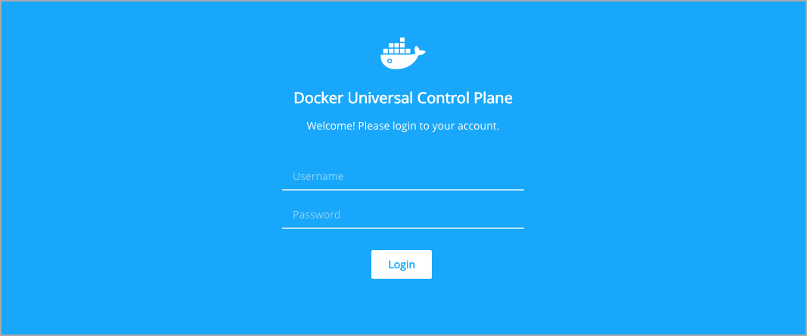
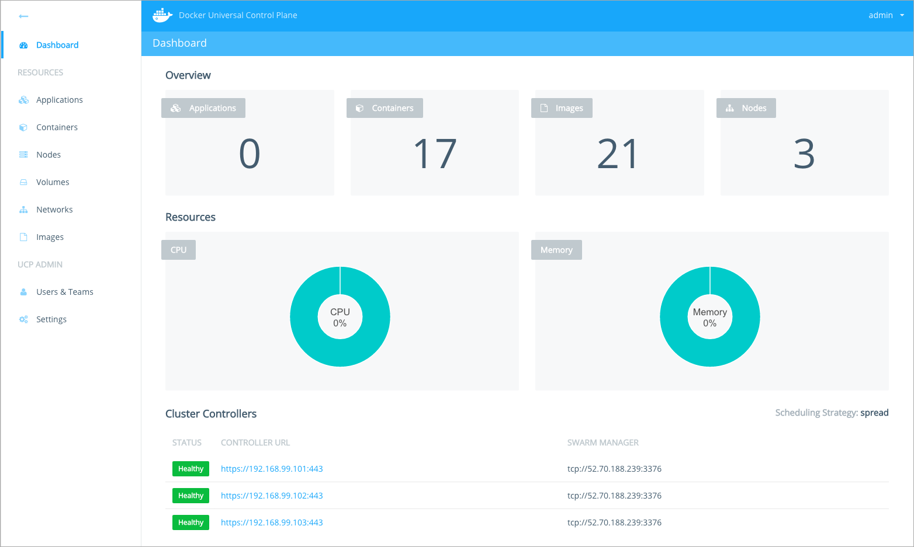
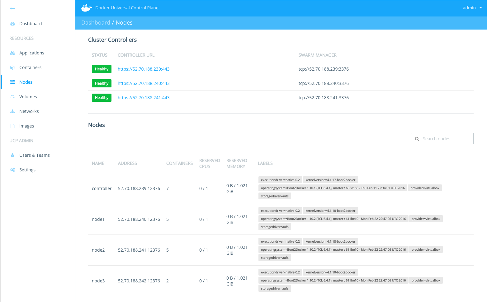

Docker Universal Control Plane (UCP) is a containerized application that can be
installed on-premises or on a cloud infrastructure.

If you're installing Docker Datacenter on Azure, [follow this guide](https://success.docker.com/?cid=ddc-on-azure).

## Step 1: Validate the system requirements

The first step in installing UCP, is ensuring your
infrastructure has all the [requirements UCP needs to run](system-requirements.md).


## Step 2: Install CS Docker on all nodes

UCP is a containerized application that requires CS Docker Engine 1.10.0 or
above to run. It is recommended to install the exact same version of the
CS Docker Engine on all nodes.

So on each host that you want to be part of the UCP cluster,
[install CS Docker Engine 1.10.0 or above](/cs-engine/install.md).
In the case where you are creating a VM template with CS Engine already
installed, make sure that `/etc/docker/key.json` is not included in the image.
You can do this by simply removing `/etc/docker/key.json`. You can then restart
Docker on each node, which will generate new `/etc/docker/key.json` files.

## Step 3: Customize named volumes

Docker UCP uses [named volumes](../architecture.md) to persist data. If you want
to customize the volume drivers and flags of these volumes, you can create the
volumes before installing UCP.

If the volumes don't exist, when installing UCP they are created with the
default volume driver and flags.


## Step 4: Customize the server certificates

The UCP cluster uses TLS to secure all communications. Two Certificate
Authorities (CA) are used for this:

* Cluster root CA: generates certificates for new nodes joining the cluster and
admin user bundles.
* Client root CA: generates non-admin user bundles.

You can customize UCP to use certificates signed by an external Certificate
Authority. These certificates are used instead of the ones generated by the
client root CA. That way you can use a certificate from a CA that your
browsers and client tools already trust.

If you want to use your own certificates:

1. Log into the host where you intend to install UCP.

2. Create a volume with the name `ucp-controller-server-certs`.

3. Add the following files to `/var/lib/docker/volumes/ucp-controller-server-certs/_data/`:

    | File     | Description                                                                       |
    |:---------|:----------------------------------------------------------------------------------|
    | ca.pem   | Your root CA certificate.                                                         |
    | cert.pem | Your signed UCP controller certificate followed by any intermediate certificates. |
    | key.pem  | Your UCP controller private key.                                                  |


## Step 5: Install the UCP controller

To install UCP you use the `docker/ucp` image. This image has commands to
install, configure, and backup UCP. To find what commands and options are
available, check the [reference documentation](../reference/install.md).

To install UCP:

1.  Log in to the machine where you want to install UCP.

2.  Use the `docker/ucp install` command to install UCP.

    In this example we run the install command interactively, so that
    the command prompts for the necessary configuration values.
    You can also use flags to pass values to the install command.

    ```none
    $ docker run --rm -it --name ucp \
      -v /var/run/docker.sock:/var/run/docker.sock \
      docker/ucp install -i \
      --host-address <$UCP_PUBLIC_IP>
    ```

    Where:

    * i, specify to run the install command interactively,
    * host-address, is the public IP where users or a load balancer can access
    UCP,
    * Also, include the `--external-server-cert` flag if you're using server
    certificates signed by an external CA.

    When installing Docker UCP, overlay networking is automatically configured
    for you. If you are running Docker CS Engine 1.10, or have custom
    configurations on your Docker CS Engine, you need to restart the Docker
    daemon at this point.

3.  Check that the UCP web application is running.

    In your browser, navigate to the address where you've installed UCP.

    If you're not using an external CA, your browser warns that UCP is
    an unsafe site. This happens because you're accessing UCP using HTTPS
    but the certificates used by UCP are not trusted by your browser.

    

## Step 6: License your installation

Now that your UCP controller is installed, you need to license it.
[Learn how to license your installation](license.md).

## Step 7: Backup the controller CAs

For a highly available installation, you can add more controller nodes to
the UCP cluster. The controller nodes are replicas of each other.

For this, you need to make the CAs on each controller node use the same
root certificates and keys.

To create a backup of the CAs used on the controller node:

1. Log into the controller node using ssh.
2.  Run the docker/ucp backup command.

    ```none
    $ docker run --rm -i --name ucp \
        -v /var/run/docker.sock:/var/run/docker.sock \
        docker/ucp backup \
        --interactive \
        --root-ca-only \
        --passphrase "secret" > /tmp/backup.tar
    ```

[Learn more about the backup command](../high-availability/replicate-cas.md).

## Step 8: Add controller replicas to the UCP cluster

This step is optional.

For a highly available installation, you can add more controller nodes to
the UCP cluster. For that, use the `docker/ucp join --replica` command.
[Learn more about the join command](../reference/join.md).

For each node that you want to install as a controller replica:

1. Log into that node using ssh.

2. Make sure you transfer the backup.tar from the previous step to this node.

3.  Use the join command with the replica option:

    In this example wwe run the join command interactively, so that
    the command prompts for the necessary configuration values. We also
    pass the backup.tar file from the previous step to ensure
    that the CAs are replicated to the new controller node.

    ```none
    $ docker run --rm -it --name ucp \
      -v /var/run/docker.sock:/var/run/docker.sock \
      -v $BACKUP_PATH/backup.tar:/backup.tar \
      docker/ucp join \
      --interactive \
      --replica \
      --passphrase "secret"
    ```

4. Since UCP configures your Docker Engine for multi-host networking, it might
prompt you to restart the Docker daemon. To make the installation faster, join
all replica nodes first, and only then restart the Docker daemon on those nodes.

5. Repeat steps 1 and 2 on the other nodes you want to set up as replicas.
Make sure you set up 3, 5, or 7 controllers.


6. Check the cluster state.

    The Dashboard page of UCP should list all your controller nodes.

    

## Step 9: Ensure controllers know about each other

Internally, each controller node has a key-value store that keeps track of
the controllers that are part of the cluster.
When you installed and joined replica controllers, the Docker daemon on that
host was configured to use that key-value store.

To make the cluster fault-tolerant and able to recover faster with less
downtime, you need to configure the Docker daemon on each controller node to
know about the key-value store that is running on the other nodes.

For each controller node:

1. Log into that node using ssh.

2.  Run the engine-discovery command.

    ```none
    $ docker run --rm -it \
        --name ucp \
        -v /var/run/docker.sock:/var/run/docker.sock \
        docker/ucp engine-discovery \
        --update
    ```

## Step 10: Add more nodes to the UCP cluster

Now you can add additional nodes to your UCP cluster. These are the nodes that
will be running your containers.

For each node that you want to add to your UCP cluster:

1. Log into that node.

2.  Use the join command, to join the node to the cluster:

    ```none
    $ docker run --rm -it --name ucp \
      -v /var/run/docker.sock:/var/run/docker.sock \
      docker/ucp join -i
    ```

3. Repeat steps 1 and 2 on the other nodes you want to add to your UCP cluster.

4. Check the cluster state.

    The Dashboard page of UCP should list all your controller nodes.

    

## Step 11. Download a client certificate bundle

To validate that your cluster is correctly configured, try accessing
the cluster with the Docker CLI client. For this, you need to get a client
certificate bundle.
[Learn more about user bundles](../access-ucp/cli-based-access.md).


## Where to go next

* [Deploy an app from the UI](../applications/deploy-app-ui.md)
* [Monitor a UCP cluster](../monitor/monitor-ucp.md)
