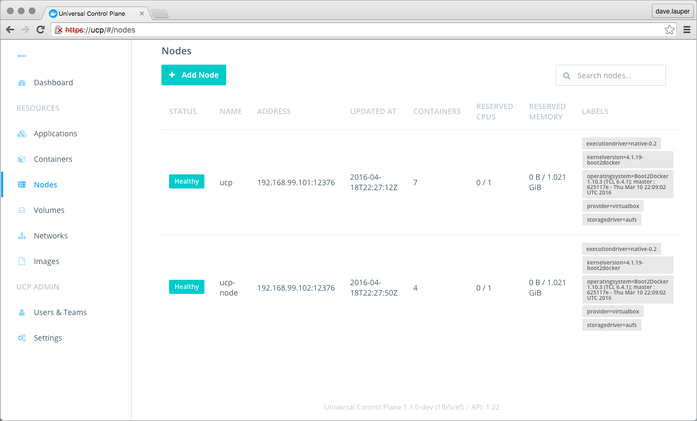

This article gives you an overview of how to monitor your Docker UCP
cluster and how to troubleshoot if something goes wrong.


## Check the cluster status from the UI

To monitor your UCP cluster, the first thing to check is the **Nodes**
screen on the UCP web app.



In the nodes screen you can see if all the nodes in the cluster are healthy, or
if there is any problem.

You can also check the state of individual UCP containers by navigating to the
**Containers** page. By default the Containers screen doesn't display system
containers. On the filter dropdown choose **Show all containers** to see all
the UCP components.


You can click on a container to see more details like configurations and logs.


## Check the cluster status from the CLI

You can also monitor the status of a UCP cluster, using the Docker CLI client.

1.  Get a client certificate bundle.

    When using the Docker CLI client you need to authenticate using client
    certificates.
    [Learn how to use client certificates](../access-ucp/cli-based-access.md).

    If your client certificate bundle is for a non-admin user, you don't have
    permissions to execute all docker commands, or see all information about
    the cluster.
2.  Use the `docker info` command to check the cluster status.

    ```bash
    $ docker info

    Containers: 11
    Nodes: 2
     ucp: 192.168.99.100:12376
      └ Status: Healthy
     ucp-node: 192.168.99.101:12376
      └ Status: Healthy
    Cluster Managers: 1
     192.168.99.104: Healthy
      └ Orca Controller: https://192.168.99.100:443
      └ Swarm Manager: tcp://192.168.99.100:3376
      └ KV: etcd://192.168.99.100:12379
    ```
3.  Check the container logs

    With an admin user certificate bundle, you can run docker commands directly
    on the Docker Engine or Swarm Manager of a node. In this example, we are
    connecting directly to the Docker Engine running on the UCP controller, and
    requesting the logs of the ucp-kv container.

    ```bash
    $ docker -H tcp://192.168.99.101:12376 logs ucp-kv

    2016-04-18 22:40:51.553912 I | etcdserver: start to snapshot (applied: 40004, lastsnap: 30003)
    2016-04-18 22:40:51.561682 I | etcdserver: saved snapshot at index 40004
    2016-04-18 22:40:51.561927 I | etcdserver: compacted raft log at 35004
    ```

## Where to go next

* [Troubleshoot your cluster](troubleshoot-ucp.md)
* [Get support](../support.md)