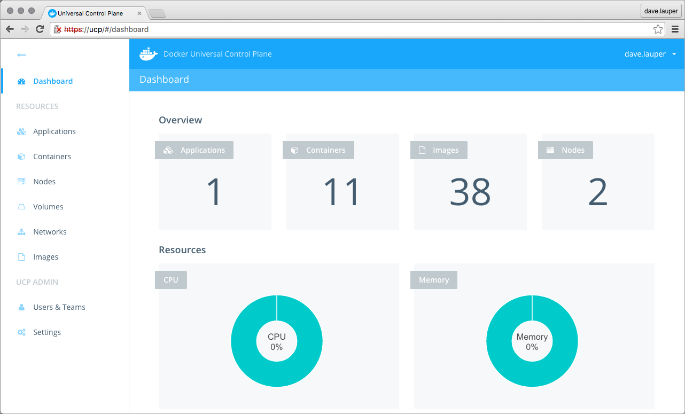
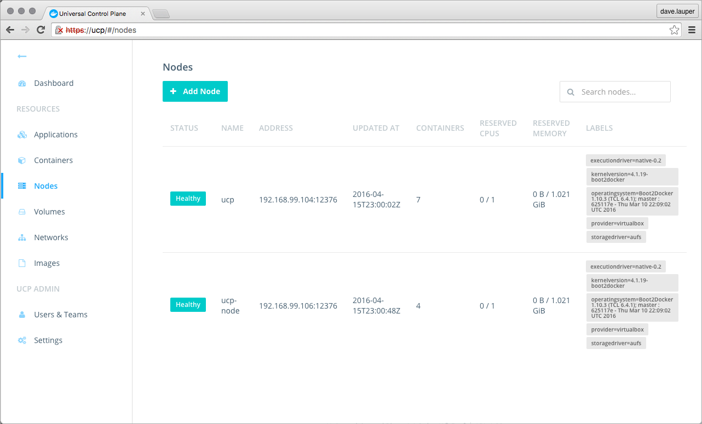

Docker Universal Control Plane (UCP) is the enterprise-grade cluster management
solution from Docker. You install it behind your firewall, and it helps you
manage your whole cluster from a single place.



## Centralized cluster management

Docker UCP can be installed on-premises, or on a virtual private cloud.
And with it, you can manage thousands of nodes as if they were a single one.
You can monitor and manage your cluster using a graphical UI.



Since UCP exposes the standard Docker API, you can continue using the tools
you already know, to manage a whole cluster.

As an example, you can use the `docker info` command to check the
status of the cluster:

```bash
$ docker info

Containers: 30
Images: 24
Server Version: swarm/1.1.3
Role: primary
Strategy: spread
Filters: health, port, dependency, affinity, constraint
Nodes: 2
  ucp: 192.168.99.103:12376
    └ Status: Healthy
    └ Containers: 20
  ucp-replica: 192.168.99.102:12376
    └ Status: Healthy
    └ Containers: 10
```

## Deploy, manage, and monitor

With Docker UCP you can manage the nodes of your infrastructure. You can also
manage apps, containers, networks, images, and volumes, in a transparent way.

## Built-in security and access control

Docker UCP has its own built-in authentication mechanism, and supports LDAP
and Active Directory. It also supports Role Based Access Control (RBAC).
This ensures that only authorized users can access and make changes to cluster.


Docker UCP also integrates with Docker Trusted Registry and Docker Content
Trust. This allows you to keep your images stored behind your firewall,
where they are safe. It also allows you to sign those images to ensure that
the images you deploy have not been altered in any way.

## Where to go next

 * [Get started with UCP](install-sandbox.md)
 * [UCP architecture](architecture.md)