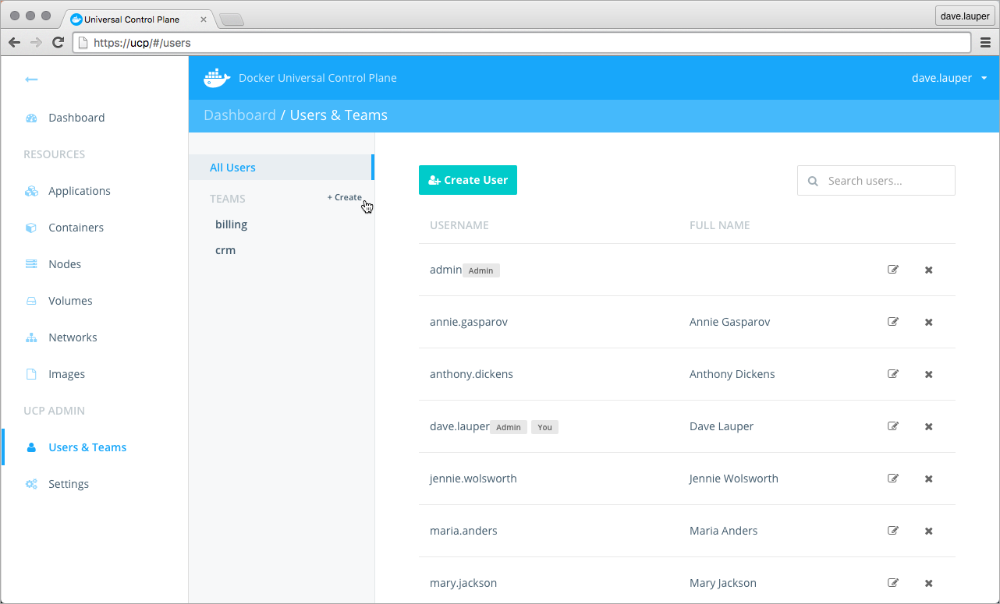
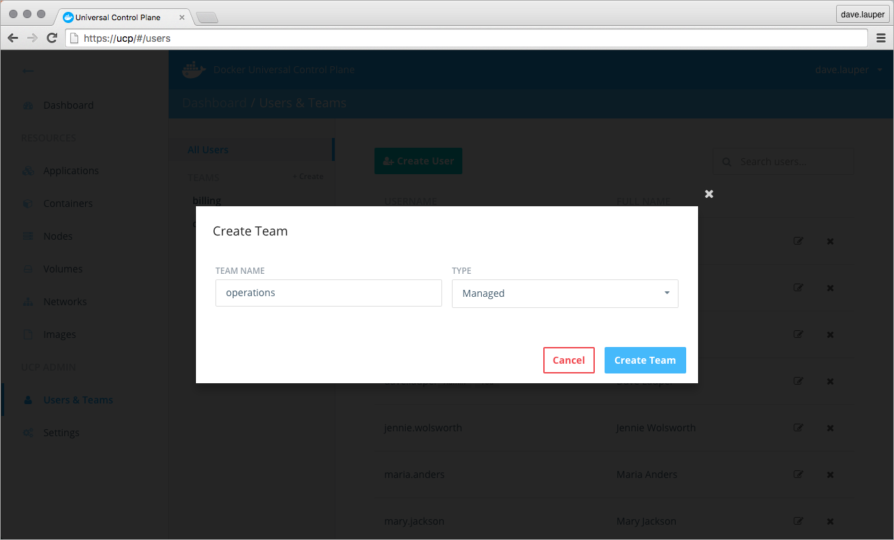
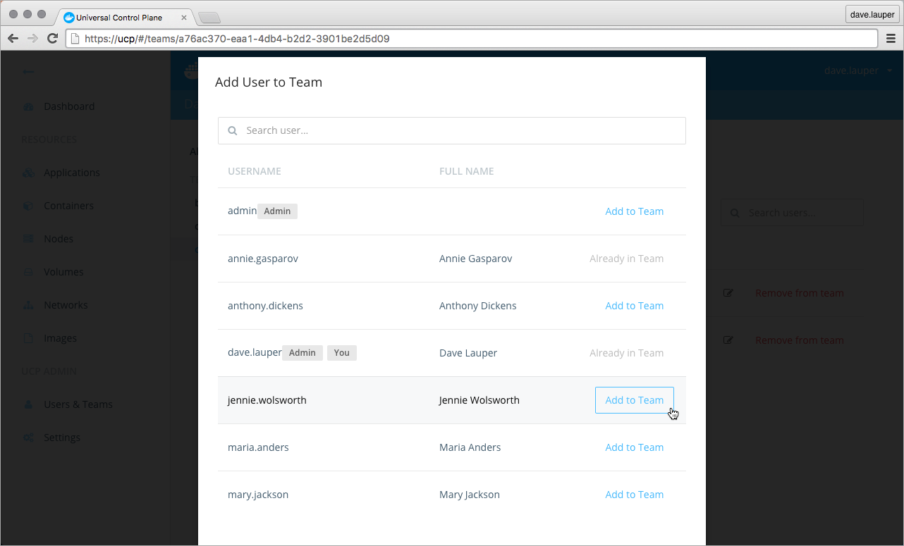
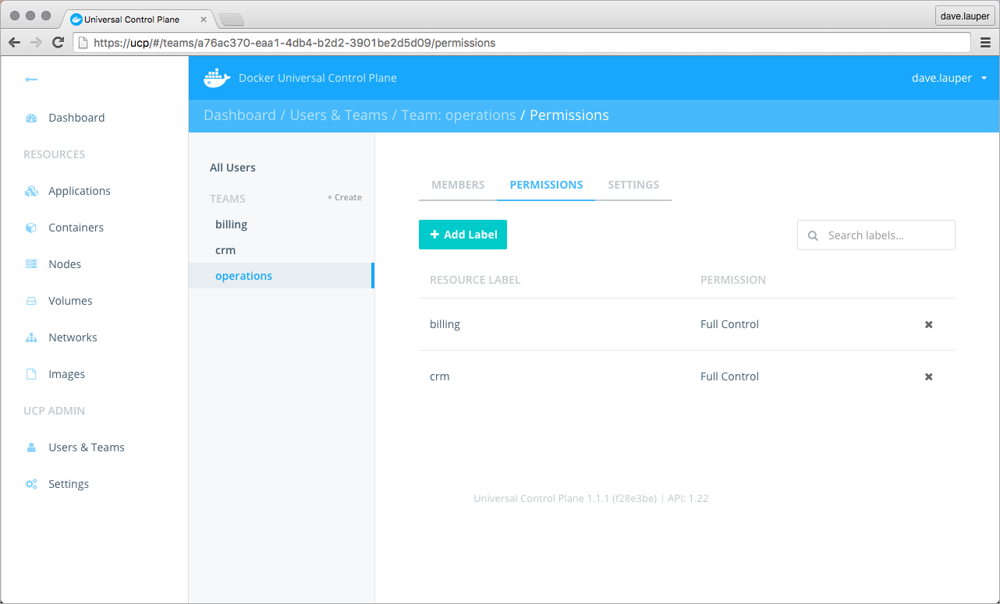

You can extend the user's default permissions by granting them fine-grain
permissions over containers. You do this by adding the user to a team.
A team defines the permissions users have for containers that have the label
`com.docker.ucp.access.label` applied to them.

To create a new team, go to the **UCP web UI**, and navigate to the
**Users & Teams** page.

Click the **Create** button to create a new team.

Give a name to the team, and choose if the team is managed by UCP, or
discovered from an LDAP service:

* Managed: You manage the team and manually define the users that are part
of the team.
* Discovered: When integrating with an LDAP service, you can map a team to
an LDAP group. When a user is added to the LDAP group, it is automatically added
to the UCP team.

## Add users to a team

If you've created a managed team, you can now add and remove users from the
team.
Navigate to the **Members** tab, and click the **Add User to Team** button.
Then choose the list of users that you want to add to the team.

If you've created a discovered team, users are automatically added and removed
from the team the next time UCP synchronizes with the LDAP server.

## Manage team permissions

To manage the permissions of the team, click the **Permissions** tab.
Here you can specify a list of labels and the permission level users will have
for containers with those labels.

In the example above, members of the 'Operations' team have permissions to
create and edit containers that have the labels
`com.docker.ucp.access.label=crm` or `com.docker.ucp.access.label=billing`.

There are four permission levels available:

| Team permission level | Description                                                                                                                                          |
|:----------------------|:-----------------------------------------------------------------------------------------------------------------------------------------------------|
| `No Access`           | The user can't view containers with this label.                                                                                                      |
| `View Only`           | The user can view but can't create containers with this label.                                                                                       |
| `Restricted Control`  | The user can view and create containers with this label. The user can't run `docker exec`, or containers that require privileged access to the host. |
| `Full Control`        | The user can view and create containers with this label, without any restriction.                                                                    |

## Where to go next

* [UCP permission levels](permission-levels.md)