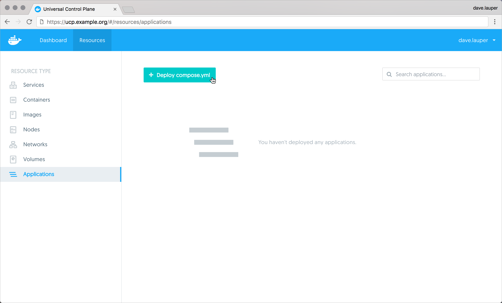
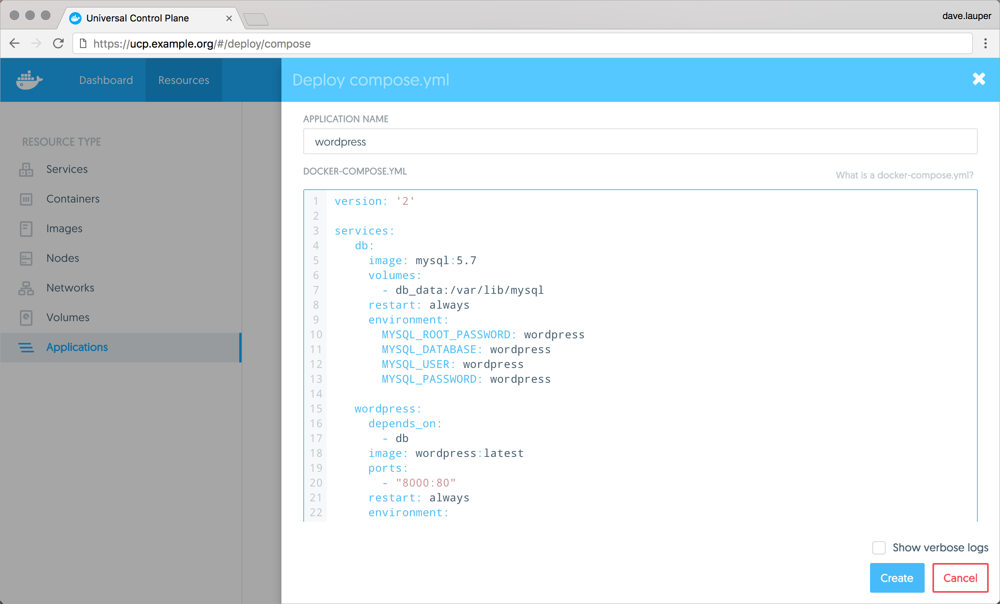
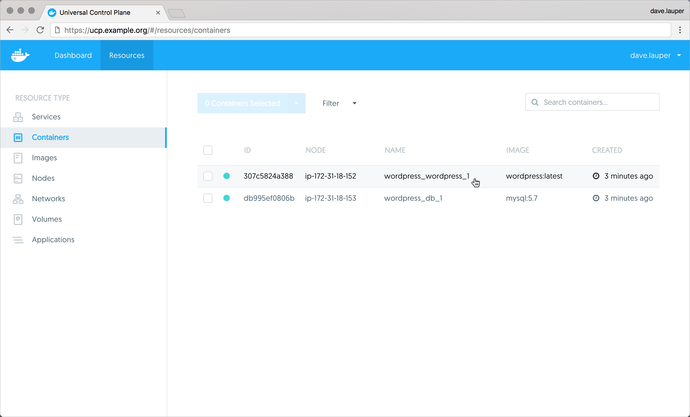
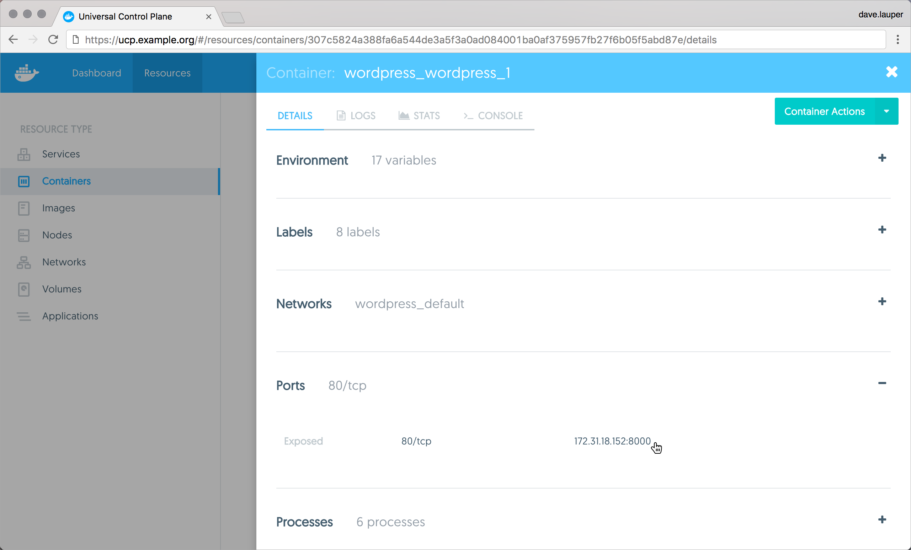
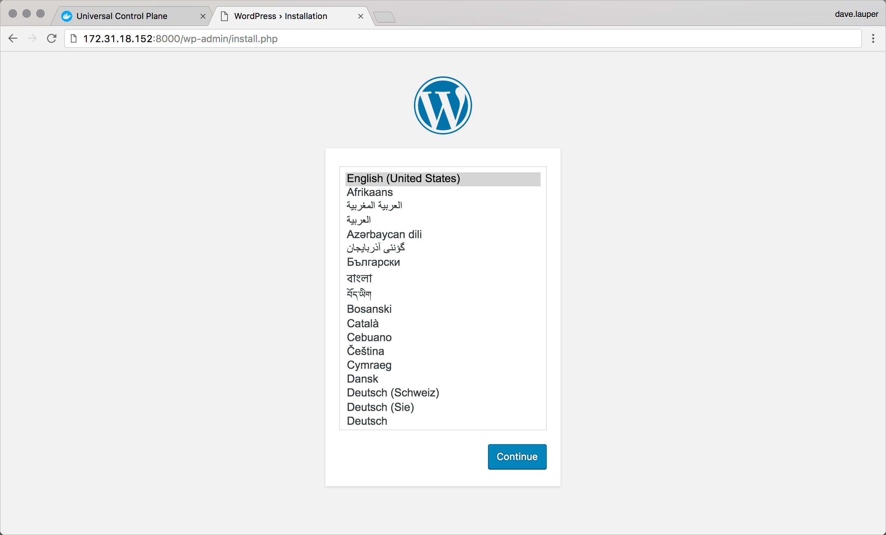
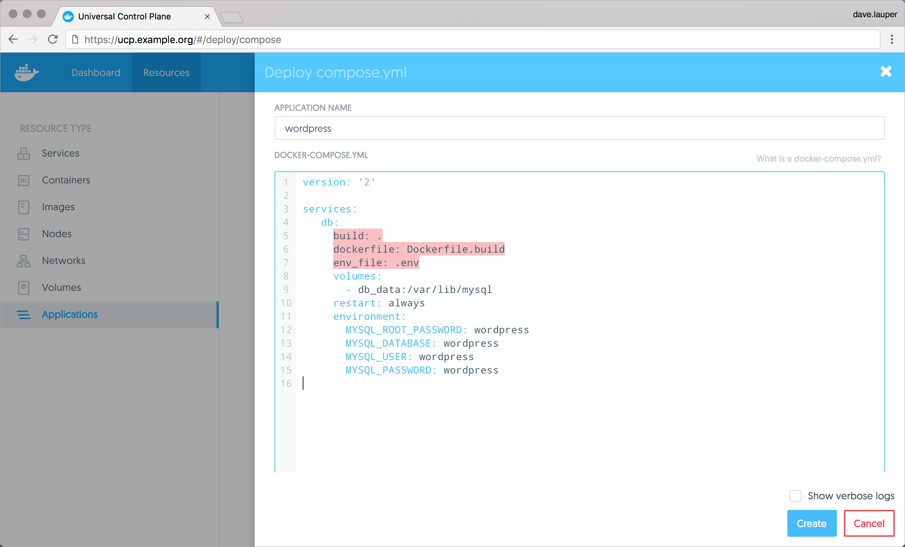

With Docker Universal Control Plane you can deploy applications from the
UI using `docker-compose.yml` files. In this example, we're going to deploy a
WordPress application.

## Deploy WordPress

In your browser, **log in** to UCP, and navigate to the **Applications** page.
There, click the **Deploy compose.yml** button, to deploy a new application.

{: .with-border}

The WordPress application we're going to deploy is composed of two services:

* wordpress: The service that runs Apache, PHP, and WordPress.
* db: A MariaDB database used for data persistence.

```none
version: '2'

services:
   db:
     image: mysql:5.7
     volumes:
       - db_data:/var/lib/mysql
     restart: always
     environment:
       MYSQL_ROOT_PASSWORD: wordpress
       MYSQL_DATABASE: wordpress
       MYSQL_USER: wordpress
       MYSQL_PASSWORD: wordpress

   wordpress:
     depends_on:
       - db
     image: wordpress:latest
     ports:
       - "8000:80"
     restart: always
     environment:
       WORDPRESS_DB_HOST: db:3306
       WORDPRESS_DB_PASSWORD: wordpress
volumes:
    db_data:
```

Name the application 'wordpress', and paste the docker-compose.yml definition.
You can also upload a docker-compose.yml file from your machine, by clicking on
the 'Upload an existing docker-compose.yml' link.

{: .with-border}

Click the **Create** button, to create the WordPress application.

Once UCP deploys the WordPress application, you can
**click on the wordpress_wordpress_1** container, to see its details.

{: .with-border}

In the container details page, search for the **Ports** the container is
exposing.

{: .with-border}

In this example, WordPress can be accessed at `172.31.18.152:8000`.
Navigate to this address in your browser, to start using the WordPress app you
just deployed.

{: .with-border}


## Limitations

There are some limitations when deploying docker-compose.yml applications from
the UI. You can't reference any external files, so the following Docker
Compose keywords are not supported:

* build
* dockerfile
* env_file

{: .with-border}

To overcome these limitations, you can
[deploy your apps from the CLI](deploy-app-cli.md).

Also, UCP doesn't store the compose file used to deploy the application. You can
use your version control system to persist that file.

## Where to go next

* [Deploy an app from the CLI](deploy-app-cli.md)
