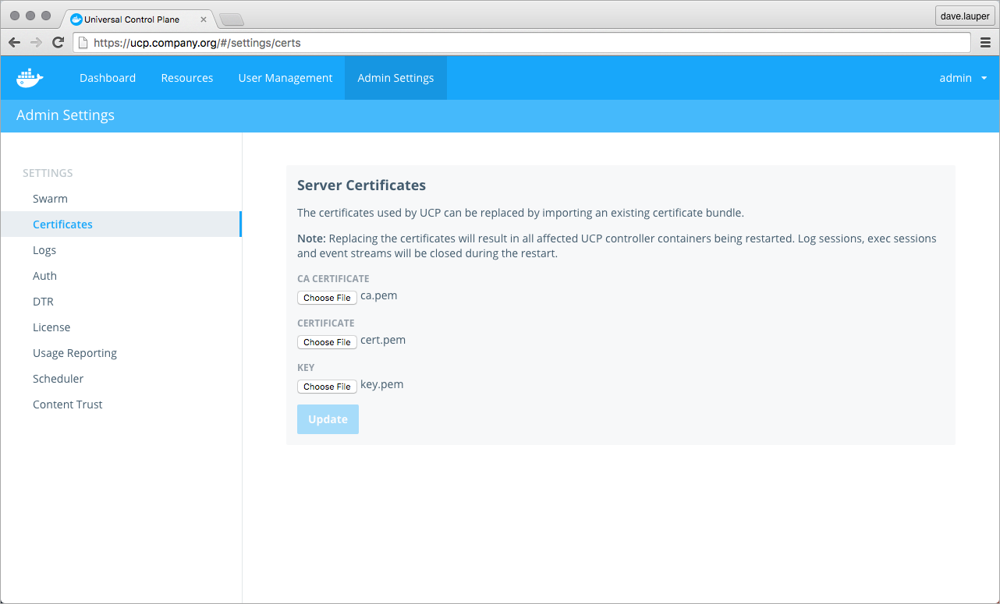
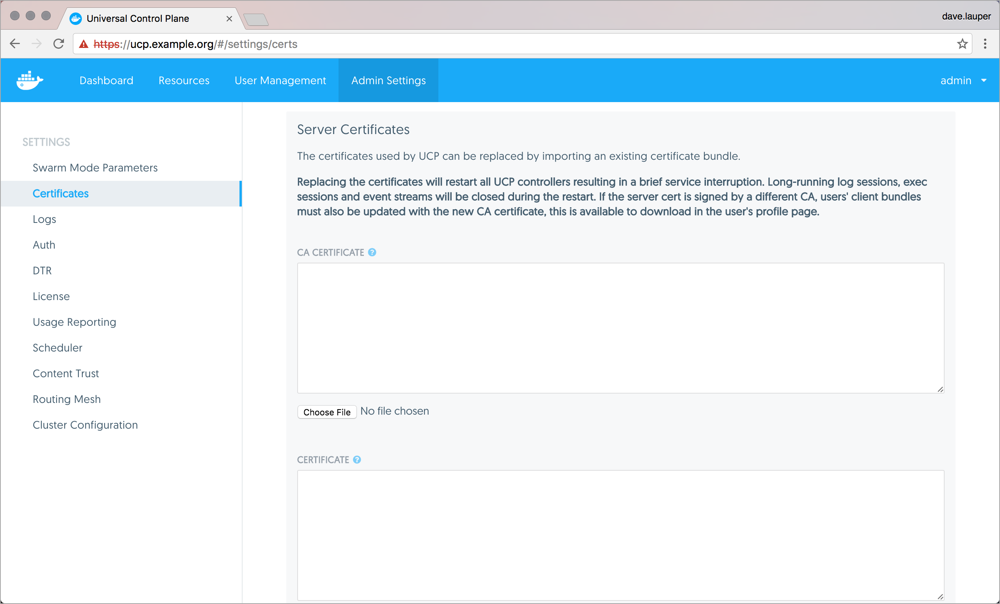

 ---
description: Learn how to configure Docker Universal Control Plane to use your own
  certificates.
keywords: Universal Control Plane, UCP, certificate, authentication, tls
title: Use externally-signed certificates
---

All UCP services are exposed using HTTPS, to ensure all communications between
clients and UCP are encrypted. By default this is done using self-signed TLS
certificates that are not trusted by client tools like web browsers. So when
you try to access UCP, your browser will warn that it doesn't trust UCP or that
UCP has an invalid certificate.



The same happens with other client tools.

```none
$ curl https://ucp.example.org

SSL certificate problem: Invalid certificate chain
```

You can configure UCP to use your own TLS certificates, so that it is
automatically trusted by your browser and client tools.

To ensure minimal impact to your business, you should plan for this change to
happen outside business peak hours. Your applications will continue running
normally, but existing UCP client certificates will become invalid, so users
need to download new ones to [access UCP from the CLI](../access-ucp/cli-based-access.md).

## Customize the UCP TLS certificates

To configure UCP to use your own TLS certificates and keys, go to the
**UCP web UI**, navigate to the **Admin Settings** page,
and click **Certificates**.



Upload your certificates and keys:

* A `ca.pem` file with the root CA public certificate.
* A `cert.pem` file with the TLS certificate for your domain and any intermediate public
certificates, in this order.
* A `key.pem` file with TLS private key. Make sure it is not encrypted with a password.
Encrypted keys should have `ENCRYPTED` in the first line.

Finally, click **Update** for the changes to take effect.

After replacing the TLS certificates your users can't authenticate
with their old client certificate bundles. Ask your users to go to the UCP
web UI and [get new client certificate bundles](../access-ucp/cli-based-access.md).

If you deployed Docker Trusted Registry, you also need to reconfigure it
to trust the new UCP TLS certificates.
[Learn how to configure DTR](/datacenter/dtr/2.1/reference/cli/reconfigure.md).

## Where to go next

* [Access UCP from the CLI](../access-ucp/cli-based-access.md)
