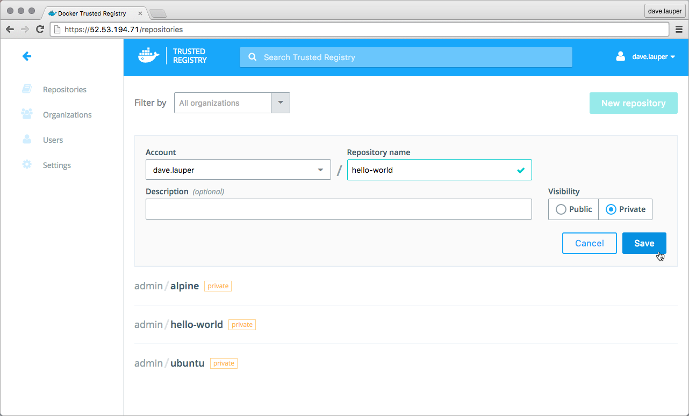
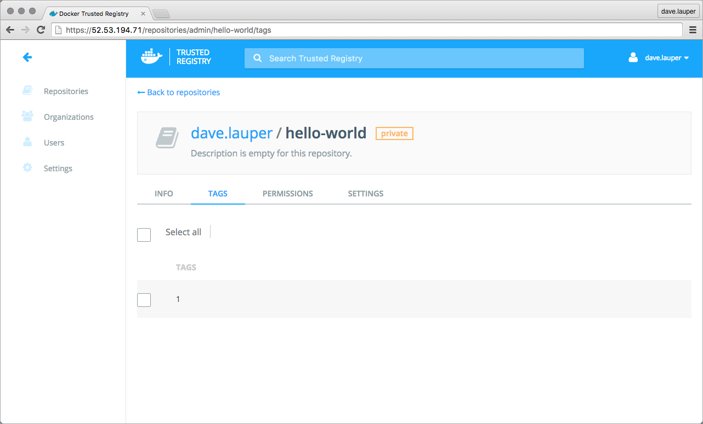

Once you deploy Docker Trusted Registry (DTR), you can use it to store your Docker
images and deploy services to UCP using those images.
[Learn how deploy DTR](/datacenter/dtr/2.1/guides/install/index.md).

Docker UCP integrates out of the box with Docker Trusted Registry (DTR).
This means that you can deploy services from the UCP web UI, using Docker
images that are stored in DTR. You can also use a
[UCP client bundle](../access-ucp/cli-based-access.md) to do the same from the
CLI.

If you've configured DTR to use TLS certificates issued by a globally-trusted
certificate authority you can skip this since all clients will automatically
trust the TLS certificates used by DTR.

If you're using the DTR default configurations or configured DTR to use
self-signed certificates, you need to configure all hosts that want to push
or pull Docker images from DTR. This includes:

* All UCP nodes
* Your local computer or any other that wants to push or pull Docker images from DTR

If your host is not configured to trust the DTR TLS certificates, you see an
error like:

```none
docker login dtr.example.org

x509: certificate signed by unknown authority
```

## 1. Configure your local computer

If you want to use your local computer to interact with DTR, you need to
configure it to trust the DTR TLS certificates. This depends on the operating
system:

* For macOS:

  In your browser navigate to `https://<dtr-url>/ca` to download the TLS
  certificate used by DTR. Then
  [add that certificate to the macOS trust store](https://support.apple.com/kb/PH18677?locale=en_US).

* For Windows:

  In your browser navigate to `https://<dtr-url>/ca` to download the TLS
  certificate used by DTR. Then
  [add that certificate to the Windows trust store](https://technet.microsoft.com/en-us/library/cc754841(v=ws.11).aspx).

* For Ubuntu:

  ```bash
  # Download the DTR CA certificate
  $ sudo curl -k https://<dtr-url>/ca -o /usr/local/share/ca-certificates/<dtr-domain-name>.crt

  # Refresh the list of certificates to trust
  $ sudo update-ca-certificates

  # Restart the Docker daemon
  $ sudo service docker restart
  ```

* For CentOS or RHEL:

  ```bash
  # Download the DTR CA certificate
  $ sudo curl -k https://<dtr-url>/ca -o /etc/pki/ca-trust/source/anchors/<dtr-domain-name>.crt

  # Refresh the list of certificates to trust
  $ sudo update-ca-trust

  # Restart the Docker daemon
  $ sudo /bin/systemctl restart docker.service
  ```

## 2. Test your local setup

The best way to confirm that your computer is correctly configured, is by
trying to pull and push images from your local Docker installation to DTR.

1.  Create a test repository on DTR.

    Navigate to the **DTR web UI**, and create a new **hello-world** repository
    so that you can push and pull images. Set it as **private**, and save
    the changes.

    

2.  Pull the `hello-world` image from Docker Store, re-tag it, and push it to the
DTR repository you created.

    ```none
    # Pull hello-world from Docker Store
    docker pull hello-world:latest

    # Re-tag it
    docker tag hello-world:latest <dtr-domain>/<user>/hello-world:latest

    # Log into DTR
    docker login <dtr-domain>

    # Push your image to DTR
    docker push <dtr-domain>/<user>/hello-world:latest
    ```

3.  Validate that your image is now stored in DTR.

    When successfully pushing the image you should see a result like:

    ```none
    The push refers to a repository [dtr/username/hello-world]
    5f70bf18a086: Pushed
    33e7801ac047: Pushed
    1: digest: sha256:7d9e482c0cc9e68c7f07bf76e0aafcb1869d32446547909200db990e7bc5461a size: 1930
    ```

    You can also check that the tag exists on the DTR web UI.

    


## 3. Configure UCP Docker Engines

You also need to configure the Docker Engine on every UCP node to trust the
DTR TLS certificates. This allows you do deploy services to UCP using images
that are stored in DTR.

For each UCP node:

1.  Log into the node as an administrator, using ssh
2.  Configure the system to trust the DTR TLS certificates, following the same
steps as you used to configure your local computer.


## Where to go next

* [use your own externally-signed TLS certificates](index.md#customize-the-ucp-tls-certificates)
