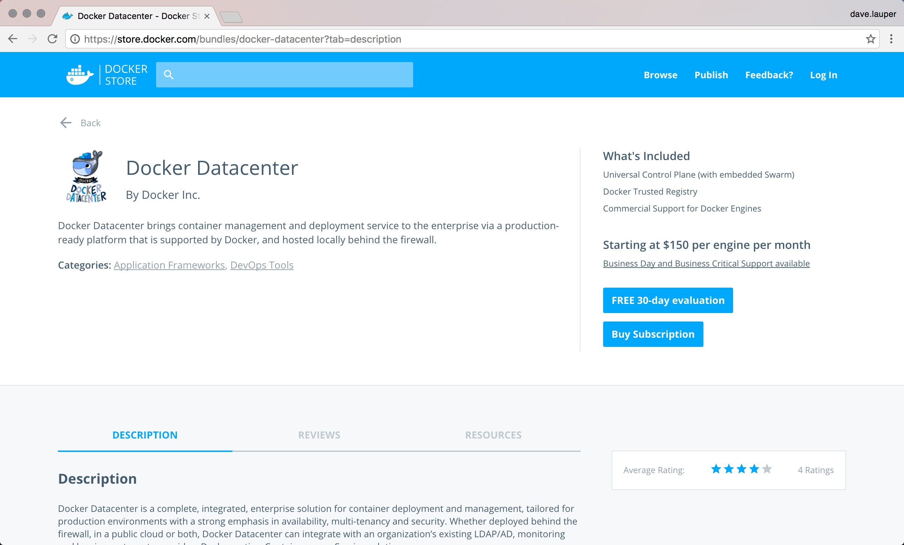
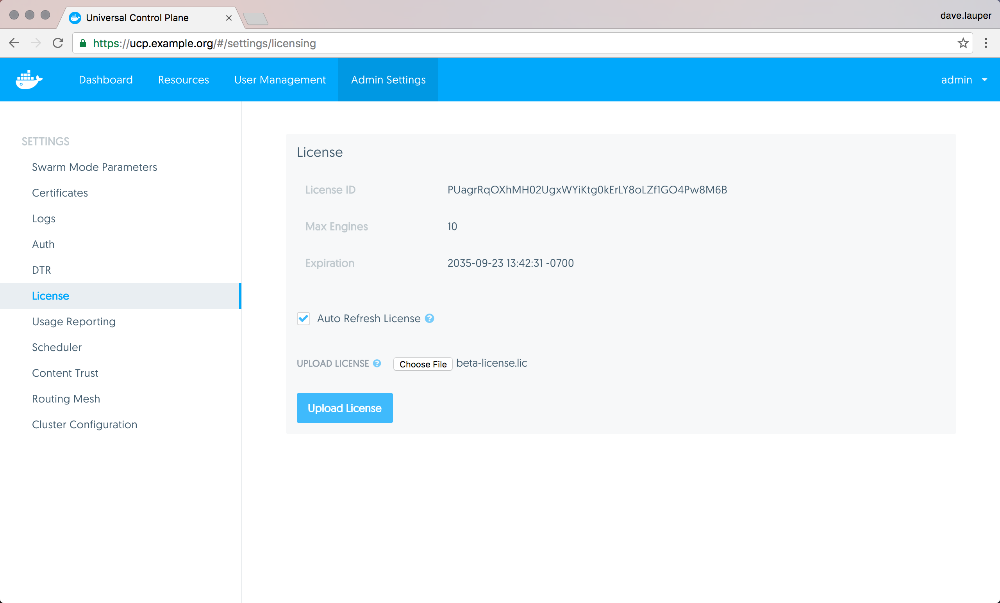

After installing Docker Universal Control Plane, you need to license your
installation. Here's how to do it.

## Download your license

Go to [Docker Store](https://store.docker.com/bundles/docker-datacenter) and
download your UCP license or get a free trial license.

{: .with-border}

## License your installation

Once you've downloaded the license file, you can apply it to your UCP
installation. Navigate to the **UCP web UI**, and then go to the **Settings
page**.

On the **License** page you can upload the new license.

{: .with-border}

Click **Upload License** for the changes to take effect.

## Where to go next

* [Install UCP](index.md)
* [Install UCP offline](install-offline.md)
