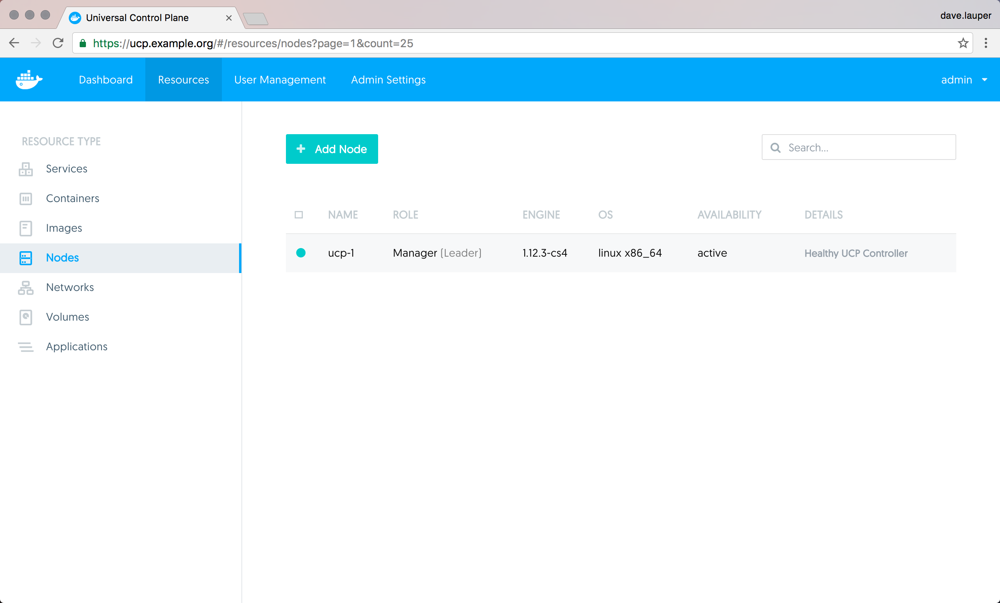
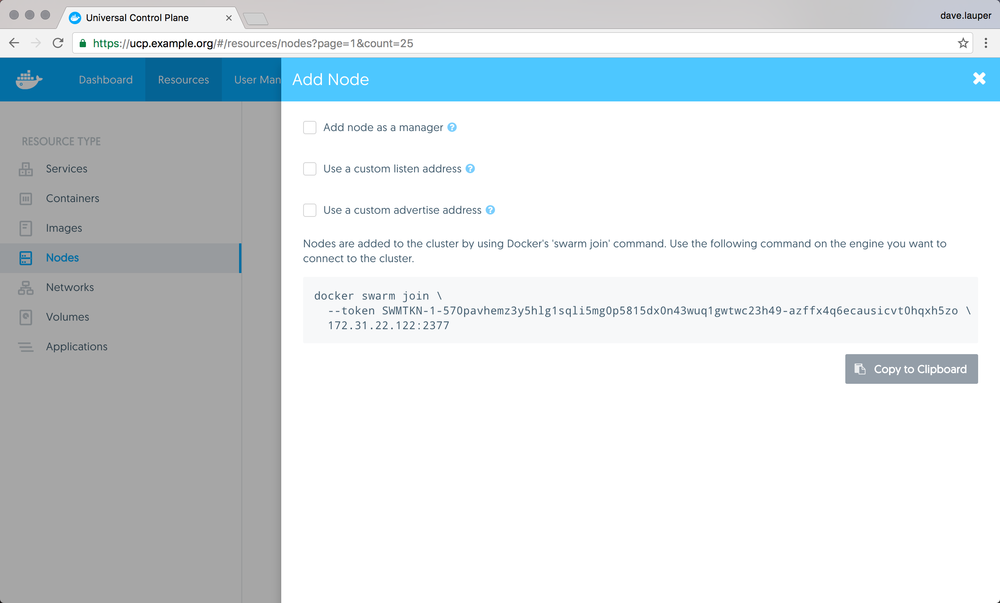
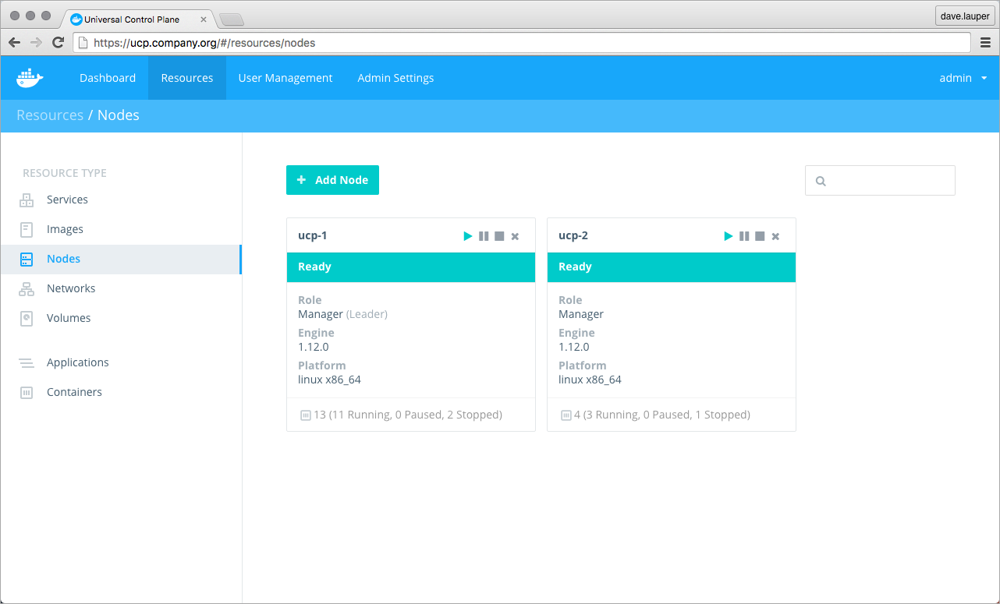
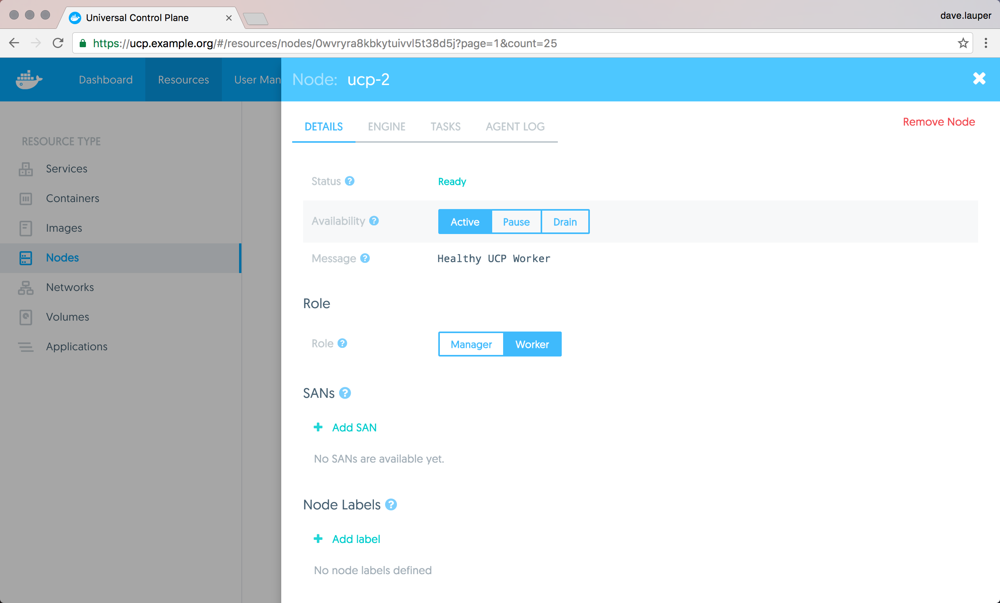

Docker UCP is designed for scaling horizontally as your applications grow in
size and usage. You can add or remove nodes from the UCP cluster to make it
scale to your needs.

Since UCP leverages the clustering functionality provided by Docker Engine,
you use the [docker swarm join](/engine/swarm/swarm-tutorial/add-nodes.md)
command to add more nodes to your cluster. When joining new nodes, the UCP
services automatically start running in that node.

When joining a node a a cluster you can specify its role: manager or worker.

* **Manager nodes**

    Manager nodes are responsible for cluster management functionality and
    dispatching tasks to worker nodes. Having multiple manager nodes allows
    your cluster to be highly-available and tolerate node failures.

    Manager nodes also run all UCP components in a replicated way, so by adding
    additional manager nodes you're also making UCP highly available.
    [Learn more about the UCP architecture.](../architecture.md)

* **Worker nodes**

    Worker nodes receive and execute your services and applications. Having
    multiple worker nodes allows you to scale the computing capacity of your
    cluster.

    When deploying Docker Trusted Registry in your cluster, you deploy it to a
    worker node.

## Join nodes to the cluster

To add join nodes to the cluster, go to the **UCP web UI**, navigate to
the **Resources** page, and go to the **Nodes** section.

{: .with-border}

Click the **Add Node button** to add a new node.

{: .with-border}

Check the 'Add node as a manager' option if you want to add the node as manager.
Also, set the 'Use a custom listen address' option to specify the IP of the
host to be joined to the cluster.

Then you can copy the command displayed, use ssh to **log into the host** that
you want to join to the cluster, and **run the command** on that host.

{: .with-border}

After you run the join command in the node, the node starts being displayed
in UCP.

## Pause, drain, and remove nodes

Once a node is part of the cluster you can change its role making a manager
node into a worker and vice versa. You can also configure the node availability
so that it is:

* Active: the node can receive and execute tasks.
* Paused: the node continues running existing tasks, but doesn't receive new ones.
* Drained: the node can't receive new tasks. Existing tasks are stopped and
replica tasks are launched in active nodes.

{: .with-border}

If you're load-balancing user requests to UCP across multiple manager nodes,
when demoting those nodes into workers, don't forget to remove them from your
load-balancing pool.

## Where to go next

* [Monitor your cluster](../monitor/index.md)
