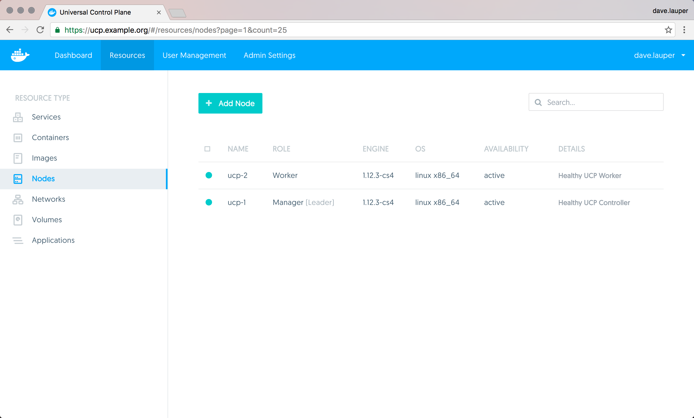
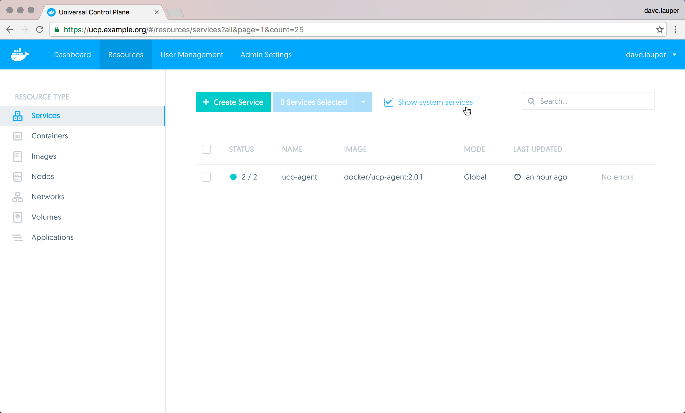
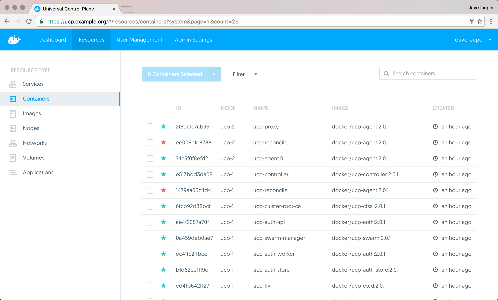

This article gives you an overview of how to monitor your Docker UCP.

## Check the cluster status from the UI

To monitor your UCP cluster, the first thing to check is the **Nodes**
screen on the UCP web app.

{: .with-border}

In the nodes screen you can see if all the nodes in the cluster are healthy, or
if there is any problem.

If you're an administrator you can also check the state and logs of the
UCP internal services.

To check the state of the `ucp-agent` service, navigate to the **Services** page
and toggle the **Show system services** option.

{: .with-border}

The `ucp-agent` service monitors the node where it is running, deploys other
UCP internal components, and ensures they keep running. The UCP components that
are deployed on a node, depend on whether the node is a manager or worker.
[Learn more about the UCP architecture](../architecture.md)

To check the state and logs of other UCP internal components, go to the
**Containers** page, and apply the **System containers** filter.
This can help validate that all UCP internal components are up and running.

{: .with-border}

It's normal for the `ucp-reconcile` to be stopped. This container only runs when
the `ucp-agent` detects that a UCP internal component should be running but for
some reason it's not. In this case the `ucp-agent` starts the `ucp-reconcile`
service to start all UCP services that need to be running. Once that is done,
the `ucp-agent` stops.

## Check the cluster status from the CLI

You can also monitor the status of a UCP cluster using the Docker CLI client.
There are two ways to do this, using a
[client certificate bundle](../access-ucp/cli-based-access.md), or logging into
one of the manager nodes using ssh.

Then you can use regular Docker CLI commands to check the status and logs
of the [UCP internal services and containers](../architecture.md).

## Automated status checking

You can use the `https://<ucp-url>/_ping` endpoint to perform automated
monitoring tasks. When you access this endpoint, UCP validates that all its
internal components are working, and returns the following HTTP error codes:

* 200, if all components are healthy
* 500, if one or more components are not healthy

If you're accessing this endpoint through a load balancer, you have no way to
know which UCP manager node is not healthy. So make sure you make a request
directly to each manager node.

## Where to go next

* [Troubleshoot your cluster](troubleshoot.md)
* [Get support](../support.md)
