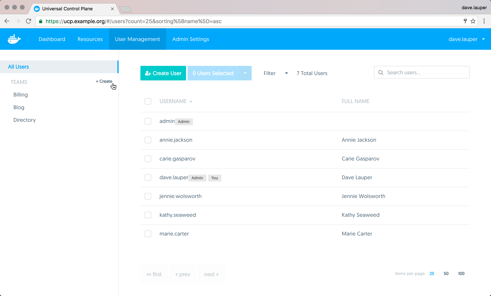
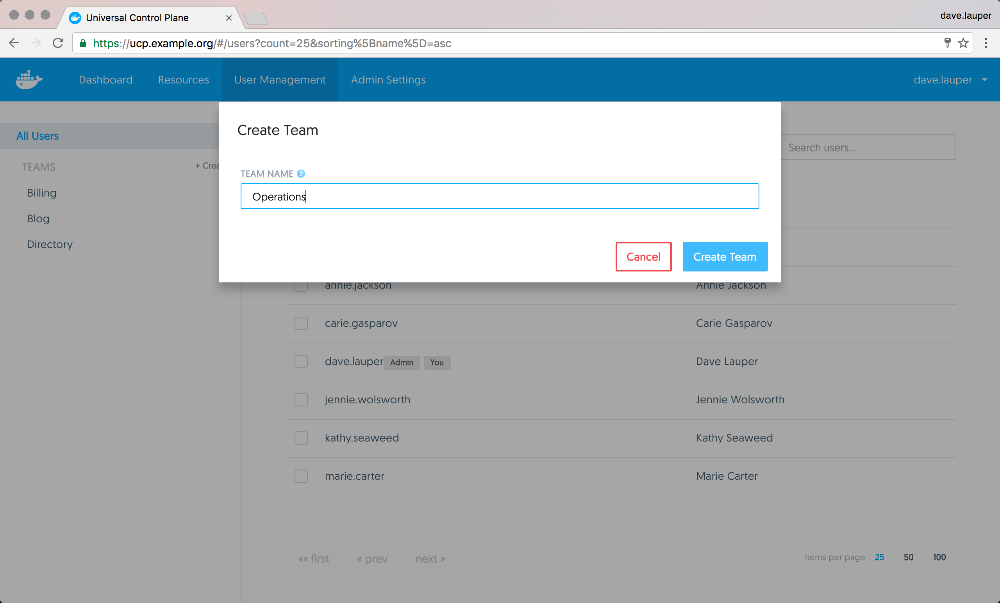
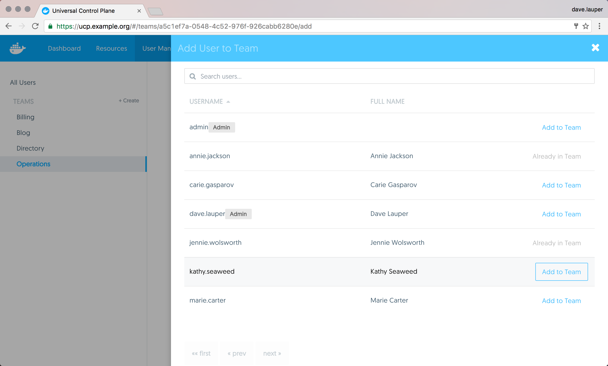
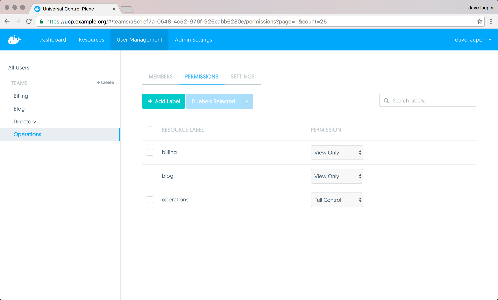

You can extend the user's default permissions by granting them fine-grain
permissions over resources. You do this by adding the user to a team.
A team defines the permissions users have for resources that have the label
`com.docker.ucp.access.label` applied to them.

To create a new team, go to the **UCP web UI**, and navigate to the
**Users & Teams** page.

{: .with-border}

Click the **Create** button to create a new team, and assign it a name.

{: .with-border}

## Add users to a team

You can now add and remove users from the team.
Navigate to the **Members** tab, and click the **Add User to Team** button.
Then choose the list of users that you want to add to the team.

{: .with-border}

## Manage team permissions

To manage the permissions of the team, click the **Permissions** tab.
Here you can specify a list of labels and the permission level users will have
for resources with those labels.

{: .with-border}

In the example above, members of the 'Operations' team have permissions to
create and edit resources that have the labels
`com.docker.ucp.access.label=operations` applied, but can only view resources
that have the `com.docker.ucp.access.label=blog` label.

There are four permission levels available:

| Team permission level | Description                                                                                                                                       |
|:----------------------|:--------------------------------------------------------------------------------------------------------------------------------------------------|
| `No Access`           | The user can't view resources with this label.                                                                                                    |
| `View Only`           | The user can view but can't create resources with this label.                                                                                     |
| `Restricted Control`  | The user can view and create resources with this label. The user can't run `docker exec`, or services that require privileged access to the host. |
| `Full Control`        | The user can view and create resources with this label, without any restriction.                                                                  |

## Where to go next

* [UCP permission levels](permission-levels.md)
