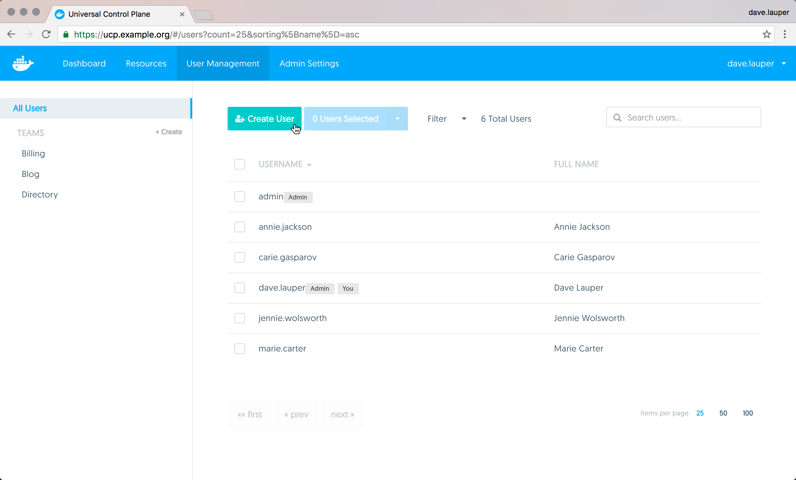
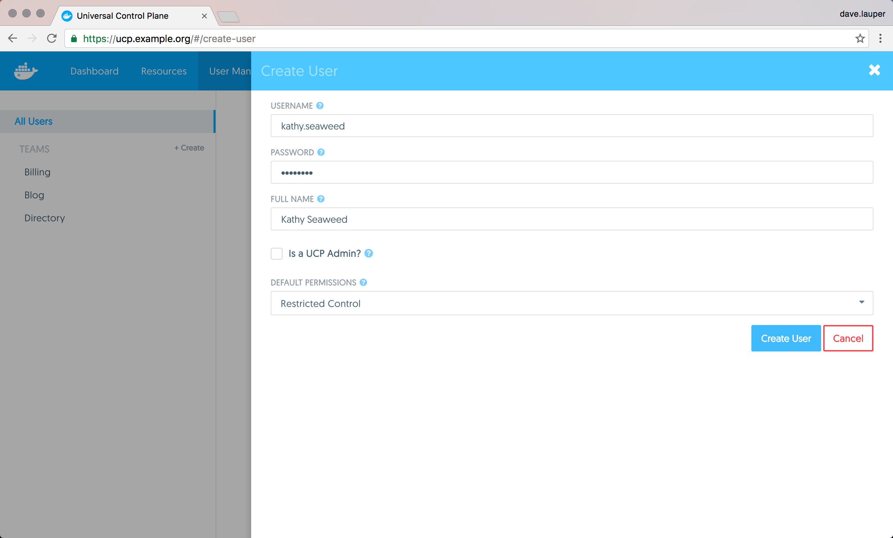

When using the UCP built-in authentication, you need to create users and
assign them with a default permission level so that they can access the
cluster.

To create a new user, go to the **UCP web UI**, and navigate to the
**Users & Teams** page.

{: .with-border}

Click the **Create User** button, and fill-in the user information.

{: .with-border}

Check the 'Is a UCP admin' option, if you want to grant permissions for the
user to change cluster configurations. Also, assign the user with a default
permission level.

Default permissions specify the permission a user has for resources that don't
have the `com.docker.access.label` label applied to them. There are four
permission levels:

| Default permission level | Description                                                                                                                                                                                     |
|:-------------------------|:------------------------------------------------------------------------------------------------------------------------------------------------------------------------------------------------|
| `No Access`              | The user can't view resource, like services, images, networks, and volumes.                                                                                                                     |
| `View Only`              | The user can view images and volumes, but can't create services.                                                                                                                                |
| `Restricted Control`     | The user can view and edit volumes and networks. They can create services, but can't see other users services, run `docker exec`, or run containers that require privileged access to the host. |
| `Full Control`           | The user can view and edit volumes and networks. They can create containers without any restriction, but can't see other users containers.                                                      |

[Learn more about the UCP permission levels](permission-levels.md). Finally,
click the **Create User** button, to create the user.

## Where to go next

* [Create and manage teams](create-and-manage-teams.md)
* [UCP permission levels](permission-levels.md)
