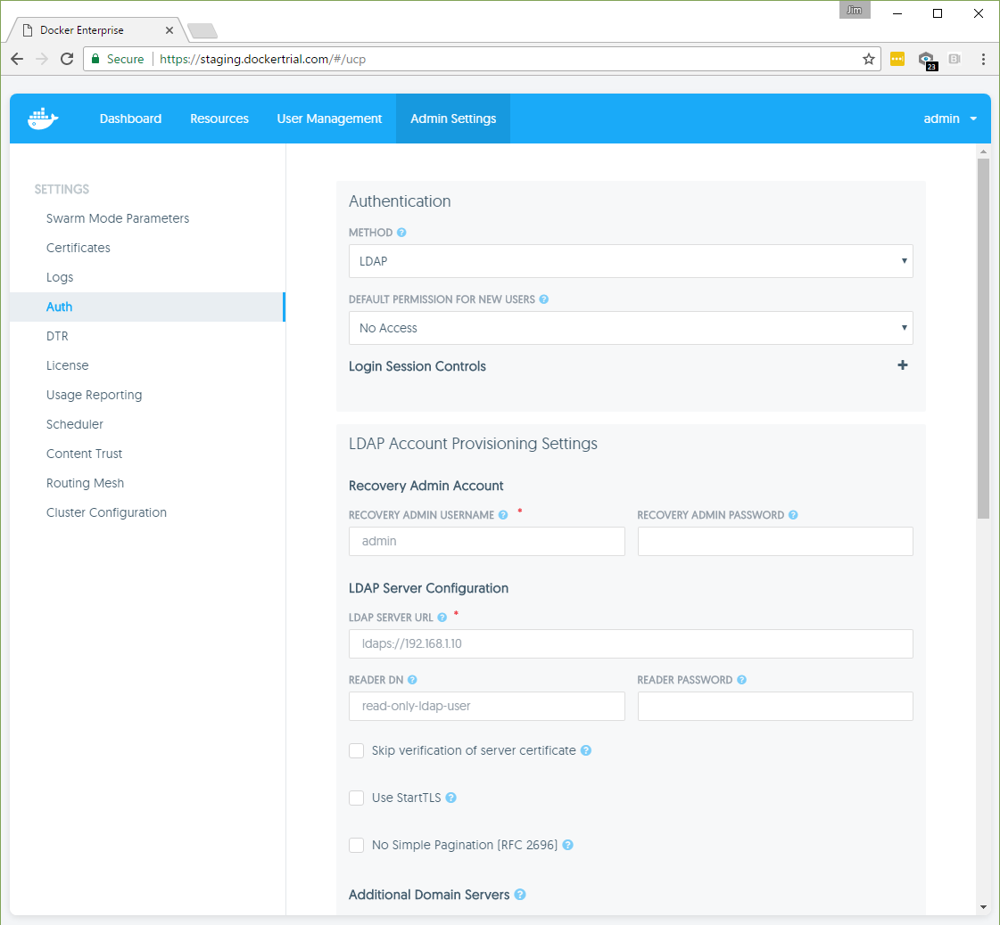
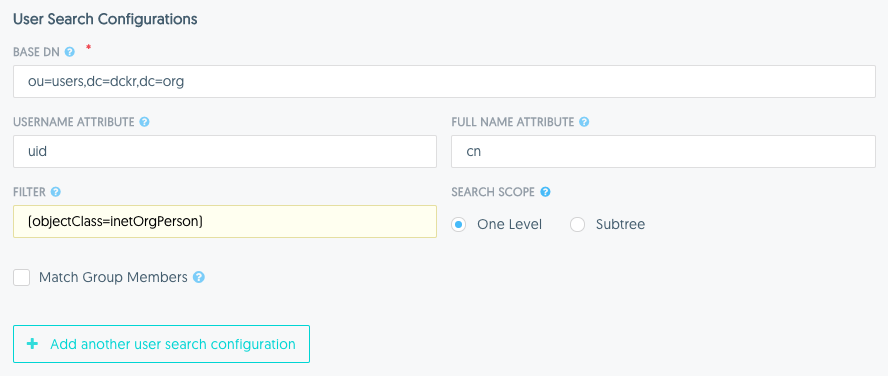

Docker UCP integrates with LDAP directory services, so that you can manage
users and groups from your organization's directory and it will automatically
propagate that information to UCP and DTR.

When you switch from built-in authentication to LDAP authentication,
all manually created users whose usernames do not match any LDAP search results
become inactive with the exception of the recovery admin user which can still
log in with the recovery admin password.

## Configure the LDAP integration

To configure UCP to create and authenticate users using an LDAP directory,
go to the **UCP web UI**, navigate to the **Admin Settings** page, and click the
**Auth** tab.

{: .with-border}

Then configure your LDAP directory integration.

## Authentication

| Field                                            | Description                                                                                                                                                                                |
|:-------------------------------------------------|:-------------------------------------------------------------------------------------------------------------------------------------------------------------------------------------------|
| Method                                           | The method used to create and authenticate users. The *LDAP* method uses a remote directory server to automatically create users and all logins will be forwarded to the directory server. |
| Default permission for newly discovered accounts | The permission level assigned by default to a new user. [Learn more about default permission levels](../../manage-users/permission-levels.md).                                             |

**Login session controls**

Click **+** on the right side of the Authentication section to specify settings for user sessions.  

| Field                   | Description                                                                                                                                                                                      |
|:------------------------|:-------------------------------------------------------------------------------------------------------------------------------------------------------------------------------------------------|
| Lifetime hours         | Specifies the initial lifetime (in hours) of a session from the moment it is generated.                                                                                                                                                    |
| Renewal threshold hours | Indicates a period of time (in hours) before the expiration of a session where, if used, a session will be extended by the current configured lifetime from then. This value cannot be greater than the configured lifetime. A value equal to the lifetime means that sessions will be extended with every use. A value of zero indicates that sessions should never be extended but this may result in unexpectedly being logged out if the session expires while performing a series of actions in the UI.                                                         |
| Per user limit | Specifies the maximum number of sessions that any user can have active at any given time. If creating a new session would put a user over this limit then the least recently used session will be deleted. A value of zero disables limiting the number of sessions that users may have. |

Click **Update Sessions Config** to save your login sessions settings.

## LDAP Account Provisioning Settings

**Recovery Admin Account**

| Field                   | Description                                                                                                                                                                                      |
|:------------------------|:-------------------------------------------------------------------------------------------------------------------------------------------------------------------------------------------------|
| Recovery admin username | The username for a recovery user that can access UCP even when the integration with LDAP is misconfigured or the LDAP server is offline.                                                         |
| Recovery admin password | The password for the recovery user which is securely salted and hashed and stored in UCP. The recovery admin user can use this password to login if the LDAP server is misconfigured or offline. |

**LDAP server configuration**

| Field                   | Description                                                                                                                                                                                      |
|:------------------------|:-------------------------------------------------------------------------------------------------------------------------------------------------------------------------------------------------|
| LDAP server URL         | The URL where the LDAP server can be reached.                                                                                                                                                    |
| Reader DN               | The distinguished name of the LDAP account used for searching entries in the LDAP server. As a best practice this should be an LDAP read-only user.                                              |
| Reader password         | The password of the account used for searching entries in the LDAP server.                                                   
| Skip verification of server certificate | Whether to verify the LDAP server certificate when using TLS. The connection is still encrypted, but vulnerable to man-in-the-middle attacks.                             |
| Use StartTLS                            | Whether to authenticate/encrypt the connection after connecting to the LDAP server over TCP. If you set the LDAP Server URL field with `ldaps://`, this field is ignored. |
| No simple pagination       | If your LDAP server doesn't support pagination. |

**Additional Domain Servers**

A list of additional LDAP domains and corresponding server configs from which to sync users and team members.

Click **+ Add another domain server** to add more LDAP domains.

| Field                   | Description                                                                                                                                                                                      |
|:------------------------|:-------------------------------------------------------------------------------------------------------------------------------------------------------------------------------------------------|
| LDAP domain         | The root domain component of this server, for example, `dc=example,dc=com`. A longest-suffix match of the base DN for LDAP searches is used to select which LDAP server to use for search requests. If no matching domain is found, the default LDAP server config is used. |

**User search configurations**

| Field                         | Description                                                                                                                                                                                            |
|:------------------------------|:----------------------------------------------------------------------------------------------------------------------------------------------------------------------------------------------------------------------------------------------------------------------------------------------------------------------------------------------------------------------------------------------------------------------------------------------------------------------------------------------------------------------------------------------------------------------------------------------|
| Base DN                       | The distinguished name of the node in the directory tree where the search should start looking for users.                                                                                                                                                                                                                                                                                                                                                                                                                                                                                     |
| Username attribute            | The LDAP attribute to use as username on UCP. Only user entries with a valid username will be created. A valid username is no longer than 100 characters and does not contain any unprintable characters, whitespace characters, or any of the following characters: `/` `\` `[` `]` `:` `;` `|` `=` `,` `+` `*` `?` `<` `>` `'` `"`.                                                                                                                                                                                                                                                         |
| Full name attribute           | The LDAP attribute to use as the user's full name for display purposes. If left empty, UCP will not create new users with a full name value.                                                                                                                                                                                                                                                                                                                                                                                                                                                  |
| Filter                        | The LDAP search filter used to find users. If you leave this field empty, all directory entries in the search scope with valid username attributes are created as users.                                                                                                                                                                                                                                                                                                                                                                                                                      |
| Search scope                  | Whether to perform the LDAP search on a single level of the LDAP tree, or search through the full LDAP tree starting at the Base DN.                                                                                                                                                                                                                                                                                                                                                                                                                                                          |
| Match group members           | Whether to further filter users by selecting those who are also members of a specific group on the directory server. This feature is helpful if the LDAP server does not support `memberOf` search filters.                                                                                                                                                                                                                                                                                                                                                                                   |
| Iterate through group members | If `Match Group Members` is selected, this option searches for users by first iterating over the target group's membership and makes a separate LDAP query for each member, as opposed to first querying for all users which match the above search query and intersecting those with the set of group members. This option can be more efficient in situations where the number of members of the target group is significantly smaller than the number of users which would match the above search filter or if your directory server does not support simple pagination of search results. |
| Group DN                      | If `Match Group Members` is selected, this specifies the distinguished name of the group from which to select users.                                                                                                                                                                                                                                                                                                                                                                                                                                                                          |
| Group member attribute        | If `Match Group Members` is selected, the value of this group attribute corresponds to the distinguished names of the members of the group.                                                                                                                                                                                                                                                                                                                                                                                                                                                   |

{: .with-border}

Clicking **+ Add another user search configuration** will expand additional
sections for configuring more user search queries. This is useful in cases
where users may be found in multiple distinct subtrees of your organization's
directory. Any user entry which matches at least one of the search
configurations will be synced as a user.

**Match LDAP Group Members**

This option specifies that system admins should be synced directly with members
of a group in your organization's LDAP directory. The admins will be synced to
match the membership of the group. The configured recovery admin user will also
remain a system admin.

| Field                  | Description                                                                                           |
|:-----------------------|:------------------------------------------------------------------------------------------------------|
| Group DN               | This specifies the distinguished name of the group from which to select users.                        |
| Group member attribute | The value of this group attribute corresponds to the distinguished names of the members of the group. |

**Match LDAP Search Results**

This option specifies that system admin should be synced using a search query
against your organization's LDAP directory. The admins will by synced to match
the users in the search results. The configured recovery admin user will also
remain a system admin.

| Field         | Description                                                                                                                                            |
|:--------------|:-------------------------------------------------------------------------------------------------------------------------------------------------------|
| Base DN       | The distinguished name of the node in the directory tree where the search should start looking for users.                                              |
| Search scope  | Whether to perform the LDAP search on a single level of the LDAP tree, or search through the full LDAP tree starting at the Base DN.                   |
| Search Filter | The LDAP search filter used to find users. If you leave this field empty, all existing users in the search scope will be added as members of the team. |

**Advanced LDAP configuration**

Click **+** on the right side of the provisioning section to specify advanced settings for LDAP configuration.  

| Field                      | Description                                                                                                                                                                                                                 |
|:---------------------------|:----------------------------------------------------------------------------------------------------------------------------------------------------------------------------------------------------------------------------|
| Enable sync of admin users | Whether to import LDAP users as UCP administrators.                                                                                                                                                                         |
| LDAP Match Method          | If admin user sync is enabled, this option specifies whether to match admin user entries using a search query or by selecting them as members from a group. For the expanded options, refer to the options described below. |
| Base DN          | The distinguished name of the element from which the LDAP server will search for users. |
| Search filter    | Whether to search for users in the entire subtree of the base DN or to only search one level under the base DN (if false). |
| Search scope  | Whether to perform the LDAP search on a single level of the LDAP tree, or search through the full LDAP tree starting at the Base DN.                   |

**Sync configuration**

| Field         | Description                                                                                                                                                                                                                                                            |
|:--------------|:-----------------------------------------------------------------------------------------------------------------------------------------------------------------------------------------------------------------------------------------------------------------------|
| Sync interval | The interval in hours to synchronize users between UCP and the LDAP server. When the synchronization job runs, new users found in the LDAP server are created in UCP with the default permission level. UCP users that don't exist in the LDAP server become inactive. |

**Test LDAP connection**

| Field    | Description                                                                                                                                          |
|:---------|:-----------------------------------------------------------------------------------------------------------------------------------------------------|
| Username | The username with which the user will login to this application. This value should correspond to the Username Attribute specified in the form above. |
| Password | The user's password used to authenticate (BIND) to the directory server.                                                                             |

Before you save the configuration changes, you should test that the integration
is correctly configured. You can do this by providing the credentials of an
LDAP user, and clicking the **Test** button.

## Synchronize users

Once you've configured the LDAP integration, UCP synchronizes users based on the
interval you've defined starting at the top of the hour. When the
synchronization runs, UCP stores logs that can help you troubleshoot when
something goes wrong.

You can also manually synchronize users by clicking the **Sync Now** button.

## Revoke user access

When a user is removed from LDAP, that user becomes inactive after the LDAP
synchronization runs.

Also, when you switch from the built-in authentication to using LDAP
authentication, all manually created users whose usernames do not match any
LDAP search results become inactive with the exception of the recovery admin
user which can still login with the recovery admin password.

## Data synced from your organization's LDAP directory

UCP saves a minimum amount of user data required to operate. This includes
the value of the username and full name attributes that you have specified in
the configuration as well as the distinguished name of each synced user.
UCP does not query, or store any additional data from the directory server.

## Syncing Teams

For syncing teams in UCP with a search query or group in your organization's
LDAP directory, refer to [the documentation on creating and managing teams](../../manage-users/create-and-manage-teams.md).
