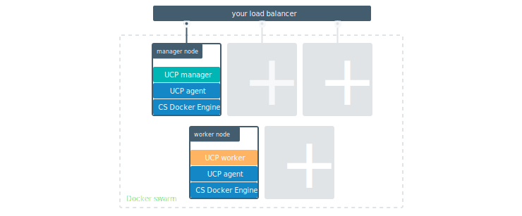
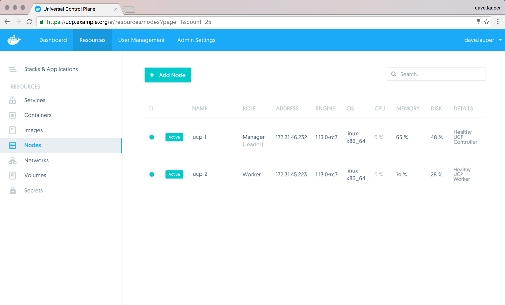

Docker UCP is designed for scaling horizontally as your applications grow in
size and usage. You can add or remove nodes from the UCP cluster to make it
scale to your needs.



Since UCP leverages the clustering functionality provided by Docker Engine,
you use the [docker swarm join](/engine/swarm/swarm-tutorial/add-nodes.md)
command to add more nodes to your cluster. When joining new nodes, the UCP
services automatically start running in that node.

When joining a node to a cluster you can specify its role: manager or worker.

* **Manager nodes**

    Manager nodes are responsible for cluster management functionality and
    dispatching tasks to worker nodes. Having multiple manager nodes allows
    your cluster to be highly-available and tolerate node failures.

    Manager nodes also run all UCP components in a replicated way, so by adding
    additional manager nodes you're also making UCP highly available.
    [Learn more about the UCP architecture.](../../architecture.md)

* **Worker nodes**

    Worker nodes receive and execute your services and applications. Having
    multiple worker nodes allows you to scale the computing capacity of your
    cluster.

    When deploying Docker Trusted Registry in your cluster, you deploy it to a
    worker node.


## Join nodes to the cluster

To join nodes to the cluster, go to the **UCP web UI**, navigate to
the **Resources** page, and go to the **Nodes** section.

{: .with-border}

Click the **Add Node** button to add a new node.

{: .with-border}

Check the 'Add node as a manager' option if you want to add the node as manager.
Also, set the 'Use a custom listen address' option to specify the IP of the
host to be joined to the cluster.

Then you can copy the command displayed, use ssh to **log into the host** that
you want to join to the cluster, and **run the command** on that host.

{: .with-border}

After you run the join command in the node, the node starts being displayed
in UCP.

## Remove nodes from the cluster

1. If the target node is a manager, you will need to first demote the node into
   a worker before proceeding with the removal:
   * From the UCP web UI, navigate to the **Resources** section and then go to
   the **Nodes** page. Select the node you wish to remove and switch its role
   to **Worker**, wait until the operation is completed and confirm that the
   node is no longer a manager.
   * From the CLI, perform `docker node ls` and identify the nodeID or hostname
   of the target node. Then, run `docker node demote <nodeID or hostname>`.

2. If the status of the worker node is `Ready`, manually force
   the node to leave the swarm. To do this, connect to the target node through
   SSH and run `docker swarm leave --force` directly against the local docker
   engine.

   >**Warning**:
   >Do not perform this step if the node is still a manager, as
   >that may cause loss of quorum.
   {:.warning}

3. Now that the status of the node is reported as `Down`, you may remove the
   node:
	* From the UCP web UI, browse to the **Nodes** page, select the node and
	click on the **Remove Node** button. You will need to click on the button
	again within 5 seconds to confirm the operation.
	* From the CLI, perform `docker node rm <nodeID or hostname>`

## Pause and drain nodes

Once a node is part of the cluster you can change its role making a manager
node into a worker and vice versa. You can also configure the node availability
so that it is:

* Active: the node can receive and execute tasks.
* Paused: the node continues running existing tasks, but doesn't receive new ones.
* Drained: the node can't receive new tasks. Existing tasks are stopped and
replica tasks are launched in active nodes.

{: .with-border}

If you're load-balancing user requests to UCP across multiple manager nodes,
when demoting those nodes into workers, don't forget to remove them from your
load-balancing pool.

## Scale your cluster from the CLI

You can also use the command line to do all of the above operations. To get the
join token, run the following command on a manager node:

```none
$ docker swarm join-token worker
```

If you want to add a new manager node instead of a worker node, use
`docker swarm join-token manager` instead. If you want to use a custom listen
address, add the `--listen-addr` arg:

```none
docker swarm join \
    --token SWMTKN-1-2o5ra9t7022neymg4u15f3jjfh0qh3yof817nunoioxa9i7lsp-dkmt01ebwp2m0wce1u31h6lmj \
    --listen-addr 234.234.234.234 \
    192.168.99.100:2377
```

Once your node is added, you can see it by running `docker node ls` on a manager:

```none
$ docker node ls
```

To change the node's availability, use:

```
$ docker node update --availability drain node2
```

You can set the availability to `active`, `pause`, or `drain`.

To remove the node, use:

```
$ docker node rm <node-hostname>
```

## Where to go next

* [Use your own TLS certificates](use-your-own-tls-certificates.md)
* [Set up high availability](set-up-high-availability.md)
