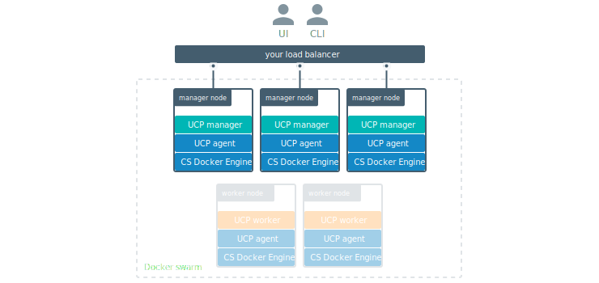

Once you've joined multiple manager nodes for high-availability, you can
configure your own load balancer to balance user requests across all
manager nodes.

This allows users to access UCP using a centralized domain name. If
a manager node goes down, the load balancer can detect that and stop forwarding
requests to that node, so that the failure goes unnoticed by users.

## Load-balancing on UCP

Since Docker UCP uses mutual TLS, make sure you configure your load balancer to:

* Load-balance TCP traffic on port 443,
* Not terminate HTTPS connections,
* Use the `/_ping` endpoint on each manager node, to check if the node
is healthy and if it should remain on the load balancing pool or not.

## Load balancing UCP and DTR

By default, both UCP and DTR use port 443. If you plan on deploying UCP and DTR,
your load balancer needs to distinguish traffic between the two by IP address
or port number.

* If you want to configure your load balancer to listen on port 443:
    * Use one load balancer for UCP, and another for DTR,
    * Use the same load balancer with multiple virtual IPs.
* Configure your load balancer to expose UCP or DTR on a port other than 443.

## Where to go next

* [Add labels to cluster nodes](add-labels-to-cluster-nodes.md)
