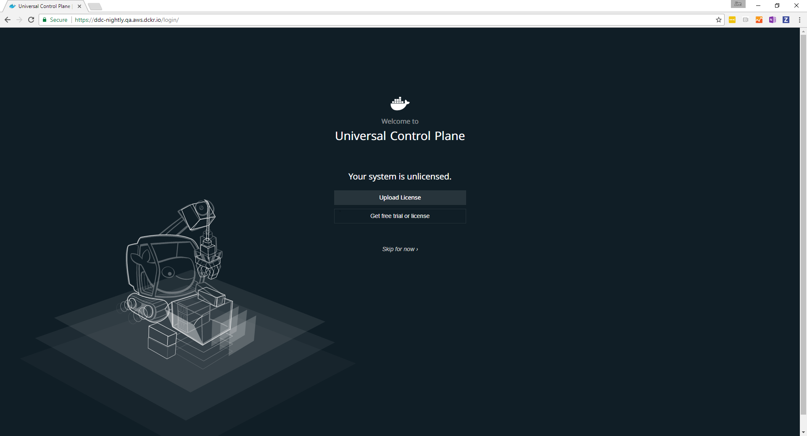
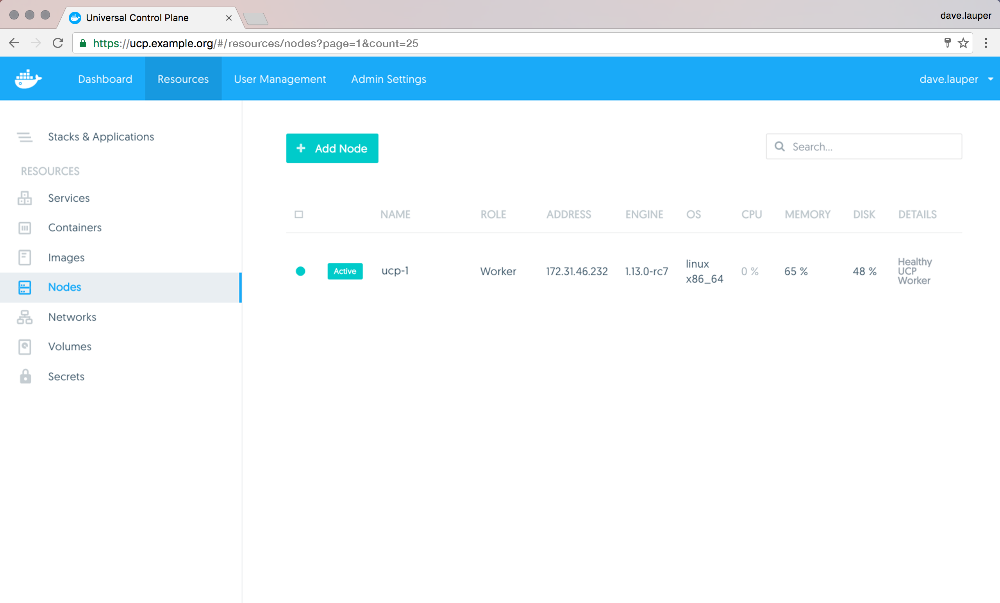
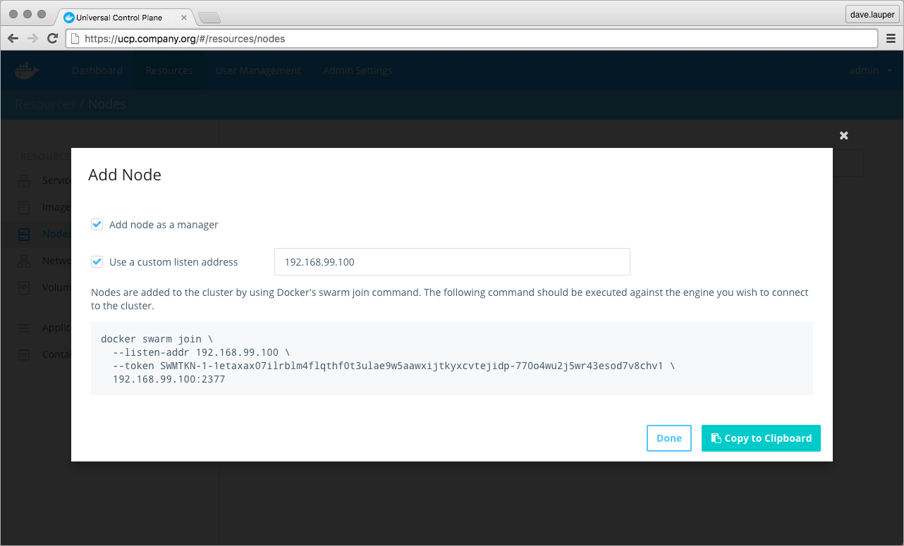
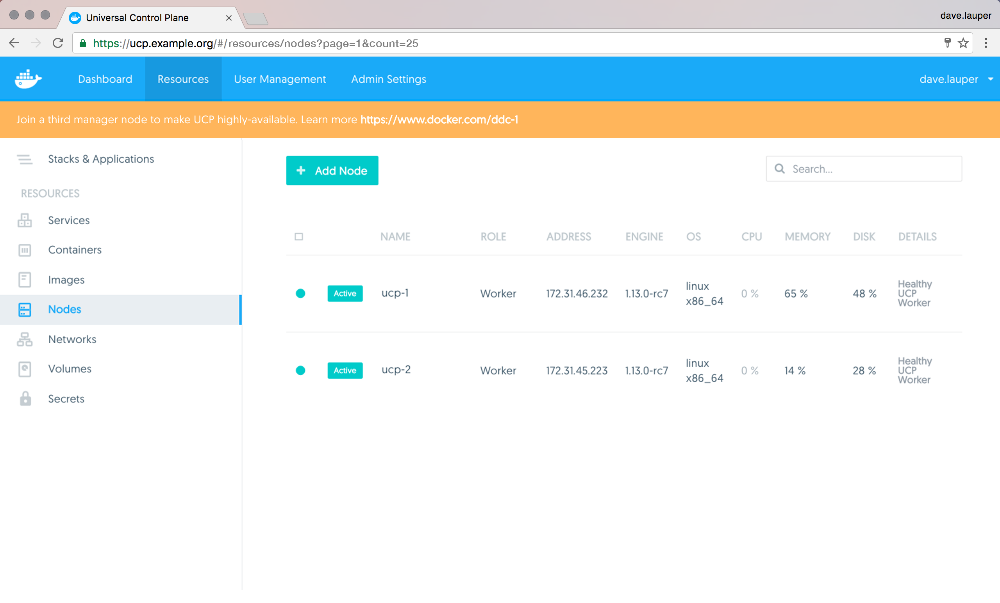

Docker Universal Control Plane (UCP) is a containerized application that can be
installed on-premise or on a cloud infrastructure.

## Step 1: Validate the system requirements

The first step to installing UCP, is ensuring your
infrastructure has all the [requirements UCP needs to run](system-requirements.md). You also need to ensure that all nodes (physical or virtual) are running the same version of CS Docker Engine.


## Step 2: Install CS Docker on all nodes

UCP is a containerized application that requires the commercially supported
Docker Engine to run.

For each host that you plan to manage with UCP:

1.  Log in to that host using ssh.
2.  Install Docker Engine 1.13:

    ```bash
    curl -SLf https://packages.docker.com/1.13/install.sh  | sh
    ```

    [You can also install Docker Engine using a package manager](/cs-engine/1.13/index.md).

Make sure you install the same Docker Engine version on all the nodes. Also,
if you're creating virtual machine templates with Docker Engine already
installed, make sure the `/etc/docker/key.json` file is not included in the
virtual machine image. When provisioning the virtual machine, restart the Docker
daemon to generate a new `/etc/docker/key.json` file.

## Step 3: Customize named volumes

Skip this step if you want to use the defaults provided by UCP.

Docker UCP uses named volumes to persist data. If you want
to customize the drivers used to manage these volumes, you can create the
volumes before installing UCP. When you install UCP, the installer
will notice that the volumes already exist, and will start using them.
[Learn about the named volumes used by UCP](../../architecture.md).

If these volumes don't exist, they'll be automatically created when installing
UCP.

## Step 4: Install UCP

To install UCP you use the `docker/ucp` image, which has commands to install and
manage UCP.

To install UCP:

1. Use ssh to log in to the host where you want to install UCP.

2.  Run the following command:

    ```none
    # Pull the latest version of UCP
    $ docker pull {{ page.docker_image }}

    # Install UCP
    $ docker run --rm -it --name ucp \
      -v /var/run/docker.sock:/var/run/docker.sock \
      {{ page.docker_image }} install \
      --host-address <node-ip-address> \
      --interactive
    ```

    This runs the install command in interactive mode, so that you're
    prompted for any necessary configuration values.
    To find what other options are available in the install command, check the
    [reference documentation](../../../reference/cli/install.md).

## Step 5: License your installation

Now that UCP is installed, you need to license it. In your browser, navigate
to the UCP web UI, log in with your administrator credentials and upload your
license.

{: .with-border}

If you're registered in the beta program and don't have a license yet, you
can get it from your [Docker Store subscriptions](https://store.docker.com/?overlay=subscriptions).

<!-- If you don't have a license yet, [learn how to get a free trial license](license.md). -->

## Step 6: Join manager nodes

Skip this step if you don't want UCP to be highly available.

To make your Docker swarm and UCP fault-tolerant and highly available, you can
join more manager nodes to it. Manager nodes are the nodes in the swarm
that perform the orchestration and swarm management tasks, and dispatch tasks
for worker nodes to execute.

To join manager nodes to the swarm, go to the **UCP web UI**, navigate to
the **Resources** page, and go to the **Nodes** section.

{: .with-border}

Click the **Add Node** button to add a new node.

{: .with-border}

Check the 'Add node as a manager' to turn this node into a manager and replicate
UCP for high-availability.
Set the 'Use a custom listen address' option if you want to customize the
network and port where this node will listen for swarm management traffic. By
default the node listens on port 2377.
Set the 'Use a custom advertise address' option if you want to customize the
network and port this node will advertise to other swarm members so that they
can reach it.

For each manager node that you want to join to UCP, log in to that
node using ssh, and run the join command that is displayed on UCP.

{: .with-border}

After you run the join command in the node, the node starts being displayed
in UCP.

## Step 7: Join worker nodes

Skip this step if you don't want to add more nodes to run and scale your apps.

To add more computational resources to your swarm, you can join worker nodes.
These nodes execute tasks assigned to them by the manager nodes. For this,
use the same steps as before, but don't check the 'Add node as a manager'
option.

## Where to go next

* [Use your own TLS certificates](../configure/use-your-own-tls-certificates.md)
* [Scale your cluster](../configure/scale-your-cluster.md)
