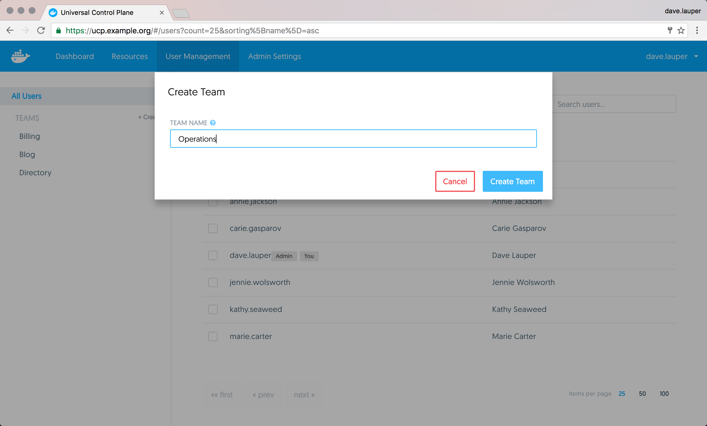
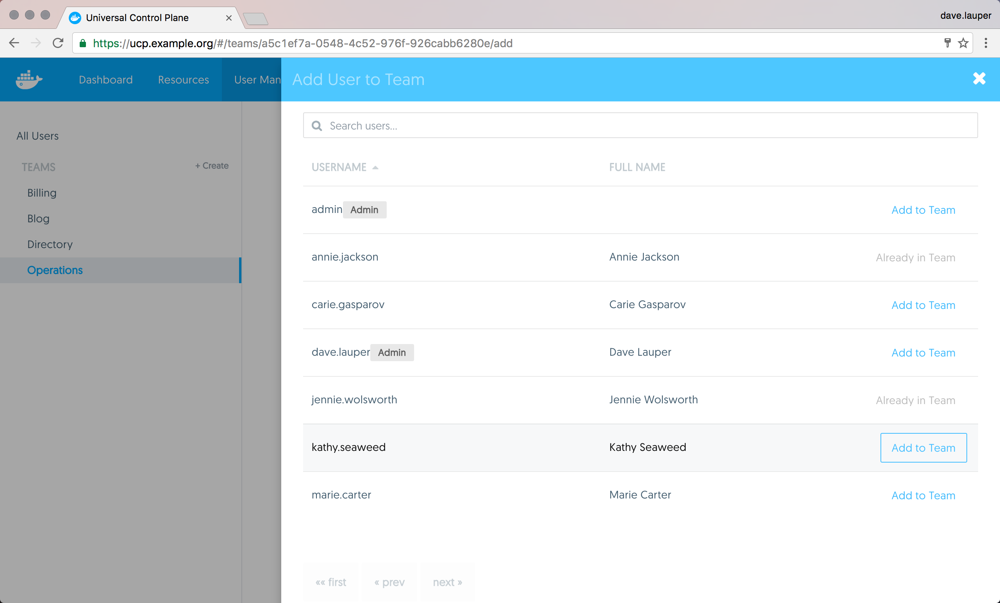
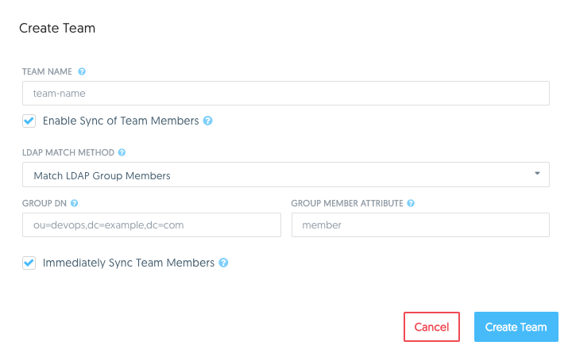
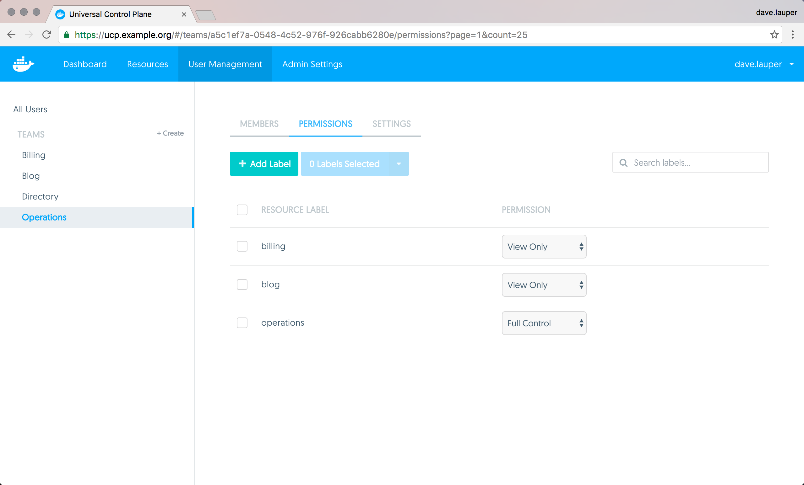

You can extend the user's default permissions by granting them fine-grain
permissions over resources. You do this by adding the user to a team.
A team defines the permissions users have for resources that have the label
`com.docker.ucp.access.label` applied to them. Keep in mind that a label can
be applied to multiple teams with different permission levels. 

To create a new team, go to the **UCP web UI**, and navigate to the
**Users & Teams** page.

{: .with-border}

Click the **Create** button to create a new team, and assign it a name.

{: .with-border}

## Add users to a team

You can now add and remove users from the team.
Navigate to the **Members** tab, and click the **Add User to Team** button.
Then choose the list of users that you want to add to the team.

{: .with-border}

## Sync team members with your organization's LDAP directory.

If UCP is configured to sync users with your organization's LDAP directory
server, you will have the option to enable syncing the new team's members when
creating a new team or when modifying settings of an existing team.
[Learn how to configure integration with an LDAP directory](../configure/external-auth/index.md).
Enabling this option will expand the form with additional field for configuring
the sync of team members.

{: .with-border}

There are two methods for matching group members from an LDAP directory:

**Match LDAP Group Members**

This option specifies that team members should be synced directly with members
of a group in your organization's LDAP directory. The team's membership will by
synced to match the membership of the group.

| Field                  | Description                                                                                           |
|:-----------------------|:------------------------------------------------------------------------------------------------------|
| Group DN               | This specifies the distinguished name of the group from which to select users.                        |
| Group member attribute | The value of this group attribute corresponds to the distinguished names of the members of the group. |

**Match LDAP Search Results**

This option specifies that team members should be synced using a search query
against your organization's LDAP directory. The team's membership will be
synced to match the users in the search results.

| Field         | Description                                                                                                                                            |
|:--------------|:-------------------------------------------------------------------------------------------------------------------------------------------------------|
| Base DN       | The distinguished name of the node in the directory tree where the search should start looking for users.                                              |
| Search scope  | Whether to perform the LDAP search on a single level of the LDAP tree, or search through the full LDAP tree starting at the Base DN.                   |
| Search Filter | The LDAP search filter used to find users. If you leave this field empty, all existing users in the search scope will be added as members of the team. |

**Immediately Sync Team Members**

Select this option to immediately run an LDAP sync operation after saving the
configuration for the team. It may take a moment before the members of the team
are fully synced.

## Manage team permissions

To manage the permissions of the team, click the **Permissions** tab.
Here you can specify a list of labels and the permission level users will have
for resources with those labels.

{: .with-border}

In the example above, members of the 'Operations' team have permissions to
create and edit resources that have the labels
`com.docker.ucp.access.label=operations` applied, but can only view resources
that have the `com.docker.ucp.access.label=blog` label.

There are four permission levels available:

| Team permission level | Description                                                                                                                                       |
|:----------------------|:--------------------------------------------------------------------------------------------------------------------------------------------------|
| `No Access`           | The user can't view resources with this label.                                                                                                    |
| `View Only`           | The user can view but can't create resources with this label.                                                                                     |
| `Restricted Control`  | The user can view and create resources with this label. The user can't run `docker exec`, or services that require privileged access to the host. |
| `Full Control`        | The user can view and create resources with this label, without any restriction.                                                                  |

## Where to go next

* [UCP permission levels](permission-levels.md)
