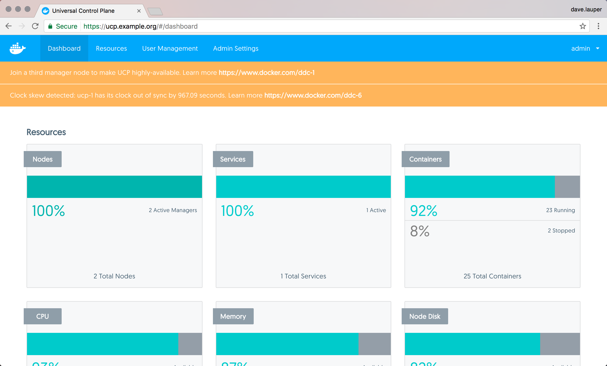
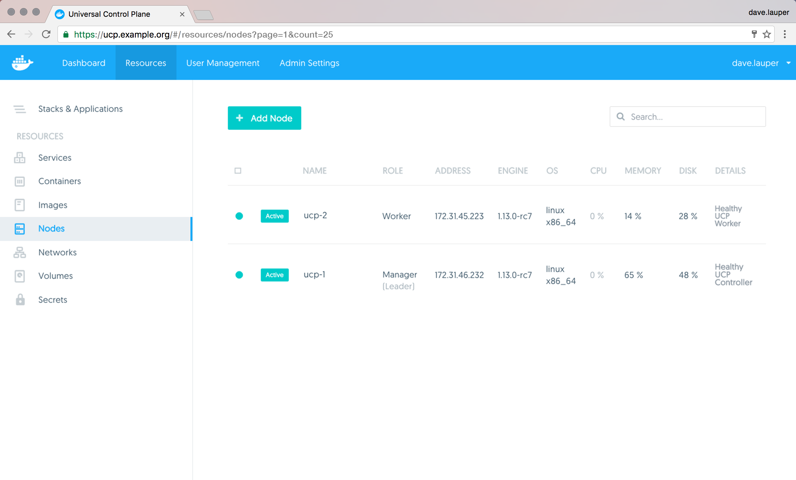

You can monitor the status of UCP by using the web UI or the CLI.
You can also use the `_ping` endpoint to build monitoring automation.

## Check status from the UI

The first place to check the status of UCP is the **UCP web UI**, since it
shows warnings for situations that require your immediate attention.
Administrators might see more warnings than regular users.

{: .with-border}

You can also navigate to the **Nodes** page, to see if all the nodes
managed by UCP are healthy or not.

{: .with-border}

Each node has a status message explaining any problems with the node.
[Learn more about node status](troubleshoot-node-messages.md).


## Check status from the CLI

You can also monitor the status of a UCP cluster using the Docker CLI client.
Download [a UCP client certificate bundle](../../user/access-ucp/cli-based-access.md)
and then run:

```none
$ docker node ls
```

As a rule of thumb, if the status message starts with `[Pending]`, then the
current state is transient and the node is expected to correct itself back
into a healthy state. [Learn more about node status](troubleshoot-node-messages.md).


## Monitoring automation

You can use the `https://<ucp-manager-url>/_ping` endpoint to check the health
of a single UCP manager node. When you access this endpoint, the UCP manager
validates that all its internal components are working, and returns one of the
following HTTP error codes:

* 200, if all components are healthy
* 500, if one or more components are not healthy

If an administrator client certificate is used as a TLS client certificate for
the `_ping` endpoint, a detailed error message is returned if any component is
unhealthy.

If you're accessing the `_ping` endpoint through a load balancer, you have no
way of knowing which UCP manager node is not healthy, since any manager node
might be serving your request. Make sure you're connecting directly to the
URL of a manager node, and not a load balancer.

## Where to go next

* [Troubleshoot with logs](troubleshoot-with-logs.md)
* [Troubleshoot node states](./troubleshoot-node-messages.md)
