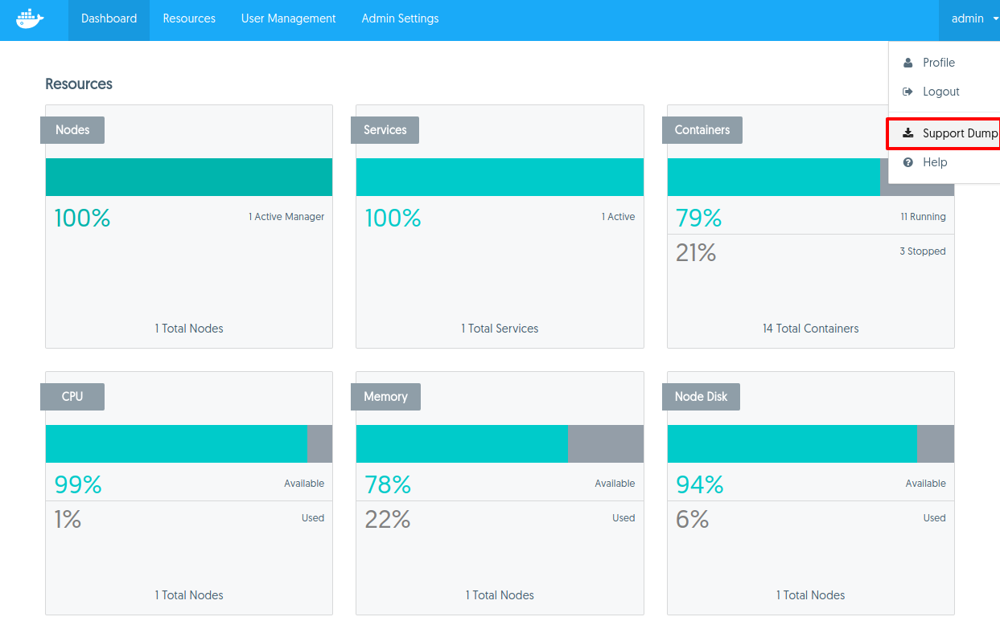

Your Docker Data Center, or Universal Control Plane subscription gives you
access to prioritized support. The service levels depend on your subscription.

If you need help, you can file a ticket via:

* [Email](mailto:support@docker.com)
* [Docker support page](https://support.docker.com/)

Be sure to use your company email when filing tickets.

Docker Support engineers may ask you to provide a UCP support dump, which is an
archive that contains UCP system logs and diagnostic information. To obtain a
support dump:

## From the UI

1. Log into the UCP UI with an administrator account.
2. On the top-right menu, **click your username**, and choose **Support Dump**.

{: .with-border}

## From the CLI

To get the support dump from the CLI, use SSH to log into a UCP manager node
and run:

```none
docker run --rm \
  --name ucp \
  -v /var/run/docker.sock:/var/run/docker.sock \
  {{ page.docker_image }} \
  support > docker-support.tgz
```

This support dump only contains logs for the node where you're running the
command. If your UCP is highly available, you should collect support dumps
from all the manager nodes.
