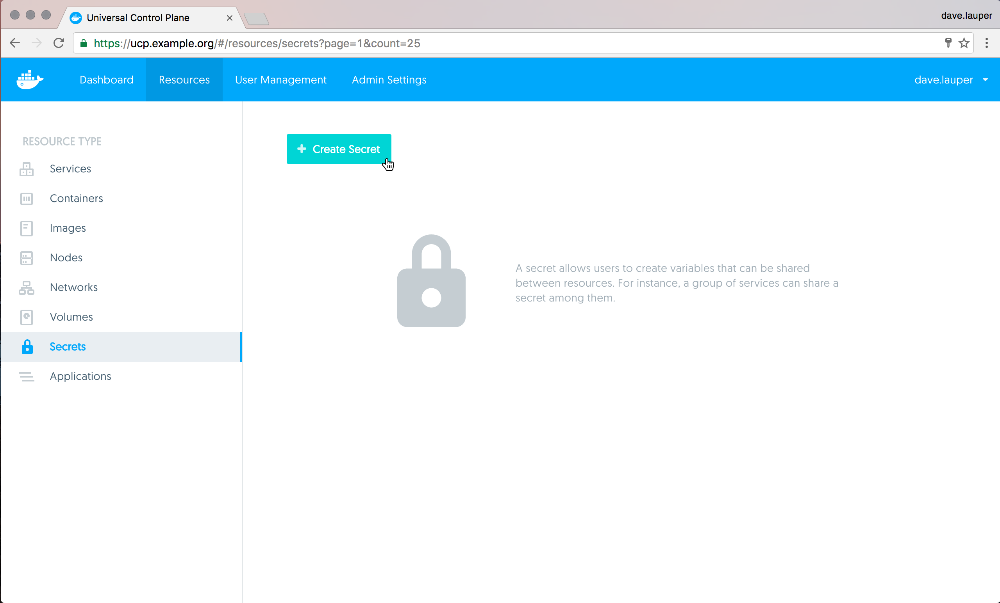
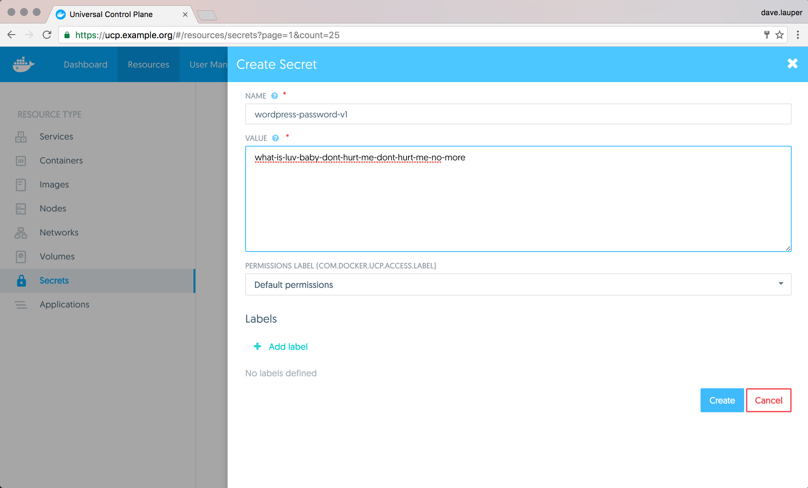
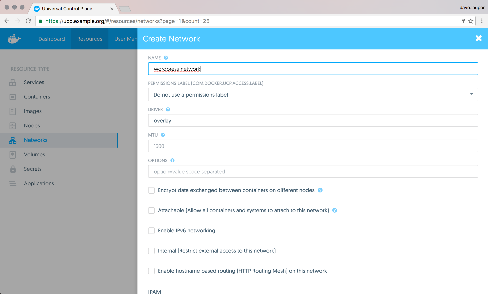
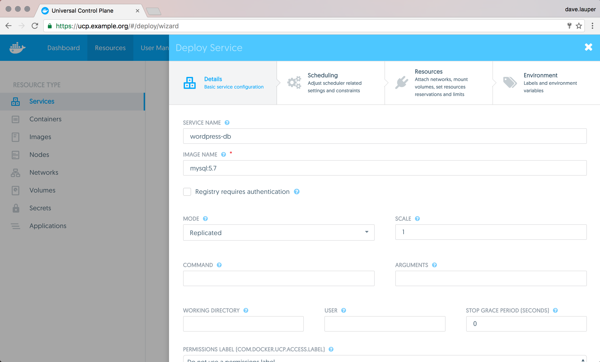
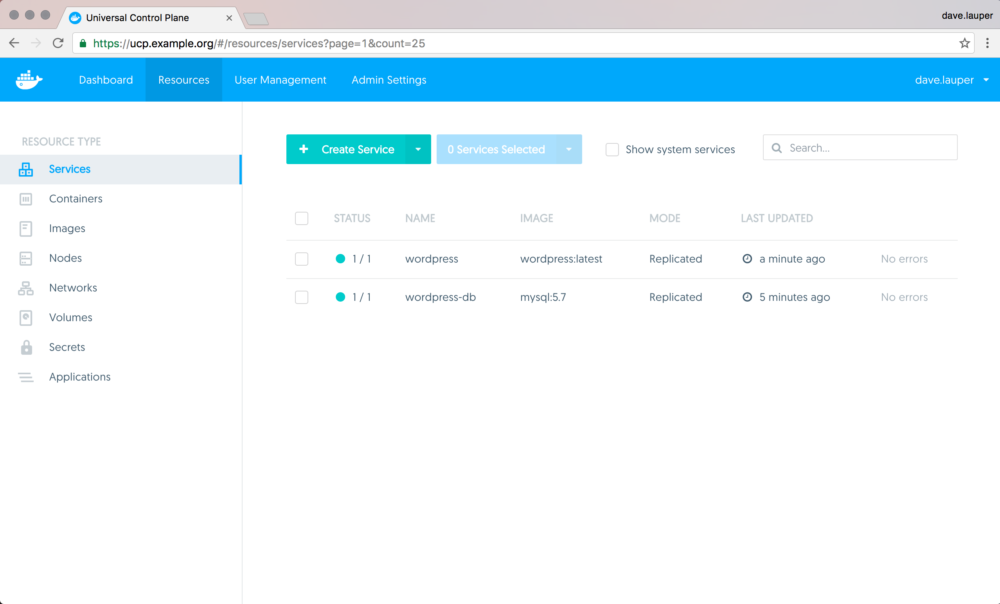
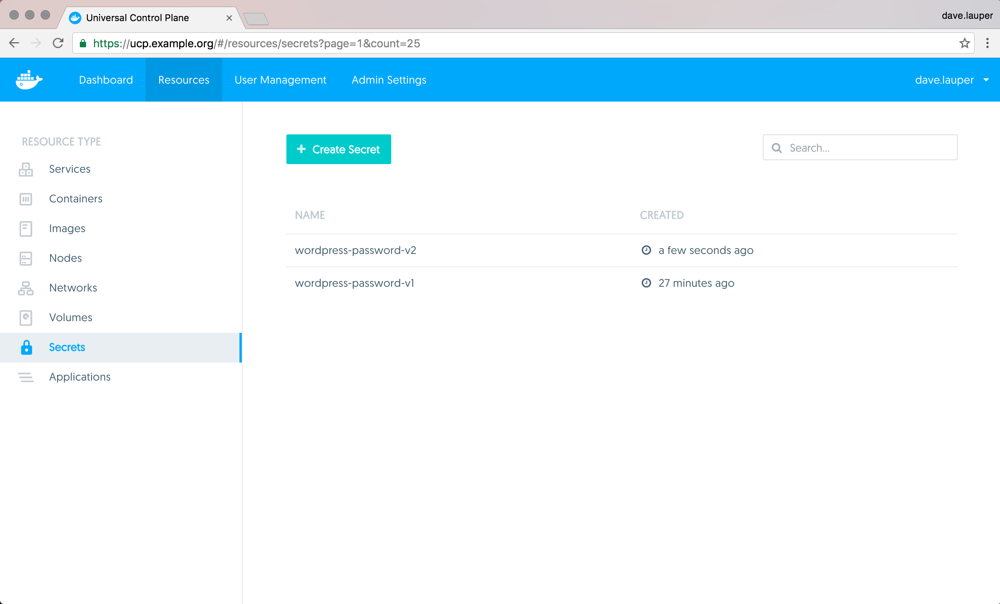
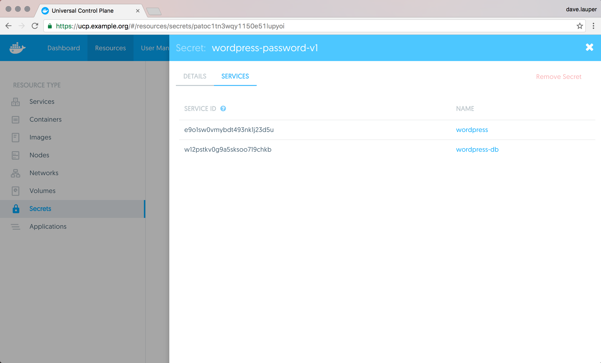
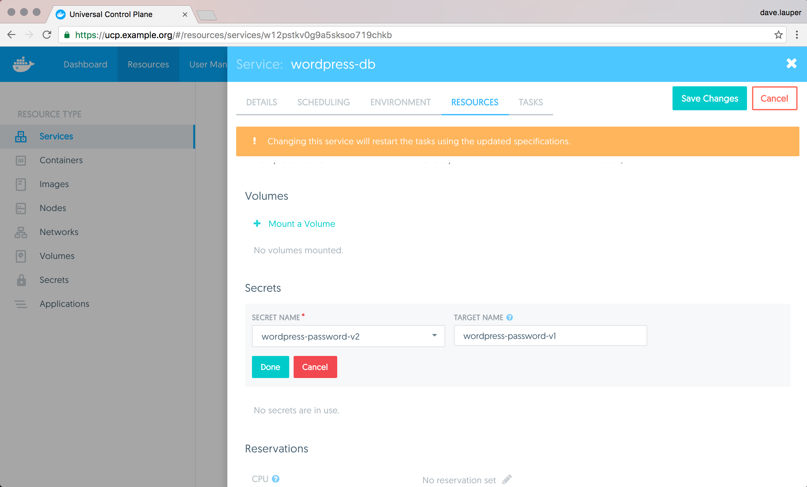

{:target="_blank" class="_"}

When deploying and orchestrating services, you often need to configure those
services with sensitive information like passwords, TLS certificates, or
private keys.

Universal Control Plane allows you to store this sensitive information, also
know as secrets, in a secure way. It also gives you role-based access control
so that you can control which users can use a secret in their services
and which ones can manage the secret.

UCP extends the functionality provided by Docker Engine, so you can continue
using the same workflows and tools you already use, like the Docker CLI client.

<!-- todo: add link when 1.13 is available [Learn how to use secrets with Docker](/engine/swarm/secrets/) -->

In this example we're going to deploy a WordPress application that's composed of
two services:

* wordpress: The service that runs Apache, PHP, and WordPress
* wordpress-db: a MySQL database used for data persistence

Instead of configuring our services to use a plain text password stored in an
environment variable, we're going to create a secret to store the password.
When we deploy those services we attach the secret to them, which creates
a file with the password inside the container running the service. Our services
can use that file, but no one else can see the
plain text password.

To make things simpler, we're not going to configure the database service to
persist data. When the service stops, the data is lost.

## Create a secret

In the **UCP web UI**, navigate to **Resources**, and click **Secrets**.

{: .with-border}

Click **Create Secret** to create a new secret. Once you create the secret,
you can't edit it or see the secret data again.

{: .with-border}

Assign a unique name to the secret and set its value. You can optionally define
a permission label to give other users permission to use this secret. Also,
a service and secret must have the same permission label (or each
must have no permission label at all) to use them together.

In this example our secret is named `wordpress-password-v1`, to make it easier
to track which version of the password our services are using.

## Use secrets in your services

Before creating the MySQL and WordPress services, we need to create the network
that they're going to use to communicate with one another.

Navigate to the **Networks** page, and create the `wordpress-network` with the
default configurations.

{: .with-border}

Start by creating the MySQL service. Navigate to the **Services** page, click
**Create Service**, and choose **Use Wizard**. Use the following configurations:

| Field                      | Value                              |
|:---------------------------|:-----------------------------------|
| Service name               | wordpress-db                       |
| Image name                 | mysql:5.7                          |
| Attached network           | wordpress-network                  |
| Secret                     | wordpress-password-v1              |
| Environment variable name  | MYSQL_ROOT_PASSWORD_FILE           |
| Environment variable value | /run/secrets/wordpress-password-v1 |

Remember, if you specified a permission label on the secret, you must also set
the same permission label on this service. If the secret does not have a
permission label, then this service must also not have a permission label.

This creates a MySQL service that's attached to the `wordpress-network` network,
and that uses the `wordpress-password-v1`, which by default will create a file
with the same name at `/run/secrets/<secret-name>` inside the container running
the service.

We also set the `MYSQL_ROOT_PASSWORD_FILE` environment variable to configure
MySQL to use the content of the `/run/secrets/wordpress-password-v1` file as
the root password.

{: .with-border}

Click the **Deploy Now** button to deploy the MySQL service.

Now that the MySQL service is running, we can deploy a WordPress service that
uses MySQL has a storage backend. Deploy a service with the following
configurations:

| Field                | Value                                                         |
|:---------------------|:--------------------------------------------------------------|
| Service name         | wordpress                                                     |
| Image name           | wordpress:latest                                              |
| Published ports      | target: 80, ingress:8000                                      |
| Attached network     | wordpress-network                                             |
| Secret               | wordpress-password-v1              						   |
| Environment variable | WORDPRESS_DB_HOST=wordpress-db:3306                           |
| Environment variable | WORDPRESS_DB_PASSWORD_FILE=/run/secrets/wordpress-password-v1 |

This creates the WordPress service attached to the same network as the MySQL
service so that they can communicate, and maps the port 80 of the service to
port 8000 of the swarm routing mesh.

Click the **Deploy Now** button to deploy the WordPress service.

{: .with-border}

Once you deploy this service, you can access it using the
IP address of any node in your UCP cluster, on port 8000.

{: .with-border}

## Update a secret

If the secret gets compromised you need to rotate it so that your services
start using a new secret. This example changes the password and updates the
MySQL and WordPress services to use the new password.

Since secrets are immutable in the sense that you cannot change the data
they store after they are created, we can use the following process to achieve
this:

1. Create a new secret with a different password
2. Update all the services that are using the old secret to use the new one
instead
3. Delete the old secret

So let's rotate the secret we've created. Navigate to the **Secrets** screen
and create a new service called `wordpress-password-v2`.

{: .with-border}

This example is simple and we know which services we need to update, but in the
real world that might not always be the case.
If you navigate to the secret `wordpress-password-v1` details page, you can
see which services you need to update.

{: .with-border}

Start by updating the `wordpress-db` service to stop using the secret
`wordpress-password-v1` and use the new version instead.

The `MYSQL_ROOT_PASSWORD_FILE` environment variable is currently set to look for
a file at `/run/secrets/wordpress-password-v1` which no longer exists after we
update the service. So we have two options:

1. Update the environment variable to have the value
`/run/secrets/wordpress-password-v2`
2. Instead of mounting the secret file in `/run/secrets/wordpress-password-v2`
(the default), we can customize it to be mounted in `/run/secrets/wordpress-password-v1`
instead. This way we don't need to change the environment variable. This is
what we're going to do.

When adding the secret to the services, instead of leaving the 'Target Name'
field with the default value, set it with `wordpress-password-v1`. This will make
the file with the content of `wordpress-password-v2` be mounted in
`/run/secrets/wordpress-password-v1`.

{: .with-border}

Then do the same thing for the WordPress service. After this is done, the
WordPress application is running and using the new password.

## Managing secrets through the CLI

You can find additional documentation on managing secrets through the CLI at [How Docker manages secrets](/engine/swarm/secrets/#read-more-about-docker-secret-commands).

## Where to go next

[Grant access to secrets](grant-revoke-access.md)
