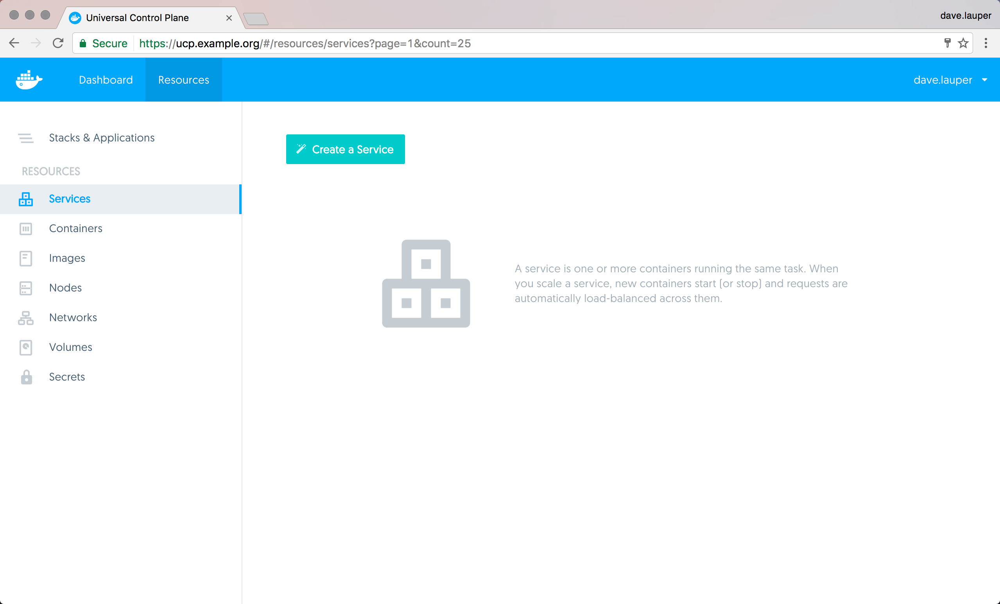
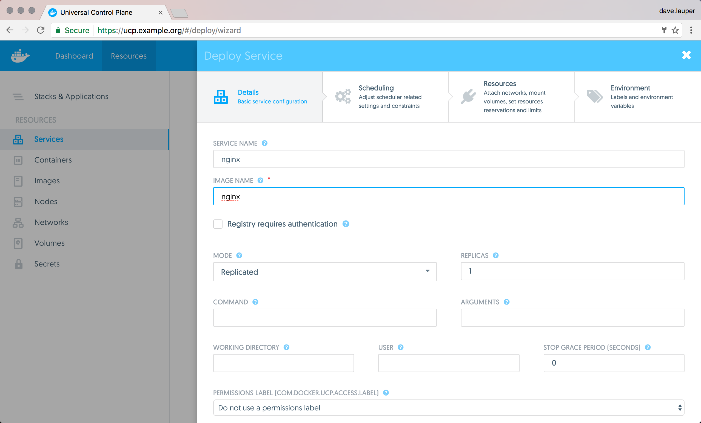

You can deploy and monitor your services from the UCP web UI. In this example
we deploy an NGINX web server, and make it accessible on port `8000`.

Navigate to the **UCP web UI**, click the **Resources** tab, and choose
**Services**.

{: .with-border}

Click the **Create a Service** button to deploy the NGINX service.

{: .with-border}

Fill-in the following fields:

| Field         | Value |
|:--------------|:------|
| Service name  | nginx |
| Image name    | nginx |
| Internal port | 80    |
| Public port   | 8000  |

{: .with-border}

Once you've specified the service image and ports, click **Deploy now** to
deploy the service into a node in the UCP cluster.

Once the service is up and running, the default NGINX
page is available at `http://<node-ip>:8000`.

{: .with-border}

## Deploy from the CLI

You can also deploy the same service from the CLI. Once you've set up your
[UCP client bundle](../access-ucp/cli-based-access.md), run:

```none
docker service create --name nginx \
  --publish 8000:80 \
  --label com.docker.ucp.access.owner=<your-username> \
  nginx
```
