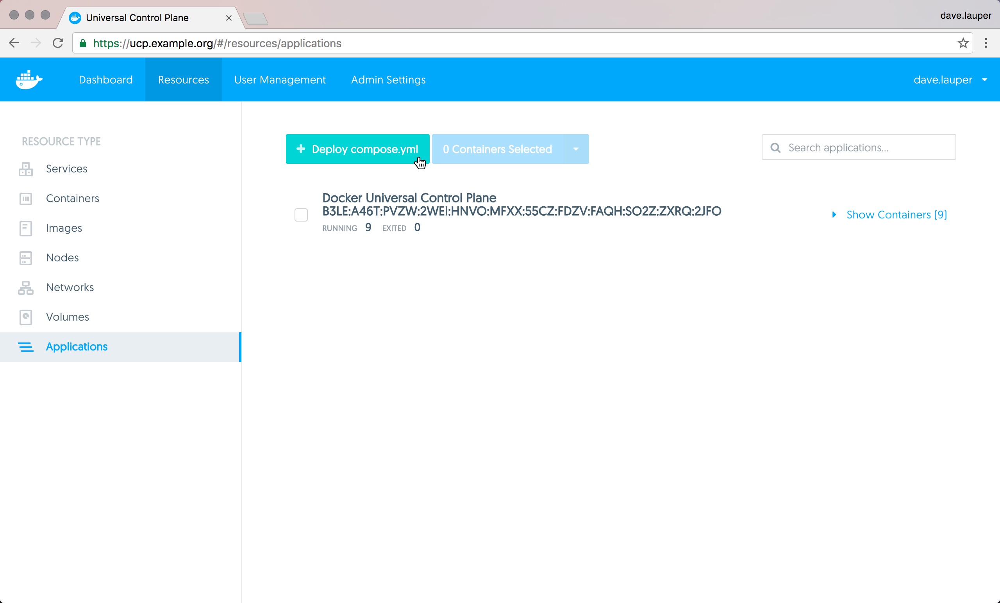
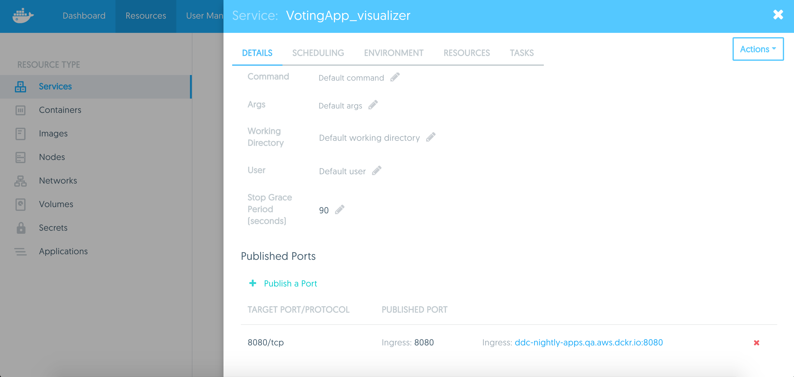

With Docker Universal Control Plane you can deploy applications from the UI
using `docker-compose.yml` files. In this example, we're going to deploy an
application that allows users to vote on whether they prefer cats or dogs. 😺 🐶

## Deploy voting application

In your browser, **log in** to UCP, and navigate to the **Stacks & Applications** page.
There, click the **Deploy** button, to deploy a new application.

{: .with-border}

The application we're going to deploy is composed of several services:

* `vote`: The web application that presents the voting interface via port 5000
* `result`: A web application that displays the voting results via port 5001
* `visualizer`: A web application that shows a map of the deployment of the various services across the available nodes via port 8080
* `redis`: Collects raw voting data and stores it in a key/value queue
* `db`: A PostgreSQL service which provides permanent storage on a host volume
* `worker`: A background service that transfers votes from the queue to permanent storage

Click **Deploy** and paste the following YAML into the **APPLICATION DEFINITION**
field.

```none
version: "3"
services:

  redis:
    image: redis:alpine
    ports:
      - "6379"
    networks:
      - frontend
    deploy:
      replicas: 2
      update_config:
        parallelism: 2
        delay: 10s
      restart_policy:
        condition: on-failure
  db:
    image: postgres:9.4
    volumes:
      - db-data:/var/lib/postgresql/data
    networks:
      - backend
    deploy:
      placement:
        constraints: [node.role == manager]
  vote:
    image: manomarks/examplevotingapp_vote
    ports:
      - 5000:80
    networks:
      - frontend
    depends_on:
      - redis
    deploy:
      replicas: 6
      update_config:
        parallelism: 2
      restart_policy:
        condition: on-failure
  result:
    image: manomarks/examplevotingapp_result
    ports:
      - 5001:80
    networks:
      - backend
    deploy:
      replicas: 2
      update_config:
        parallelism: 2
        delay: 10s
      restart_policy:
        condition: on-failure

  worker:
    image: manomarks/examplevotingapp_worker
    networks:
      - frontend
      - backend
    deploy:
      mode: replicated
      replicas: 2
      labels: [APP=VOTING]
      restart_policy:
        condition: on-failure
        delay: 10s
        max_attempts: 3
        window: 120s
      placement:
        constraints: [node.role == worker]
  visualizer:
    image: manomarks/visualizer
    ports:
      - "8080:8080"
    stop_grace_period: 1m30s
    volumes:
      - "/var/run/docker.sock:/var/run/docker.sock"

networks:
  frontend:
  backend:

volumes:
  db-data:
```

> When "Services" is selected, you can define services in this YAML file that
have a `deploy:` key, which schedules the containers on certain nodes, defines
their restart behavior, configures the number of replicas, and so on. These
features are provided by the [Compose V3 file format](/compose/compose-file/index.md).

Give the application a name (such as "VotingApp," used here), and click
**Create**.

Once UCP deploys the application, click on **VotingApp** or go to **Services** on the left navigation,
to see the details of the services you have deployed across your nodes. Try
clicking on the `visualizer` service, and scroll to the bottom of the detail page.
You see a link to your UCP instance's URL that includes the published port
of that service, which is 8080 in this case.

{: .with-border}

Visiting that URL accesses the running instance of the `visualizer` service in
your browser, which shows a map of how this application was deployed:

{: .with-border}

Here you can see some of the characteristics of the deployment specification
from the Compose file in play. For example, the manager node is running the
PostgreSQL container, as configured by setting `[node.role == manager]` as a
constraint in the `deploy` key for the `db` service.

## Limitations

There are some limitations when deploying docker-compose.yml applications from
the UI. You can't reference any external files, so the following Docker
Compose keywords are not supported:

* build
* dockerfile
* env_file

To overcome these limitations, you can
[deploy your apps from the CLI](deploy-app-cli.md).

Also, UCP doesn't store the compose file used to deploy the application. You can
use your version control system to persist that file.

## Where to go next

* [Deploy an app from the CLI](deploy-app-cli.md)
