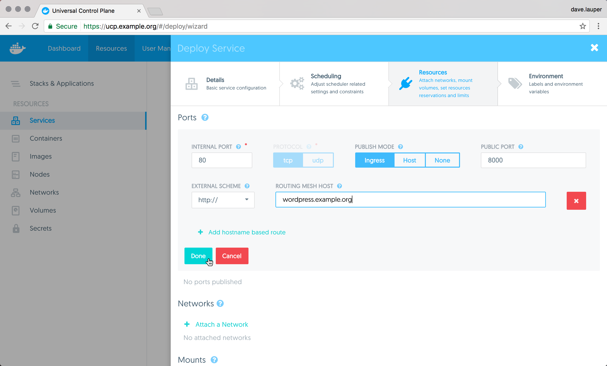

You can make it easier for users to access your HTTP and HTTPS services, by
making them accessible from a domain name, instead of an IP address.


In this example, we're going to deploy a Wordpress service and make it accessible
to users at `http://wordpress.example.org`.

## Enable the HTTP routing mesh

Before you start, make sure an administrator user has
[enabled the HTTP routing mesh service](../../admin/configure/use-domain-names-to-access-services.md).
You also need permissions to attach services to the `ucp-hrm` network.

## Deploy Wordpress

Log in the **UCP web UI**, navigate to the **Services** page, and click
**Create a service**. Then create a Wordpress service with the following
configurations:

| Field             | Value                 |
|:------------------|:----------------------|
| Service name      | wordpress             |
| Image name        | wordpress:latest      |
| Internal port     | 80                    |
| Protocol          | tcp                   |
| Publish Mode      | ingress               |
| Public port       | 8000                  |
| External scheme   | http://               |
| Routing mesh host | wordpress.example.com |

When creating the service, make sure to publish both internal and public ports.
This maps the port 80 on the container running the service, to port 8000 on the
ingress routing mesh.

{: .with-border}

Then click the **Add hostname based route** to set the hostname that will
resolve to the service.

{: .with-border}

Finally, you need to connect the service to the `ucp-hrm` network. This is
what ensures traffic send to the HTTP routing mesh is redirected to your
service.

{: .with-border}

Click **Deploy now** to deploy your service. Once the service is deployed,
the HTTP routing mesh service is reconfigured to redirect HTTP requests with
the hostname set to `wordpress.example.org`, to the Wordpress service.

## Add a DNS entry

Now that Wordpress is deployed, add a new DNS entry that maps
`wordpress.example.org` to the IP address of any node in the UCP cluster.
When testing locally, you can also change your `/etc/hosts` file to
create this mapping, instead of using a DNS service.

Once this is done, you can access the wordpress service from your browser.

{: .with-border}

## From the CLI

To deploy the Wordpress service from the CLI, you need to add labels to the
service that are specific to the HTTP routing mesh.

Once you get your [UCP client bundle](../access-ucp/cli-based-access.md), you
can run:

```none
docker service create \
  --publish target=80,published=8000 \
  --network ucp-hrm \
  --label com.docker.ucp.mesh.http=external_route=http://wordpress.example.org,internal_port=80 \
  --name wordpress \
  wordpress:latest
```

## Under the hood

Under the hood, UCP relies on labels to configure your services to use the
HTTP routing mesh. The UCP web UI automatically adds labels to your services,
but when deploying from the CLI or using compose files, you need to add labels
to your services.

The HTTP routing mesh can route to a service, as long as that service:

* Is attached to a network that has the `com.docker.ucp.mesh.http` label. You can use the default ucp-hrm network or create your own.
* Publishes the ports that you want to route to (UCP versions 2.1.0 and 2.1.1 only).
* Has one or more labels with the prefix `com.docker.ucp.mesh.http`, specifying
the ports to route to

### Service labels

The HTTP routing mesh label that you apply to your services needs to have a list
of keys and values separated by a comma, specifying how to route the traffic to
your service. The label syntax looks like this:

```none
com.docker.ucp.mesh.http[.label-number]=<key-1>=<value-1>,<key-2>=<value-2>
```

Where `.label-number` is an optional number that you can include in your label
name if you want to have multiple routes to the same service. As an example
you could have one route for HTTP and another for HTTPS. In that case you'd
apply two labels:

```none
com.docker.ucp.mesh.http.1=<key-1>=<value-1>
com.docker.ucp.mesh.http.2=<key-1>=<value-1>
```

The keys and values in your label are what defined the route configuration.
These keys are supported:

| Key             | Mandatory                                                | Values                                   | Description                                                                                              |
|:----------------|:---------------------------------------------------------|:-----------------------------------------|:---------------------------------------------------------------------------------------------------------|
| external_route  | yes                                                      | http://domain-name or sni://domain-name  | The external URL to route to this service                                                                |
| internal_port   | yes, if the service publishes no ports or multiple ports | port-number                              | The internal port to use for the service                                                                 |
| sticky_sessions | no                                                       | cookie-name                              | Always route a user to the same service, using HTTP cookies. This option can't be used with HTTPS routes |
| redirect        | no                                                       | http://domain-name, or sni://domain-name | Redirect incoming requests to another route using an HTTP 301 redirect                                   |


### Sticky sessions

You can use the `sticky_sessions` value to always route a user to the same
backend service. The first time a user makes a request, the service includes
a cookie in the response. When the user makes a new request, the user's browser
will send the cookie, and the HTTP routing mesh can use it to decide to which
service to route to.

Since this requires the HTTP routing mesh to read the cookie, this
option only works with HTTP routes.

Sticky sessions might stop temporarily if the service is reconfigured to
change the number of replicas, or if the replicas are restarted.

### HTTP redirects

You can use the `redirect` option to redirect requests from one route to
another.

This allows you to redirect traffic to a new domain name if you've renamed the
domain you're using to serve your services. For that, you apply two labels to
your service:

```none
com.docker.ucp.mesh.http.1=external_route=http://old.example.org,redirect=http://new.example.org
com.docker.ucp.mesh.http.2=external_route=http://new.example.org
```

You can also use this to redirect HTTP requests to an HTTPS route. For that you
apply two labels to your service:

```none
com.docker.ucp.mesh.http.1=external_route=http://example.org,redirect=https://example.org
com.docker.ucp.mesh.http.2=external_route=sni://example.org
```

### Keep services isolated

If you want to keep the services from sharing the same network, before
enabling the HTTP routing mesh:

1. Create multiple networks and apply the `com.docker.ucp.mesh.http` label to them
2. Enable the HTTP routing mesh
3. Attach each service to one of the different networks you've created

The HTTP routing mesh will route to all services in these networks, but services
on different networks can't communicate directly.

When using a UCP client bundle for an admin user, or a user with administrator privileges,
you can create an overlay network that contains the `com.docker.mesh.http` label by running the following command.

```none
docker network create -d overlay --label com.docker.ucp.mesh.http=true new-hrm-network
```

If you're creating a new HRM network you need to disable the HRM service first, or disable
and enable the HRM service after you create the network else HRM will not be available on new network.
