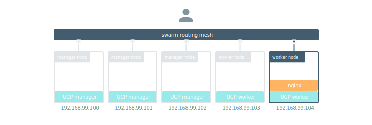
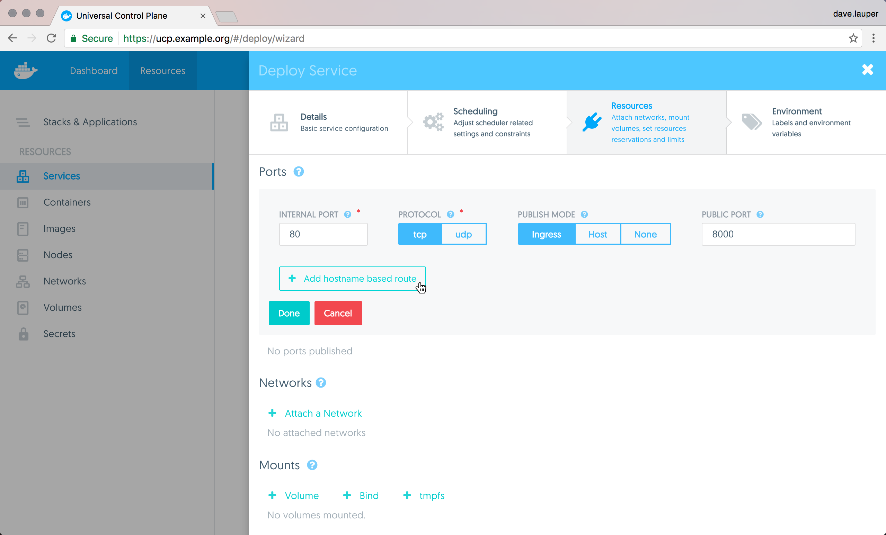
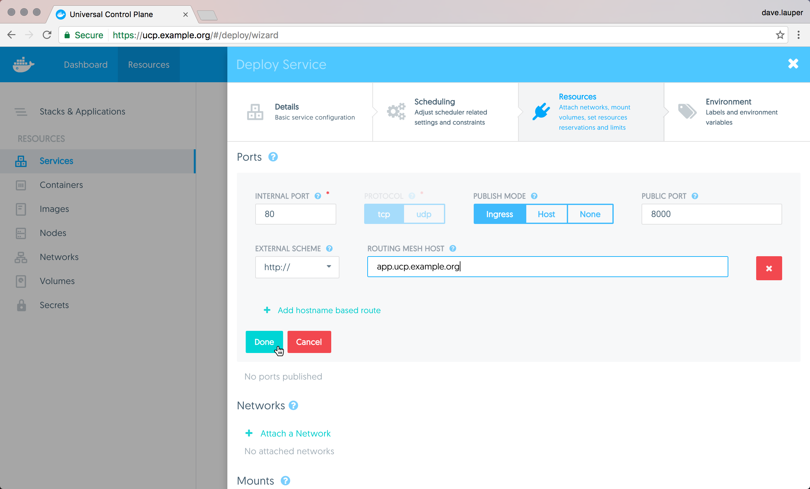
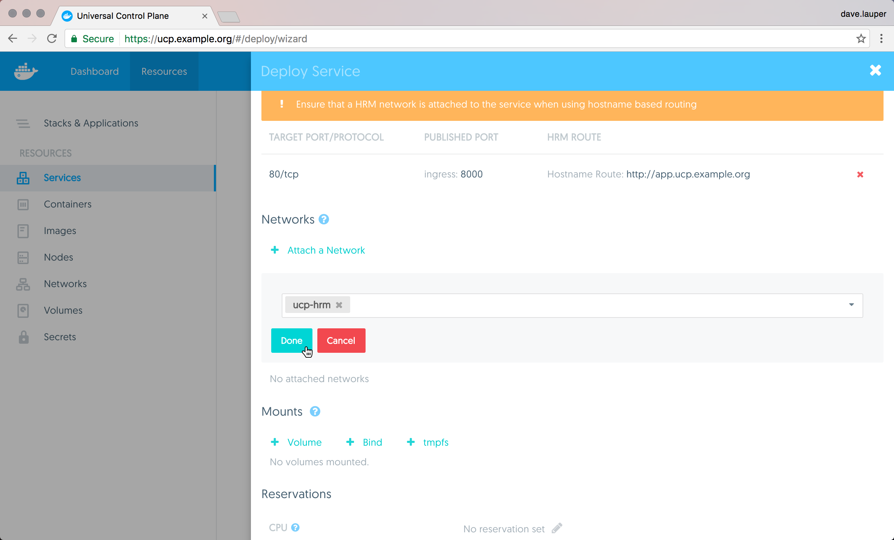
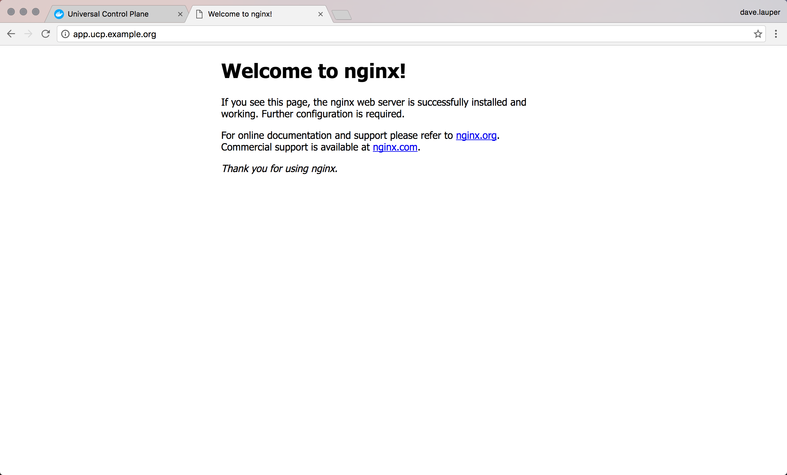

When you deploy a service with an HTTP or HTTPS endpoint, you can make it
accessible to users by mapping the service port to the swarm routing mesh port.
This makes your service available using the IP address of any node in the
cluster.

UCP takes this one step further and allows you to configure your HTTP or HTTPS
services to make them available using hostnames.
In this example we're going to deploy an NGINX service and make it available
with the hostname `app.ucp.example.com`.

Start by making sure that the
[HTTP routing mesh service is enabled](../../admin/configure/use-domain-names-to-access-services.md)
and you have access to the `ucp-hrm` network.
If you don't have administrator credentials, ask your system administrator to
enable the HTTP routing mesh, and grant you access to the `ucp-hrm` network.

Log in the **UCP web UI**, navigate to the **Services** page, and click
**Create a service**. Then create an NGIN service with the following
configurations:

| Field             | Value               |
|:------------------|:--------------------|
| Service name      | nginx               |
| Image name        | nginx               |
| Internal port     | 80                  |
| Public port       | 8000                |
| External scheme   | http://             |
| Routing mesh host | app.ucp.example.com |

When creating the service, make sure to publish both internal and public ports.
This maps the port 80 on the container running the service, to port 8000 on the
ingress routing mesh.

{: .with-border}

Then click the **Add hostname based route** to set the hostname that will
resolve to the service.

{: .with-border}

Finally, you need to connect the service to the `ucp-hrm` network. This is
what ensures traffic send to the HTTP routing mesh is redirected to your
service.

{: .with-border}

Click **Deploy now** to deploy your service. Once the service is deployed,
the HTTP routing mesh service is reconfigured to redirect HTTP requests with
the hostname set to `app.ucp.example.com`, to the NGINX service.

To make this service accessible to users, you need to add an entry to your DNS,
mapping the name `app.ucp.example.com` to the IP address of any node in the
UCP cluster. When testing locally, you can also change your `/etc/hosts` file to
create this mapping, instead of using a DNS service.

Now when you access `http://app.ucp.example.com` from your browser, you'll see
the default NGINX page.

{: .with-border}
