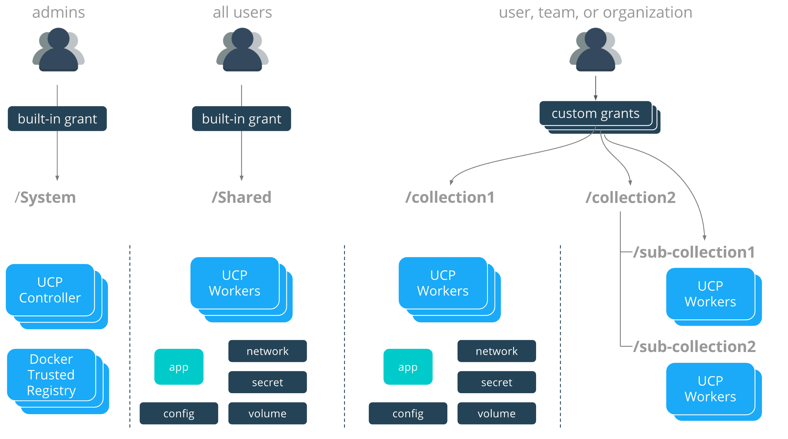

The ability to segment scheduling and visibility by node is called
*node access control* and is a feature of Docker EE Advanced. By default,
all nodes that aren't infrastructure nodes (UCP & DTR nodes) belong to a
built-in collection called `/Shared`. By default, all application workloads
in the cluster will get scheduled on nodes in the `/Shared` collection. This
includes users that are deploying in their private collections
(`/Shared/Private/`) and in any other collections under `/Shared`. This is
enabled by a built-in grant that grants every UCP user the `scheduler`
capability against the `/Shared` collection.

Node Access Control works by placing nodes into custom collections outside of
`/Shared`. If the `scheduler` capability is granted via a role to a user or
group of users against a collection, they can schedule
containers and services on these nodes. In the following example, users with
`scheduler` capability against `/collection1` can schedule
applications on those nodes.

In the directory these collections lie outside of the `/Shared`
collection so users without grants will not have access to these collections
unless explicitly granted access. These users can only deploy
applications on the built-in `/Shared` collection nodes.

{: .with-border}

The tree representation of this collection structure looks like this:

```
/
├── Shared
├── System
├── collection1
└── collection2
    ├── sub-collection1
    └── sub-collection2
```

With the use of default collections, users, teams, and organizations can be
constrained to what nodes and physical infrastructure they are capable of
deploying on.

## Where to go next

- [Isolate swarm nodes to a specific team](isolate-nodes-between-teams.md)