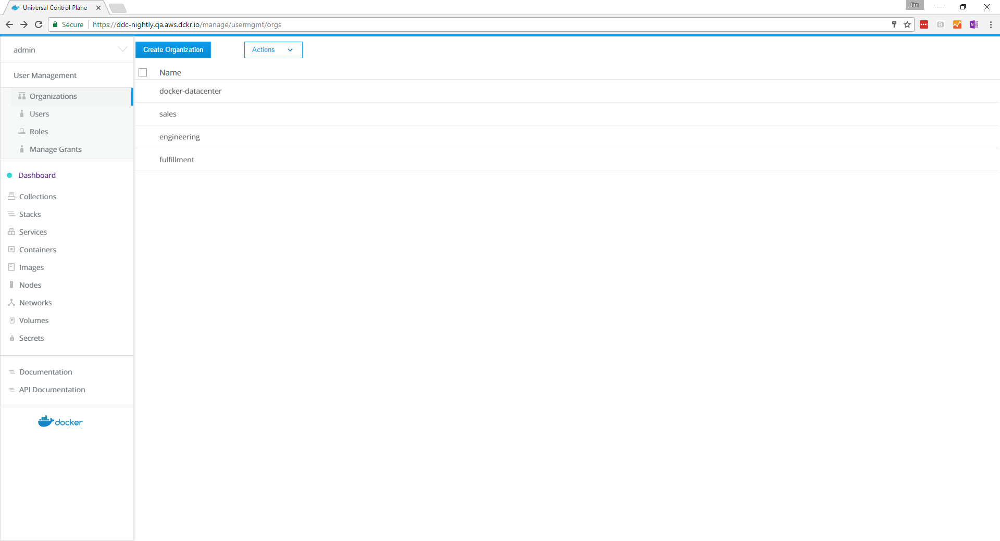
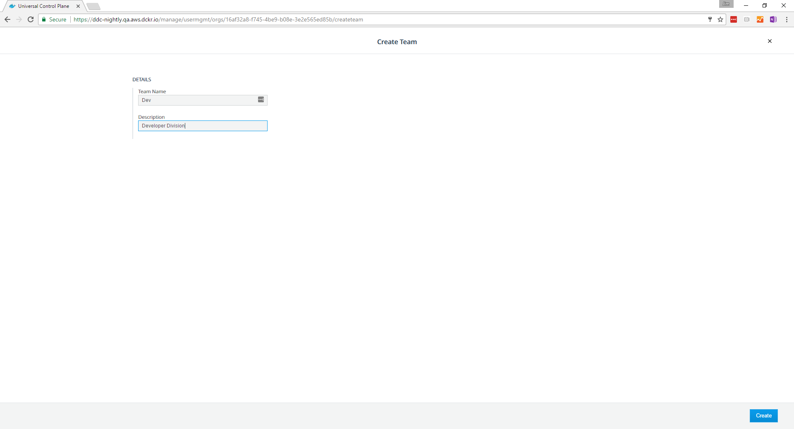
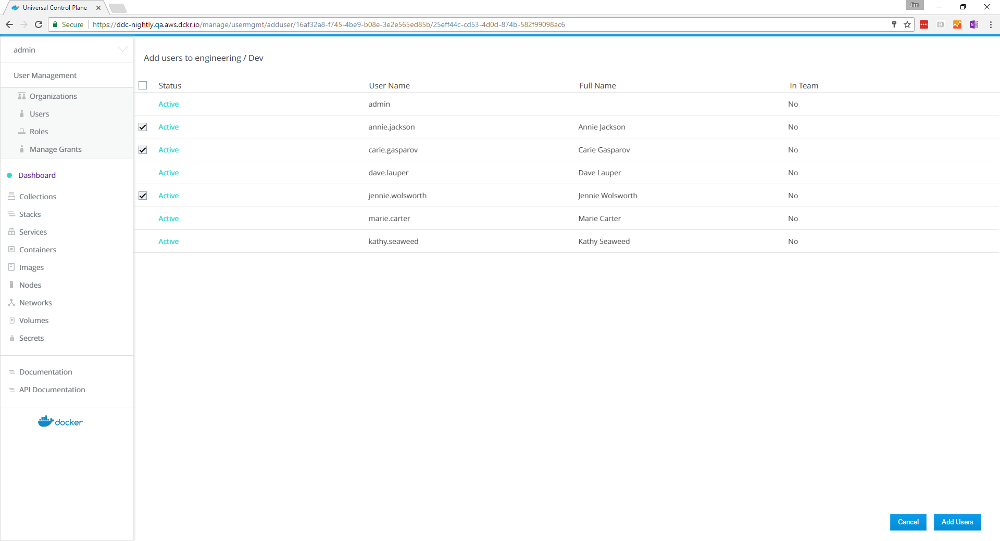
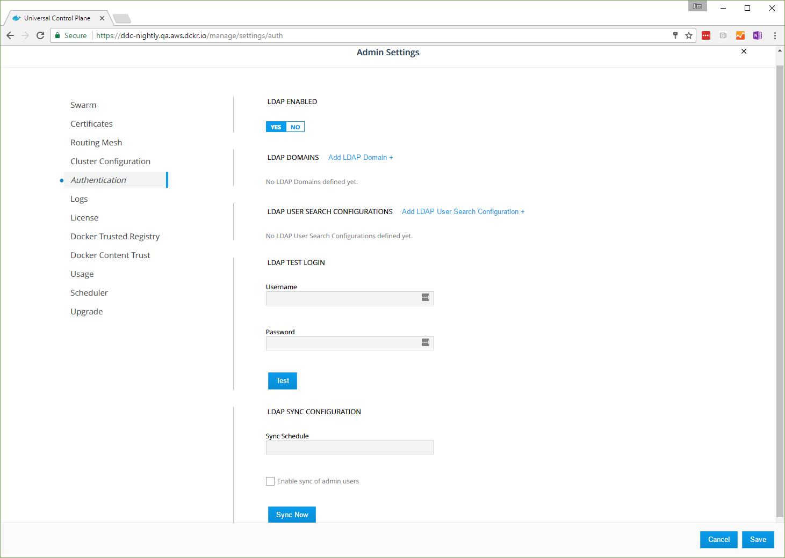
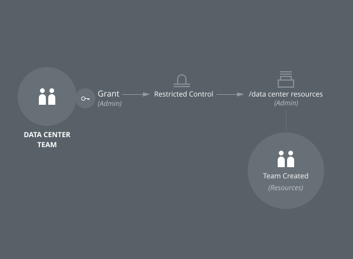
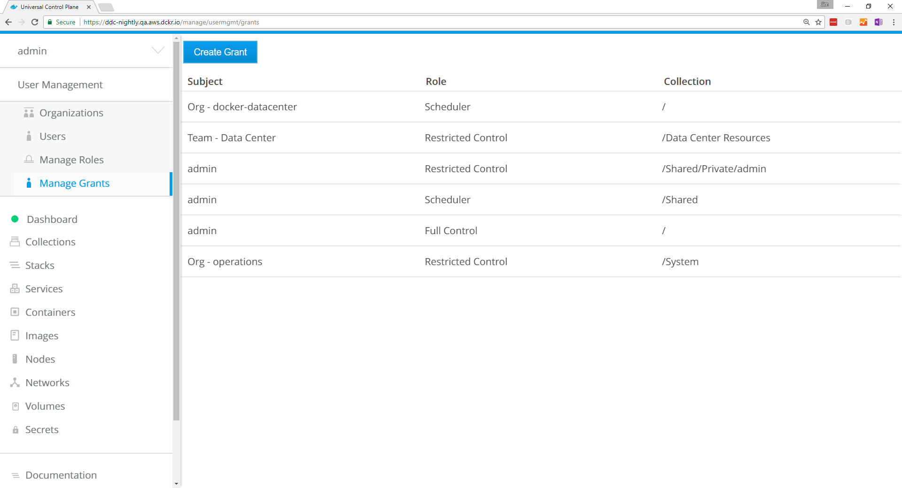

You can extend the user's default permissions by granting them fine-grained
permissions over resources. You do this by adding the user to a team.

To create a new team, go to the UCP web UI, and navigate to the
**Organizations** page.

{: .with-border}

If you want to put the team in a new organization, click
**Create Organization** and give the new organization a name, like
"engineering". Click **Create** to create it.

In the list, click the organization where you want to create the new team.
Name the team, give it an optional description, and click **Create** to
create a new team.

{: .with-border}

## Add users to a team

You can now add and remove users from the team. In the current organization's
teams list, click the new team, and in the details pane, click **Add Users**.
Choose the users that you want to add to the team, and when you're done, click
**Add Users**.

{: .with-border}

## Enable Sync Team Members

To sync the team with your organization's LDAP directory, click **Yes**.

If UCP is configured to sync users with your organization's LDAP directory
server, you have the option to enable syncing the new team's members when
creating a new team or when modifying settings of an existing team.
[Learn how to configure integration with an LDAP directory](../admin/configure/external-auth/index.md).
Enabling this option expands the form with additional fields for configuring
the sync of team members.

{: .with-border}

There are two methods for matching group members from an LDAP directory:

**Match Group Members**

This option specifies that team members should be synced directly with members
of a group in your organization's LDAP directory. The team's membership will by
synced to match the membership of the group.

| Field                  | Description                                                                                           |
|:-----------------------|:------------------------------------------------------------------------------------------------------|
| Group DN               | This specifies the distinguished name of the group from which to select users.                        |
| Group Member Attribute | The value of this group attribute corresponds to the distinguished names of the members of the group. |

**Match Search Results**

This option specifies that team members should be synced using a search query
against your organization's LDAP directory. The team's membership will be
synced to match the users in the search results.

| Field                                    | Description                                                                                                                                            |
| :--------------------------------------- | :----------------------------------------------------------------------------------------------------------------------------------------------------- |
| Search Base DN                           | The distinguished name of the node in the directory tree where the search should start looking for users.                                              |
| Search Filter                            | The LDAP search filter used to find users. If you leave this field empty, all existing users in the search scope will be added as members of the team. |
| Search subtree instead of just one level | Whether to perform the LDAP search on a single level of the LDAP tree, or search through the full LDAP tree starting at the Base DN.               |

**Immediately Sync Team Members**

Select this option to run an LDAP sync operation immediately after saving the
configuration for the team. It may take a moment before the members of the team
are fully synced.

## Manage team permissions

Create a grant to manage the team's permissions.
[Learn how to grant permissions to users based on roles](grant-permissions.md).
In this example, you create a collection for the "Data Center" team,
where they can deploy services and resources, and you create a grant that
gives the team permission to access the collection.

{: .with-border}

1.  Navigate to the **Organizations & Teams** page.
2.  Select **docker-datacenter**, and click **Create Team**. Name the team
    "Data Center", and click **Create**.
3.  Navigate to the **Collections** page.
4.  Click **Create Collection**, name the collection "Data Center Resources",
    and click **Create**.
5.  Navigate to the **Grants** page, and click **Create Grant**.
6.  Find **Swarm** in the collections list, and click **View Children**.
7.  Find **Data Center Resources**, and click **Select Collection**.
8.  In the left pane, click **Roles** and in the **Role** dropdown, select
    **Restricted Control**.   
9.  In the left pane, click **Subjects** and select the **Organizations**
    subject type.
10. In the **Organization** dropdown, select **docker-datacenter**, and in the
   **Teams** dropdown, select **Data Center**.
11. Click **Create** to create the grant.

{: .with-border}

In this example, you gave members of the `Data Center` team
`Restricted Control` permissions to create and edit resources in
the `Data Center Resources` collection.

## Where to go next

-  [UCP permission levels](permission-levels.md)
-  [Isolate volumes between two different teams](isolate-volumes-between-teams.md)
-  [Isolate swarm nodes between two different teams](isolate-nodes-between-teams.md)

