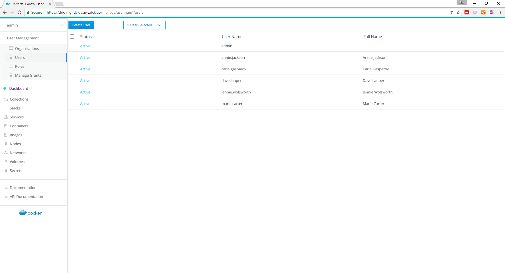
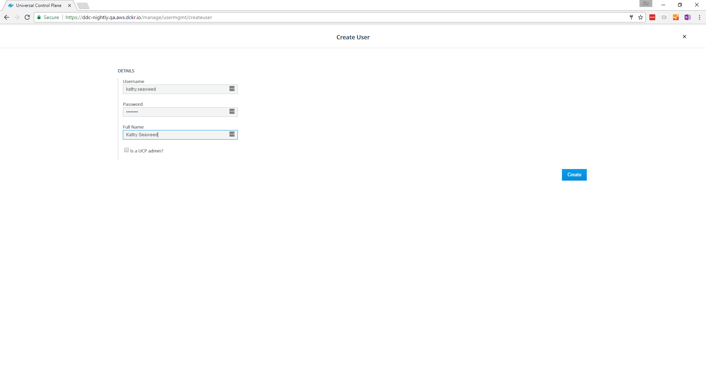

Docker Universal Control Plane provides built-in authentication and also
integrates with LDAP directory services. If you want to manage
users and groups from your organization's directory, choose LDAP. 
[Learn to integrate with an LDAP directory](../admin/configure/external-auth/index.md).

When using the UCP built-in authentication, you need to create users and
optionally grant them UCP administrator permissions.

Each new user gets a default permission level so that they can access the
swarm.

To create a new user, go to the UCP web UI, and navigate to the
**Users** page.

{: .with-border}

Click the **Create user** button, and fill-in the user information.

{: .with-border}

Check the `Is a UCP admin?` option, if you want to grant permissions for the
user to change the swarm configuration and manage grants, roles, and
collections.

Finally, click the **Create** button to create the user.

## Where to go next

* [Create and manage teams](create-and-manage-teams.md)
* [UCP permission levels](permission-levels.md)
