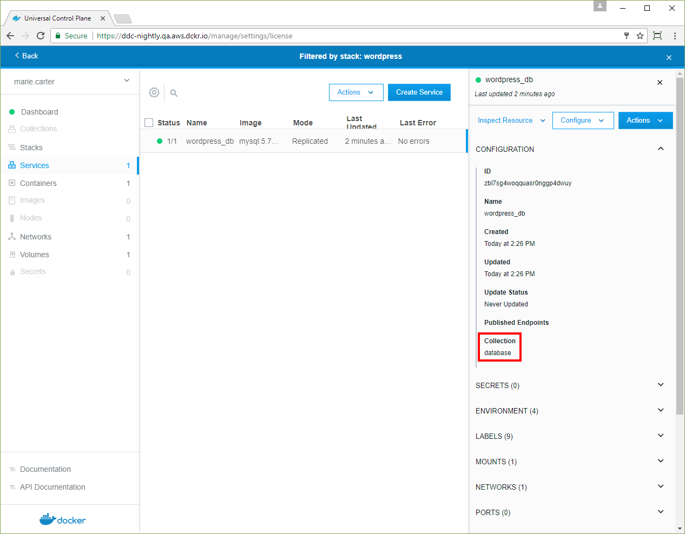

A stack file is the definition of an application, and in the stack file,
you can apply access labels to specify access to application resources.
UCP interprets an access label to be the name of a collection that users are
granted access to by an administrator.
[Learn about managing access to resources by using collections](manage-access-with-collections.md).  

Specify a collection for a resource by adding a `labels:` dictionary to the
stack file and assigning the `com.docker.ucp.access.label` key. For example,
a stack file that puts a resource in the `database` collection might look
similar to this:  

```none
services:
   db:
     image: mysql:5.7
     deploy:
      labels:
        com.docker.ucp.access.label: database
```

If you don't specify access labels in the stack file, resources are placed in
the user's default collection when the stack deploys.

You can place a stack's resources into multiple collections, but most of the
time, you won't need to do this.

## Deploy a stack file resource to a collection

In this example, the following legacy stack file deploys a MySQL service with
the access label `database`. For this deployment to succeed, an administrator
must create a collection at `/Shared/Legacy/database` and
[grant user permissions](grant-permissions.md) to access it.

```none
version: '3.0'

services:
   db:
     image: mysql:5.7
     deploy:
      replicas: 1
      restart_policy:
        condition: on-failure
        max_attempts: 3
      labels:
        com.docker.ucp.access.label: database
     volumes:
       - db_data:/var/lib/mysql
     environment:
       MYSQL_ROOT_PASSWORD: secure-password
       MYSQL_DATABASE: wordpress
       MYSQL_USER: wordpress
       MYSQL_PASSWORD: secure-password
volumes:
    db_data:
```

To deploy the application:

1. In the UCP web UI, navigate to the **Stacks** page and click **Create Stack**.
2. Name the app "wordpress". 
3. From the **Mode** dropdown, select **Services**.
4. Copy and paste the previous stack file into the **Compose.yml** editor.
5. Click **Create** to deploy the application, and click **Done** when the
   deployment completes.

If the `/Shared/Legacy/database` collection doesn't exist, or if you don't have
a grant for accessing it, UCP reports an error.

To confirm that the service deployed to the `database` collection:

1. In the **Stacks** page, click **wordpress**.
2. In the details pane, click **Inspect Resource** and select **Services**.
3. On the **Services** page, click **wordpress_db**. In the details pane,
   check that the **Collection** is `database`.  

{: .with-border}

If you want to specify the user's default collection, instead of the legacy
`database` collection, remove the `labels:` dictionary from the stack file.

If you want to specify a different collection, use path notation. For example,
`com.docker.ucp.access.label: /Shared/database` deploys to a child of the
built-in `/Shared` collection. An administrator must create the child collection
and grant permissions before you can deploy to it.

 ## Where to go next

 - [Manage access to resources by using collections](manage-access-with-collections.md)
