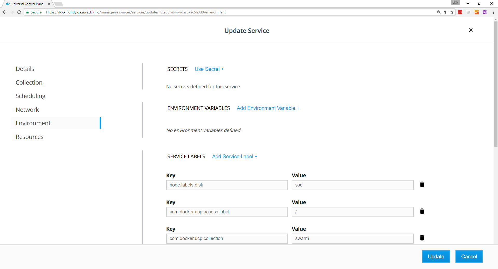

With Docker UCP, you can add labels to your nodes. Labels are metadata that
describe the node, like its role (development, QA, production), its region
(US, EU, APAC), or the kind of disk (hdd, ssd). Once you have labeled your
nodes, you can add deployment constraints to your services, to ensure they
are scheduled on a node with a specific label.

For example, you can apply labels based on their role in the development
lifecycle, or the hardware resources they have.


Don't create labels for authorization and permissions to resources.
Instead, use collections to organize access to your swarm.
[Learn about managing access with collections](../manage-access-with-collections.md).   

## Apply labels to a node

In this example we'll apply the `ssd` label to a node. Then we'll deploy
a service with a deployment constraint to make sure the service is always
scheduled to run on a node that has the `ssd` label.

Log in with administrator credentials in the UCP web UI, navigate to the
**Nodes** page, and choose the node you want to apply labels to. In the
details pane, click **Configure**.

In the **Edit Node** page, scroll down to the **Labels** section.

Click **Add Label**, and add a label that has a key set to `nodel.labels.disk`
and a value of `ssd`. 

{: .with-border}

When you're done, click **Save** and dismiss the **Edit Node** page.
In the node's details pane, click **Labels** to view the labels that are
applied to the node. 

You can also do this from the CLI by running:

```bash
$ docker node update --label-add <key>=<value> <node-id>
```

## Add a constraint to a service

When deploying a service, you can specify constraints, so that the service gets
scheduled only on a node that has a label that fulfills all of the constraints
you specify.

In this example, when users deploy a service, they can add constraints for the
service to be scheduled on nodes that have SSD storage.

You can add deployment constraints to your docker-stack.yml file or when you're
creating a stack:


Or you can apply them when you're creating a service.
To check if a service has deployment constraints, navigate to the 
**Services** page and choose the service that you want to check.
In the details pane, click **Constraints** to list the constraint labels.

To edit the labels on the service, click **Configure** and select
**Environment** 



From here, you can add or remove deployment constraints, too.

## Where to go next

* [Store logs in an external system](store-logs-in-an-external-system.md)
