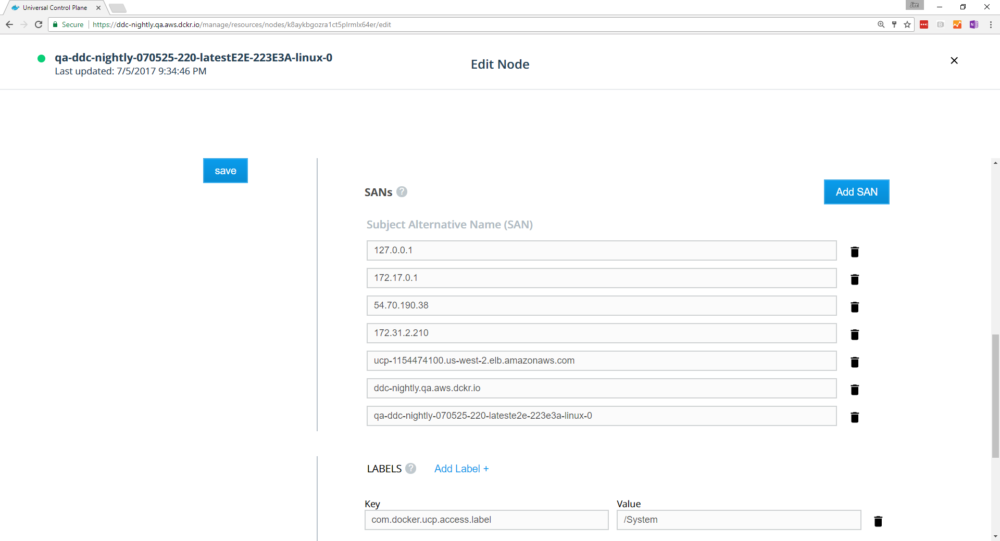

UCP always runs with HTTPS enabled. When you connect to UCP, you need to make
sure that the hostname that you use to connect is recognized by UCP's
certificates. If, for instance, you put UCP behind a load balancer that
forwards its traffic to your UCP instance, your requests will be for the load
balancer's hostname or IP address, not UCP's. UCP will reject these requests
unless you include the load balancer's address as a Subject Alternative Name
(or SAN) in UCP's certificates.

If you use your own TLS certificates, make sure that they have the correct SAN
values.
[Learn about using your own TLS certificates](use-your-own-tls-certificates.md).

If you want to use the self-signed certificate that UCP has out of the box, you
can set up the SANs when you install UCP with the `--san` argument. You can
also add them after installation.

## Add new SANs to UCP

1.  In the UCP web UI, log in with administrator credentials and navigate to
    the **Nodes** page.
2.  Click on a manager node, and in the details pane, click **Configure**.
3.  In the **SANs** section, click **Add SAN**, and enter one or more SANs
    for the swarm.
    {: .with-border}
4.  Once you're done, click **Save**.

You need to do this on every manager node in the swarm, but once you
have done so, the SANs are applied automatically to any new manager nodes
that join the swarm.

You can also do this from the CLI by first running:


```bash
$ docker node inspect --format '{{ index .Spec.Labels "com.docker.ucp.SANs" }}' <node-id>
default-cs,127.0.0.1,172.17.0.1
```


This will get the current set of SANs for the given manager node. Append your
desired SAN to this list, for example `default-cs,127.0.0.1,172.17.0.1,example.com`,
and then run:

```bash
$ docker node update --label-add com.docker.ucp.SANs=<SANs-list> <node-id>
```

`<SANs-list>` is the list of SANs with your new SAN appended at the end. As in
the web UI, you must do this for every manager node.
