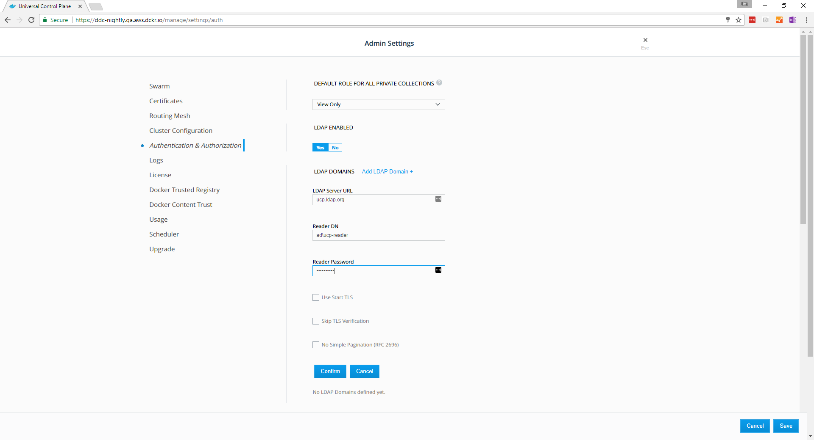
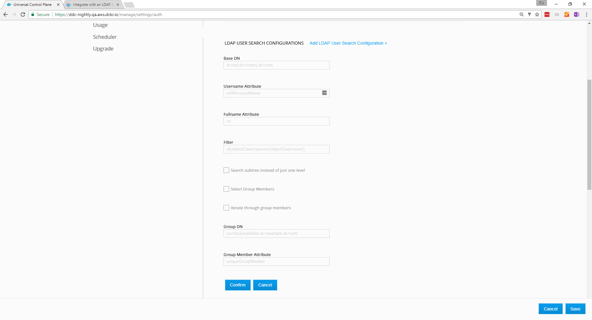

Docker UCP integrates with LDAP directory services, so that you can manage
users and groups from your organization's directory and it will automatically
propagate that information to UCP and DTR.

If you enable LDAP, UCP uses a remote directory server to create users
automatically, and all logins are forwarded to the directory server.

When you switch from built-in authentication to LDAP authentication,
all manually created users whose usernames don't match any LDAP search results
are still available.

## Configure the LDAP integration

To configure UCP to create and authenticate users using an LDAP directory,
go to the UCP web UI, navigate to the **Admin Settings** page and click 
**Authentication & Authorization** to select the method used to create and
authenticate users.

In the **LDAP Enabled** section, click **Yes** to The LDAP settings appear.
Now configure your LDAP directory integration.

## Default Role For All Private Collections

Click the dropdown to select the permission level assigned by default to
the private collections of new users.
[Learn more about permission levels](../../../access-control/permission-levels.md).                                    

## LDAP domains

Click **Add LDAP Domain** to show the LDAP server configuration settings.

| Field                 | Description                                                                                                                                                               |
| :-------------------- | :------------------------------------------------------------------------------------------------------------------------------------------------------------------------ |
| LDAP server URL       | The URL where the LDAP server can be reached.                                                                                                                             |
| Reader DN             | The distinguished name of the LDAP account used for searching entries in the LDAP server. As a best practice, this should be an LDAP read-only user.                       |
| Reader password       | The password of the account used for searching entries in the LDAP server.                                                                                                |
| Use Start TLS         | Whether to authenticate/encrypt the connection after connecting to the LDAP server over TCP. If you set the LDAP Server URL field with `ldaps://`, this field is ignored. |
| Skip TLS verification | Whether to verify the LDAP server certificate when using TLS. The connection is still encrypted but vulnerable to man-in-the-middle attacks.                              |
| No simple pagination  | If your LDAP server doesn't support pagination.                                                                                                                           |

{: .with-border}

Click **Confirm** to add your LDAP domain. 

## LDAP user search configurations

| Field                                    | Description                                                                                                                                                                                                                                                                                                                                                                                                                                                                                                                                                                                   |                                        |
| :--------------------------------------- | :-------------------------------------------------------------------------------------------------------------------------------------------------------------------------------------------------------------------------------------------------------------------------------------------------------------------------------------------------------------------------------------------------------------------------------------------------------------------------------------------------------------------------------------------------------------------------------------------- | -------------------------------------- |
| Base DN                                  | The distinguished name of the node in the directory tree where the search should start looking for users.                                                                                                                                                                                                                                                                                                                                                                                                                                                                                     |                                        |
| Username attribute                       | The LDAP attribute to use as username on UCP. Only user entries with a valid username will be created. A valid username is no longer than 100 characters and does not contain any unprintable characters, whitespace characters, or any of the following characters: `/` `\` `[` `]` `:` `;` `|` `=` `,` `+` `*` `?` `<` `>` `'` `"`. |
| Full name attribute                      | The LDAP attribute to use as the user's full name for display purposes. If left empty, UCP will not create new users with a full name value.                                                                                                                                                                                                                                                                                                                                                                                                                                                  |                                        |
| Filter                                   | The LDAP search filter used to find users. If you leave this field empty, all directory entries in the search scope with valid username attributes are created as users.                                                                                                                                                                                                                                                                                                                                                                                                                      |                                        |
| Search subtree instead of just one level | Whether to perform the LDAP search on a single level of the LDAP tree, or search through the full LDAP tree starting at the Base DN.                                                                                                                                                                                                                                                                                                                                                                                                                                                          |                                        |
| Select Group Members                     | Whether to further filter users by selecting those who are also members of a specific group on the directory server. This feature is helpful if the LDAP server does not support `memberOf` search filters.                                                                                                                                                                                                                                                                                                                                                                                   |                                        |
| Iterate through group members            | If `Select Group Members` is selected, this option searches for users by first iterating over the target group's membership, making a separate LDAP query for each member. as opposed to first querying for all users which match the above search query and intersecting those with the set of group members. This option can be more efficient in situations where the number of members of the target group is significantly smaller than the number of users which would match the above search filter, or if your directory server does not support simple pagination of search results. |                                        |
| Group DN                                 | If `Select Group Members` is selected, this specifies the distinguished name of the group from which to select users.                                                                                                                                                                                                                                                                                                                                                                                                                                                                         |                                        |
| Group Member Attribute                   | If `Select Group Members` is selected, the value of this group attribute corresponds to the distinguished names of the members of the group.                                                                                                                                                                                                                                                                                                                                                                                                                                                  |                                        |

{: .with-border}

To configure more user search queries, click **Add LDAP User Search Configuration**
again. This is useful in cases where users may be found in multiple distinct
subtrees of your organization's directory. Any user entry which matches at
least one of the search configurations will be synced as a user.

## LDAP Test Login

| Field    | Description                                                                                                                                                                           |
| :------- | :------------------------------------------------------------------------------------------------------------------------------------------------------------------------------------ |
| Username | An LDAP username for testing authentication to this application. This value corresponds with the **Username Attribute** specified in the **LDAP user search configurations** section. |
| Password | The user's password used to authenticate (BIND) to the directory server.                                                                                                              |

Before you save the configuration changes, you should test that the integration
is correctly configured. You can do this by providing the credentials of an
LDAP user, and clicking the **Test** button.

## LDAP Sync Configuration

| Field                      | Description                                                                                                                                                                                                                                                              |
| :------------------------- | :----------------------------------------------------------------------------------------------------------------------------------------------------------------------------------------------------------------------------------------------------------------------- |
| Sync interval              | The interval, in hours, to synchronize users between UCP and the LDAP server. When the synchronization job runs, new users found in the LDAP server are created in UCP with the default permission level. UCP users that don't exist in the LDAP server become inactive. |
| Enable sync of admin users | This option specifies that system admins should be synced directly with members of a group in your organization's LDAP directory. The admins will be synced to match the membership of the group. The configured recovery admin user will also remain a system admin.    |

Once you've configured the LDAP integration, UCP synchronizes users based on
the interval you've defined starting at the top of the hour. When the 
synchronization runs, UCP stores logs that can help you troubleshoot when
something goes wrong.

You can also manually synchronize users by clicking **Sync Now**.

## Login Session Controls

| Field                   | Description                                                                                                                                                                            |
| :---------------------- | :------------------------------------------------------------------------------------------------------------------------------------------------------------------------------------- |
| Lifetime Hours          | The maxiumum length of a login session. When this time expires, UCP invalidates the session, and the user must authenticate again to establish a new session. The default is 72 hours. |
| Renewal Threshold Hours | The time to wait before UCP renews the session automatically. Typically, this occurs during a user session and is independent of session activity. The default is 24 hours.            |
| Per User Limit          | The maximum number of simultaneous logins for a user.                                                                                                                                  |

## Revoke user access

When a user is removed from LDAP, that user becomes inactive after the LDAP
synchronization runs.

Also, when you switch from the built-in authentication to using LDAP
authentication, all manually created users whose usernames do not match any
LDAP search results become inactive, with the exception of the recovery admin
user which can still login with the recovery admin password.

## Data synced from your organization's LDAP directory

UCP saves a minimum amount of user data required to operate. This includes
the value of the username and full name attributes that you have specified in
the configuration as well as the distinguished name of each synced user.
UCP does not query, or store any additional data from the directory server.

## Sync teams

UCP enables syncing teams with a search query or group in your organization's
LDAP directory. 
[Sync team members with your organization's LDAP directory](../../manage-users/create-and-manage-teams.md).

## Where to go next

-  [Create and manage users](../../../access-control/create-and-manage-users.md)
-  [Create and manage teams](../../../access-control/create-and-manage-teams.md)
-  [UCP permission levels](../../../access-control/permission-levels.md)
-  [Enable LDAP integration by using a configuration file](enable-ldap-config-file.md)
