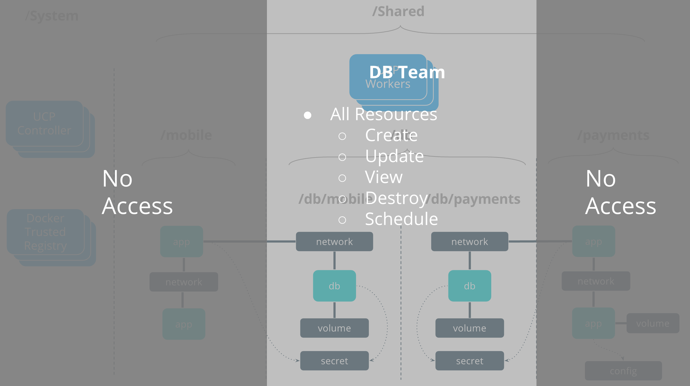

[Collections and grants](../manage-users/) are strong tools that can be used to control access and visibility to resources in UCP. The previous [Introductory Multitenancy Tutorial](design-access-control-ee-standard.md) describes a fictional company called SecureBank that has designed a resource access architecture that fits the specific security needs of their organization. Be sure to go through this tutorial if you have not already before continuing. 

In this tutorial SecureBank's deployment model and organizational structure has grown in complexity and will require a new UCP access control design to accommodate it. This tutorial builds on the [Introductory Tutorial](design-access-control-ee-standard) by introducing centralized LDAP/AD, multiple grants per team, and also the ability for resources to be shared between different teams.

## Team Access Requirements

After the initial RBAC design, SecureBank has reorganized their application teams to specialize more and provide shared services to other applications. A `db` team was created just to manage the databases that other applications will utilize. Additionally, SecureBank recently read a book about DevOps. They have decided that developers should have the capability to deploy and manage the lifecycle of their own applications, effectively merging developer and operations teams.

- `security` should have visibility-only access across all applications in the cluster.
- `db` should have the full set of capabilities against all database applications and their respective resources.
- `payments` should have the full set of capabilities to deploy Payments apps and also access some of the shared services provided by the `db` team.
- `mobile` has the same rights as the `payments` team, with respect to the Mobile applications.

## Role Composition

SecureBank will use the same roles as in the Introductory Tutorial, but will replace the `dev` role with a new role called `View & Use Networks + Secrets`. This type of role will enable application DevOps teams to use shared resources provided by other teams. It will enable applications to connect to networks and use secrets that will also be used by `db` containers, but not the ability to see or impact the `db` applications themselves.

{: .with-border}

## Collection Architecture

The previous tutorial introduced a tier of collections specific to the types of applications being deployed by SecureBank.

- `/Shared/payments` hosts all applications and resources for the Payments applications.
- `/Shared/mobile` hosts all applications and resources for the Mobile applications.

Some new collections will be created to enable the shared `db` applications.

- `/Shared/db` will be a top-level collection for all `db` resources.
- `/Shared/db/payments` will be specifically for `db` resources providing service to the Payments applications.
- `/Shared/db/mobile` will do the same for the Mobile applications.

The following grant composition will show that this collection architecture allows an app team to access shared `db` resources without providing access to _all_ `db` resources. At the same time _all_ `db` resources will be managed by a single `db` team.

## LDAP/AD Integration

SecureBank has standardized on LDAP for centralized authentication to help their identity team scale across all the platforms they manage. As a result LDAP groups will be mapped directly to UCP teams using UCP's native LDAP/AD integration. As a result users can be added to or removed from UCP teams via LDAP which can be managed centrally by SecureBank's identity team. The following grant composition shows how LDAP groups are mapped to UCP teams .

## Grant Composition

The Introductory Tutorial used a design with a 1:1 ratio between grants and teams. That is a valid design but eams can also support multiple grants per team which allows for more complex access scenarios. SecureBank will apply two grants for each application team, allowing each team to fully manage their own apps in their collection, but also have limited access against networks and secrets within the `db` collection.

{: .with-border}

## SecureBank Access Architecture

The resulting access architecture shows applications connecting across collection boundaries. Multiple grants per team allow Mobile applications and Databases to connect to the same networks and use the same secrets so they can securely connect with each other but through a secure and controlled interface. Note that these resources are still deployed across the same group of UCP worker nodes. Node segmentation is discussed in the [next tutorial](#).

{: .with-border}

### DB Team

The `db` team is responsible for deploying and managing the full lifecycle of the databases used by the application teams. They have the full set of capabilities against all database resources. 

{: .with-border}

### Mobile Team

The `mobile` team is responsible for deploying their own application stack, minus the database tier which is managed by the `db` team. 

{: .with-border}

