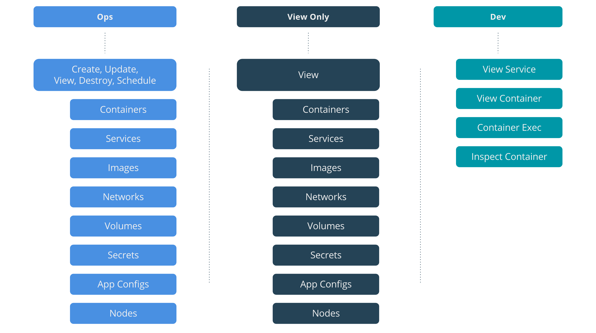
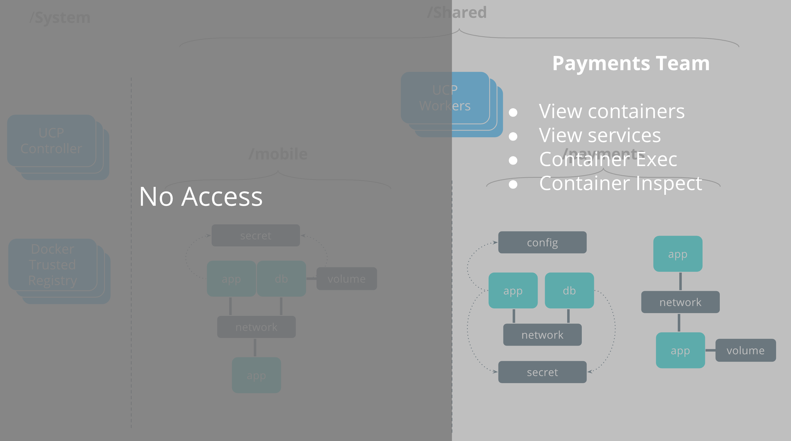

[Collections and grants](../manage-users/) are strong tools that can be used to control access and visibility to resources in UCP. UCP Access Control is flexible and granular to provide for an access design that fits the architecture and specific needs of diverse organizational structures. Many different structures are possible with the flexibility of UCP and the examples in these tutorials show just a few possible scenarios.

This example shows a very simple access structure to clearly explain the basics of UCP Access Control at a fictional company named SecureBank.

## Team Access Requirements

Company SecureBank deploys their production applications on a UCP cluster. They have four teams that interact with containerized applications along their production lifecycle. 

- `ops` is responsible for deploying and managing all of the operations of all container applications. This is the only team with the capability to deploy applications in the production UCP cluster.
- `security` conducts security audits for production applications. They must have visibility across all production container resources in the UCP cluster.
- `payments` is a team of developers responsible for payments applications. At SecureBank developers do not deploy applications in to production, however developers can get access directly to the container only to do operations or troubleshooting. This team should only have visibility to their own applications.
- `mobile` has the same rights as the `payments` team, but should only be able to have access to only their own applications.

## Role Composition

UCP provides some [default roles](../manage-users/permission-levels/#roles) but custom roles can also be created to cater to very specific combinations of capabilities. SecureBank will create custom roles so they can get provide more customized access to resources. SecureBank will have three types of custom roles that will map to the types of actual roles they have in their organization.

- `Ops` can do any action against any type of resource in the cluster including creating, viewing, and destroying resources.
- `View Only` can view but not edit any type of resource in the cluster.
- `Dev` can only see services and containers and `exec` into the containers to interact with the processes inside the containers that they have access to.

{: .with-border}

## Collection Architecture

UCP provides [default collections](../manage-users/manage-access-with-collections/#control-access-to-nodes) to enforce broad access rights such as separation between infrastructure (UCP & DTR) nodes and application (worker) nodes. More granular segmentation of users is up to the administrator to design using collections to best fit the organizational structure that they need. 

In addition the the default collections, SecureBank will create two more collections to map to specific application teams in their org.

- `/Shared` is the default Shared collection that all non-Infra, application hosting nodes will belong to.
- `/Shared/payments` is created to host all resources related to the Payments applications.
- `/Shared/mobile` is created to host all resources related to the Mobile applications.

## Grant Composition

[Grants](../manage-users/grant-permissions/) are the specific rules that govern who has access to which resources. SecureBank will tie together their teams, custom roles, and collections to create a set of grants. The following images shows the four grants that are created that will enforce the access requirements of SecureBank.

{: .with-border}

## SecureBank Access Architecture

The image below shows the access architecture as a result of the UCP Grants. Docker infrastructure nodes that host UCP and DTR are in a `/System` collection that no non-admin UCP users have access to. The remaining UCP worker nodes are by default in the top-level `/Shared` collection and will be shared across all applications. 

{: .with-border}

### Ops Team

The `ops` team can execute any capability against resources in the `/Shared` collection. This gives `ops` members the ability to schedule containers on UCP workers, create networks & volumes, and more. The `ops` team has no access against anything in the `/System` collection. When deploying Mobile and Payments applications, `ops` members will select either `/Shared/payments` or `/Shared/mobile` to deploy applications in to.

{: .with-border}

### Security Team

The `security` team can view all resources in the `/Shared` collection. This gives visibility to all resources used by the Mobile and Payments applications. 

{: .with-border}

### Payments Team

All Mobile applications and their respective resources will be scheduled in the `/Shared/payments` collection. The `payments` team will have visibility to the containers and services in this collection as well as the ability to `exec` in to the container.

{: .with-border}

### Mobile Team

The `mobile` team and Mobile applications will also have their own collection, `/Shared/mobile`.

{: .with-border}

