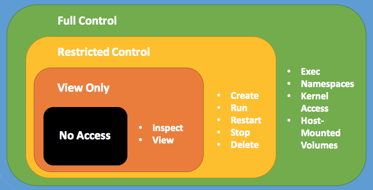

Docker Universal Control Plane has two types of users: administrators and
regular users. Administrators can make changes to the UCP swarm, while
regular users have permissions that range from no access to full control over
resources like volumes, networks, images, and containers. Users are 
grouped into teams and organizations.

Administrators create *grants* to users, teams, and organizations to give
permissions to swarm resources.  

## Administrator users

In Docker UCP, only users with administrator privileges can make changes to
swarm settings. This includes:

* Managing user permissions by creating grants.
* Managing swarm configurations, like adding and removing nodes.

## Roles

A role is a set of permitted API operations on a collection that you
can assign to a specific user, team, or organization by using a grant.

UCP administrators view and manage roles by navigating to the **Roles** page. 

The system provides the following default roles: 

| Built-in role        | Description |
|----------------------|-------------|
| `View Only`          | The user can view resources like services, volumes, and networks but can't create them. |
| `Restricted Control` | The user can view and edit volumes, networks, and images but can't run a service or container in a way that might affect the node where it's running. The user can't mount a node directory and can't `exec` into containers. Also, The user can't run containers in privileged mode or with additional kernel capabilities. |
| `Scheduler`          | The user can schedule and view workloads on worker nodes. By default, all users get a grant with the `Scheduler` role against the `/Shared` collection. |
| `Full Control`       | The user can view and edit volumes, networks, and images, They can create containers without any restriction, but can't see other users' containers. |

Administrators can create a custom role that has Docker API permissions
that specify the API actions that a subject may perform.

The **Roles** page lists the available roles, including the default roles
and any custom roles that administrators have created. In the **Roles**
list, click a role to see the API operations that it uses. For example, the
`Scheduler` role has two of the node operations, `Schedule` and `View`.

Click **Create role** to create a custom role and define the API operations
that it uses. When you create a custom role, all of the APIs that you can use
are listed on the **Create Role** page. For example, you can create a custom
role that uses all of the node operations, `Join Token`, `Schedule`,
`Update`, and `View`, and you might give it a name like "Node Operator".

You can give a role a global name, like "Remove Images", which might enable 
the **Remove** and **Force Remove** operations for images. You can apply a
role with the same name to different collections.

Only an administrator can create and remove roles. An administrator
can enable and disable roles in the system. Roles can't be edited, so
to change a role's API operations, you must delete it and recreate it.

You can't delete a custom role if it's used in a grant. You must first delete
the grants that use the role. 

## Where to go next

* [Create and manage users](create-and-manage-users.md)
* [Create and manage teams](create-and-manage-teams.md)
* [Docker Reference Architecture: Securing Docker Datacenter and Security Best Practices](https://success.docker.com/KBase/Docker_Reference_Architecture%3A_Securing_Docker_Datacenter_and_Security_Best_Practices)
