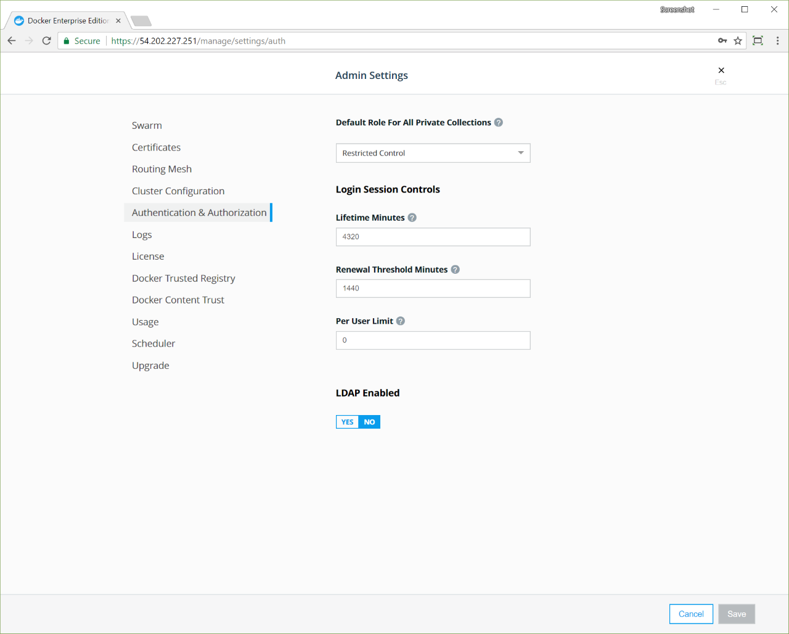

Docker Universal Control Plane enables setting properties of user sessions,
like session timeout and number of concurrent sessions.

To configure UCP login sessions, go to the UCP web UI, navigate to the
**Admin Settings** page and click **Authentication & Authorization**.

## Login session controls

|          Field          |                                                                                                                                                                                                                                             Description                                                                                                                                                                                                                                             |
| :---------------------- | :-------------------------------------------------------------------------------------------------------------------------------------------------------------------------------------------------------------------------------------------------------------------------------------------------------------------------------------------------------------------------------------------------------------------------------------------------------------------------------------------------- |
| Lifetime Minutes          | The initial lifetime of a login session, from the time UCP generates it. When this time expires, UCP invalidates the session, and the user must authenticate again to establish a new session. The default is 4320 minutes, which is 72 hours.                                                                                                                                                                                                                                                                             |
| Renewal Threshold Minutes | The time before session expiration when UCP extends an active session. UCP extends the session by the number of hours specified in **Lifetime Hours**. The threshold value can't be greater than **Lifetime Hours**. The default is 1440 minutes, which is 24 hours. To specify that sessions are extended with every use, set the threshold equal to the lifetime. To specify that sessions are never extended, set the threshold to zero. This may cause users to be logged out unexpectedly while using the UCP web UI. |
| Per User Limit          | The maximum number of simultaneous logins for a user. If creating a new session exceeds this limit, UCP deletes the least recently used session. To disable the limit, set the value to zero.                                                                                                                                                                                                                                                                                                       |
