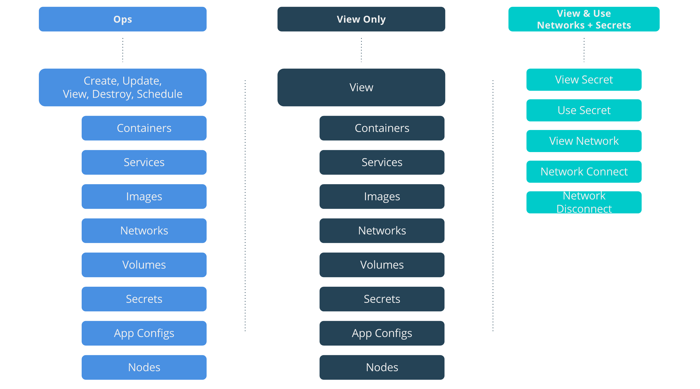
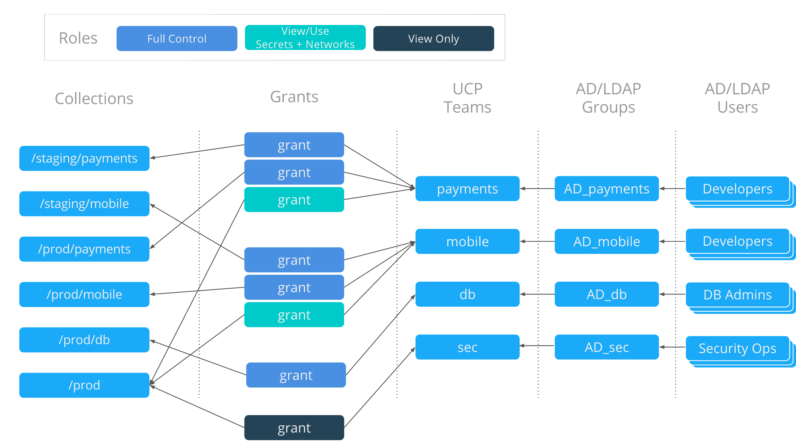
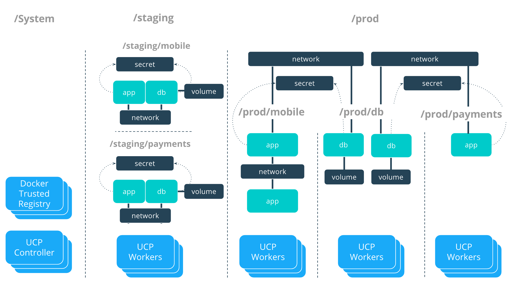
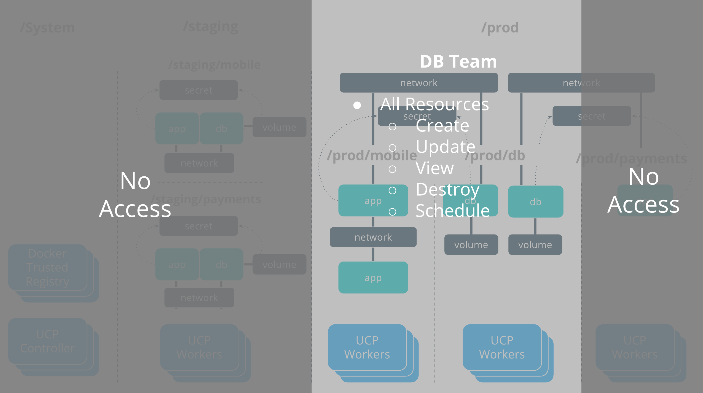

[Collections and grants](index.md) are strong tools that can be used to control
access and visibility to resources in UCP. The previous tutorial,
[Access Control Design with Docker EE Standard](access-control-design-ee-standard.md),
describes a fictional company called OrcaBank that has designed a resource
access architecture that fits the specific security needs of their organization.
Be sure to go through this tutorial if you have not already before continuing. 

In this tutorial OrcaBank's deployment model is becoming more advanced.
Instead of moving developed applications directly in to production,
OrcaBank will now deploy apps from their dev cluster to a staging zone of
their production cluster. After applications have passed staging they will
be moved to production. OrcaBank has very stringent security requirements for
production applications. Its security team recently read a blog post about
DevSecOps and is excited to implement some changes. Production applications
aren't permitted to share any physical infrastructure with non-Production
infrastructure. 

In this tutorial OrcaBank will use Docker EE Advanced feature to segment the
scheduling and access control of applications across disparate physical
infrastructure. [Node Access Control](access-control-node.md) with EE Advanced
licensing allows nodes to be placed in different collections so that resources
can be scheduled and isolated on disparate physical or virtual hardware
resources.

## Team access requirements

As in the [Introductory Multitenancy Tutorial](access-control-design-ee-standard.md)
OrcaBank still has three application teams, `payments`, `mobile`, and `db` that
need to have varying levels of segmentation between them. Their upcoming Access
Control redesign will organize their UCP cluster in to two top-level collections,
Staging and Production, which will be completely separate security zones on
separate physical infrastructure.

- `security` should have visibility-only access across all
  applications that are in Production. The security team is not
  concerned with Staging applications and thus will not have
  access to Staging
- `db` should have the full set of operations against all database
  applications that are in Production. `db` does not manage the
  databases that are in Staging, which are managed directly by the
  application teams.
- `payments` should have the full set of operations to deploy Payments
  apps in both Production and Staging and also access some of the shared
  services provided by the `db` team.
- `mobile` has the same rights as the `payments` team, with respect to the
  Mobile applications.

## Role composition

OrcaBank will use the same roles as in the Introductory Tutorial. An `ops` role
will provide them with the ability to deploy, destroy, and view any kind of
resource. `View Only` will be used by the security team to only view resources
with no edit rights. `View & Use Networks + Secrets` will be used to access
shared resources across collection boundaries, such as the `db` services that
are offered by the `db` collection to the other app teams. 

{: .with-border}


## Collection architecture

The previous tutorial had separate collections for each application team.
In this Access Control redesign there will be collections for each zone,
Staging and Production, and also collections within each zone for the
individual applications. Another major change is that Docker nodes will be
segmented themselves so that nodes in Staging are separate from Production
nodes. Within the Production zone every application will also have their own
dedicated nodes.

The resulting collection architecture takes the following tree representation:

```
/
├── System
├── Shared
├── prod
│   ├── db
│   ├── mobile
│   └── payments
└── staging
    ├── mobile
    └── payments
```

## Grant composition

OrcaBank will now be granting teams diverse roles to different collections.
Multiple grants per team are required to grant this kind of access. Each of
the Payments and Mobile applications will have three grants that give them the
operation to deploy in their production zone, their staging zone, and also the
ability to share some resources with the `db` collection.

{: .with-border}

## OrcaBank access architecture

The resulting access architecture provides the appropriate physical segmentation
between Production and Staging. Applications will be scheduled only on the UCP
Worker nodes in the collection where the application is placed. The production
Mobile and Payments applications use shared resources across collection
boundaries to access the databases in the `/prod/db` collection.

{: .with-border}

### DB team

The OrcaBank `db` team is responsible for deploying and managing the full
lifecycle of the databases that are in Production. They have the full set of
operations against all database resources. 

{: .with-border}

### Mobile team

The `mobile` team is responsible for deploying their full application stack in
staging. In production they deploy their own applications but utilize the
databases that are provided by the `db` team.

{: .with-border}


