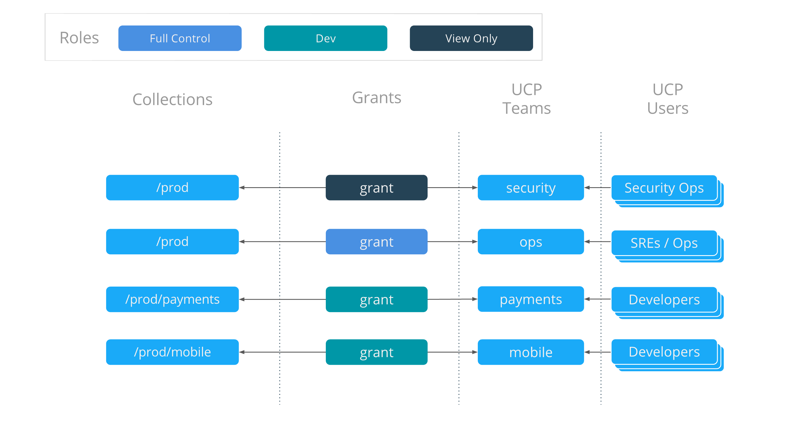
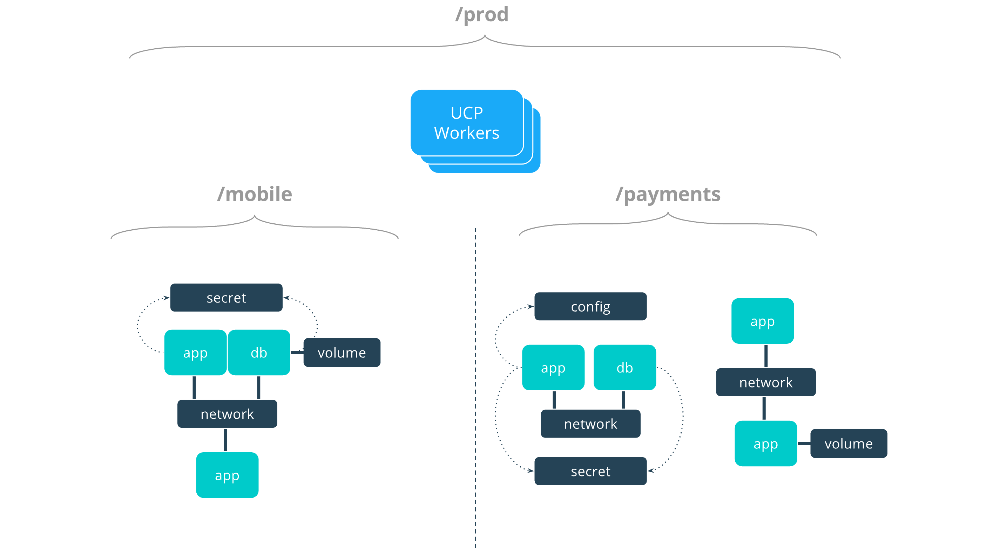

With Docker Universal Control Plane, you get to control who can create and
edit container resources in your swarm, like services, images, networks,
and volumes. You can grant and manage permissions to enforce fine-grained
access control as needed.

## Grant access to swarm resources

If you're a UCP administrator, you can create *grants* to control how users
and organizations access swarm resources.

A grant is made up of a *subject*, a *role*, and a *resource collection*.
A grant defines who (subject) has how much access (role)
to a set of resources (collection).
[Learn how to grant permissions to users based on roles](grant-permissions.md).


An administrator is a user who can manage grants, subjects, roles, and
collections. An administrator identifies which operations can be performed
against specific resources and who can perform these actions. An administrator
can create and manage role assignments against subject in the system.
Only an administrator can manage subjects, grants, roles, and collections.

## Subjects

A subject represents a user, team, or organization. A subject is granted a
role for a collection of resources.

-   **User**: A person that the authentication backend validates. You can
    assign users to one or more teams and one or more organizations.
-   **Organization**: A group of users that share a specific set of
    permissions, defined by the roles of the organization.
-   **Team**: A group of users that share a set of permissions defined in the
    team itself. A team exists only as part of an organization, and all of its
    members must be members of the organization. Team members share
    organization permissions. A team can be in one organization only.

## Roles

A role is a set of permitted API operations that you can assign to a specific
subject and collection by using a grant. UCP administrators view and manage
roles by navigating to the **Roles** page.
[Learn more about roles and permissions](permission-levels.md).

## Resource collections

Docker EE enables controlling access to swarm resources by using
*collections*. A collection is a grouping of swarm cluster resources that you
access by specifying a directory-like path.

Swarm resources that can be placed in to a collection include:

- Physical or virtual nodes
- Containers
- Services
- Networks
- Volumes
- Secrets
- Application configs

## Collection architecture

Grants tie together who has which kind of access to what resources. Grants
are effectively ACLs, which grouped together, can provide full and comprehensive
access policies for an entire organization. However, before grants can be
implemented, collections need to be designed to group resources in a way that
makes sense for an organization.

The following example shows a potential access policy of an organization.
Consider an organization with two application teams, Mobile and Payments, that
will share cluster hardware resources, but still need to segregate access to the
applications. Collections should be designed to map to the organizational
structure desired, in this case the two application teams. Their collection
architecture for a production UCP cluster might look something like this:

```
prod
├── mobile
└── payments
```

> A subject that has access to any level in a collection hierarchy will have
> that same access to any collections below it.

## Role composition

Roles define what operations can be done against cluster resources. An
organization will likely use several different kinds or roles to give the
right kind of access. A given team or user may have different roles provided
to them depending on what resource they are accessing. There are default roles
provided by UCP and also the ability to build custom roles. In this example
three different roles are used:

- Full Control - This is a default role that provides the full list of
  operations against cluster resources.
- View Only - This is also a default role that allows a user to see resources,
  but not to edit or delete.
- Dev - This is not a default role, but a potential custom role. In this
  example "Dev" includes the ability to view containers and also `docker exec`.
  This allows developers to run a shell inside their container process but not
  see or change any other cluster resources.

## Grant composition

The following four grants define the access policy for the entire organization
for this cluster. They tie together the collections that were created, the
default and custom roles, and also teams of users that are in UCP.

{: .with-border}

## Access architecture

The resulting access architecture defined by these grants is depicted below.

{: .with-border}

There are four teams that are given access to cluster resources:

- `security` can see, but not edit, all resources shown, as it has `View Only`
  access to the entire `/prod` collection.
- `ops` has `Full Control` against the entire `/prod` collection, giving it the
  capability to deploy, view, edit, and remove applications and application
  resources.
- `mobile` has the `Dev` role against the `/prod/mobile` collection. This team
  can see and `exec` in to their own applications, but can't see any
  of the `payments` applications.
- `payments` has the same type of access but for the `/prod/payments` collection.

[See a deeper tutorial on how to design access control architectures.](access-control-design-ee-standard.md)

[Manage access to resources by using collections](manage-access-with-collections.md).

## Transition from UCP 2.1 access control

-   Your existing access labels and permissions are migrated automatically
    during an upgrade from UCP 2.1.x.
-   Unlabeled "user-owned" resources are migrated into the user's private
    collection, in `/Shared/Private/<username>`.
-   Old access control labels are migrated into `/Shared/Legacy/<labelname>`.
-   When deploying a resource, choose a collection instead of an access label.
-   Use grants for access control, instead of unlabeled permissions.

## Where to go next

-  [Create and manage users](create-and-manage-users.md)
-  [Create and manage teams](create-and-manage-teams.md)
-  [Deploy a service with view-only access across an organization](deploy-view-only-service.md)
-  [Isolate volumes between two different teams](isolate-volumes-between-teams.md)
-  [Isolate swarm nodes between two different teams](isolate-nodes-between-teams.md)

