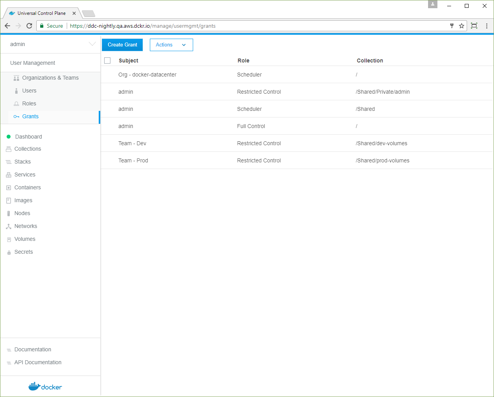
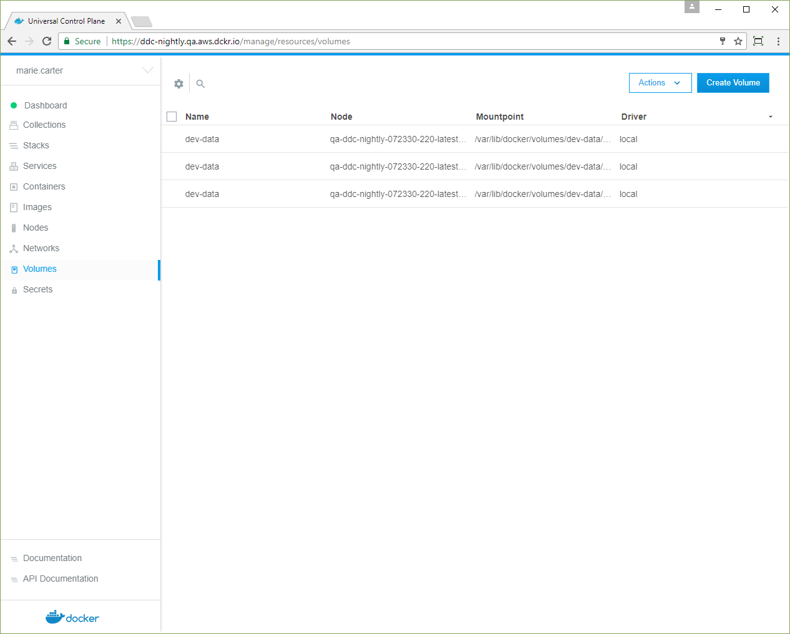

In this example, two teams are granted access to volumes in two different
resource collections. UCP access control prevents the teams from viewing and
accessing each other's volumes, even though they may be located in the same
nodes.

1.  Create two teams.
2.  Create two collections, one for either team.
3.  Create grants to manage access to the collections.
4.  Team members create volumes that are specific to their team.

{: .with-border}

## Create two teams

Navigate to the **Organizations & Teams** page to create two teams in your
organization, named "Dev" and "Prod". Add a user who's not a UCP administrator
to the Dev team, and add another non-admin user to the Prod team.
[Learn how to create and manage teams](create-and-manage-teams.md).

## Create resource collections

In this example, the Dev and Prod teams use two different volumes, which they
access through two corresponding resource collections. The collections are
placed under the `/Shared` collection.

1.  In the left pane, click **Collections** to show all of the resource
    collections in the swarm.
2.  Find the **/Shared** collection and click **View children**.
2.  Click **Create collection** and name the new collection "dev-volumes".
3.  Click **Create** to create the collection.
4.  Click **Create collection** again, name the new collection "prod-volumes",
    and click **Create**.

## Create grants for controlling access to the new volumes

In this example, the Dev team gets access to its volumes from a grant that
associates the team with the `/Shared/dev-volumes` collection, and the Prod
team gets access to its volumes from another grant that associates the team
with the `/Shared/prod-volumes` collection.

1.  Navigate to the **Grants** page and click **Create Grant**.
2.  In the left pane, click **Collections**, and in the **Swarm** collection,
    click **View Children**.
3.  In the **Shared** collection, click **View Children**.
4.  In the list, find **/Shared/dev-volumes** and click **Select Collection**.
3.  Click **Roles**, and in the dropdown, select **Restricted Control**.
4.  Click **Subjects**, and under **Select subject type**, click **Organizations**.
    In the dropdown, pick your organization, and in the **Team** dropdown,
    select **Dev**.
5.  Click **Create** to grant permissions to the Dev team.
6.  Click **Create Grant** and repeat the previous steps for the **/Shared/prod-volumes**
    collection and the Prod team.

{: .with-border}

With the collections and grants in place, users can sign in and create volumes
in their assigned collections.

## Create a volume as a team member

Team members have permission to create volumes in their assigned collection.

1.  Log in as one of the users on the Dev team.
2.  Navigate to the **Volumes** page to view all of the volumes in the swarm
    that the user can access.
2.  Click **Create volume** and name the new volume "dev-data".
3.  In the left pane, click **Collections**. The default collection appears.
    At the top of the page, click **Shared**, find the **dev-volumes**
    collection in the list, and click **Select Collection**.
4.  Click **Create** to add the "dev-data" volume to the collection.
5.  Log in as one of the users on the Prod team, and repeat the previous steps
    to create a "prod-data" volume assigned to the `/Shared/prod-volumes`
    collection.

{: .with-border}

Now you can see role-based access control in action for volumes. The user on
the Prod team can't see the Dev team's volumes, and if you log in again as a
user on the Dev team, you can't see the Prod team's volumes.

{: .with-border}

Sign in with a UCP administrator account, and you see all of the volumes
created by the Dev and Prod users.

{: .with-border}

## Where to go next

- [Isolate swarm nodes to a specific team](isolate-nodes-between-teams.md)

