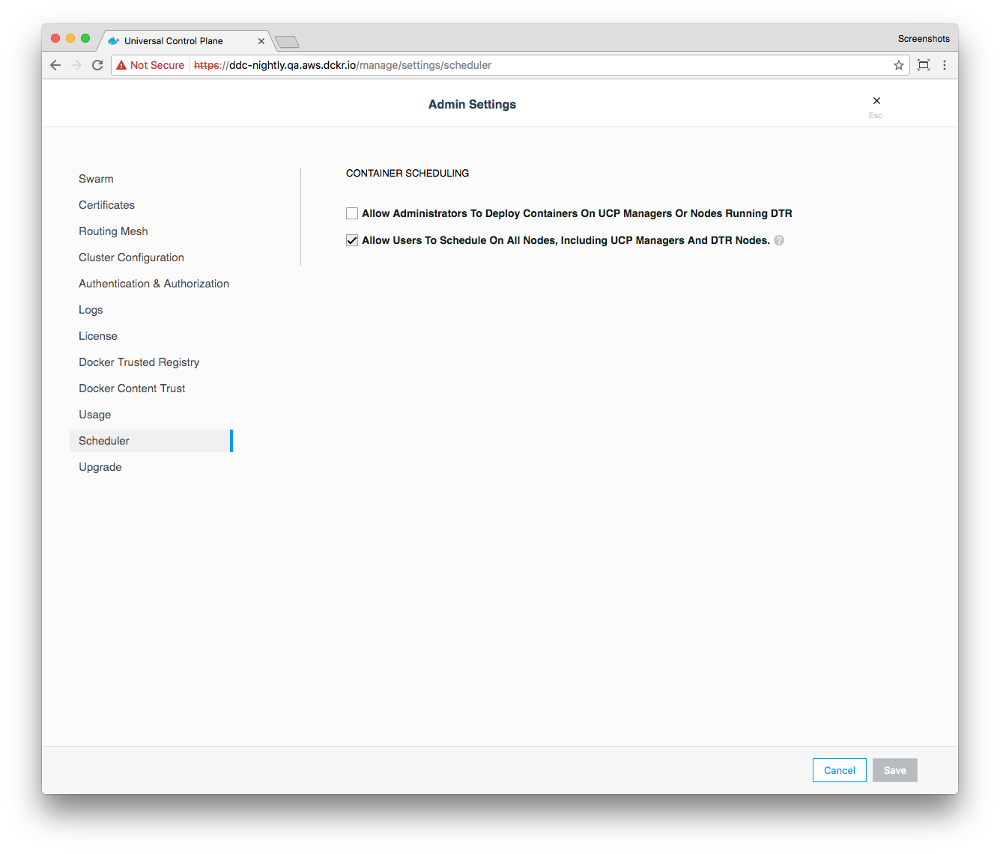



You can configure UCP to allow users to deploy and run services only in
worker nodes. This ensures all cluster management functionality stays
performant, and makes the cluster more secure.

If a user deploys a malicious service that can affect the node where it
is running, it won't be able to affect other nodes in the cluster, or
any cluster management functionality.

To restrict users from deploying to manager nodes, log in with administrator
credentials to the UCP web UI, navigate to the **Admin Settings**
page, and choose **Scheduler**.

{: .with-border}

You can then choose if user services should be allowed to run on manager nodes
or not.

Having a grant with the `Scheduler` role against the `/` collection takes
precedence over any other grants with `Node Schedule` on subcollections.



Learn about [restricting services to worker nodes](/datacenter/ucp/2.2/guides/admin/configure/restrict-services-to-worker-nodes.md).



