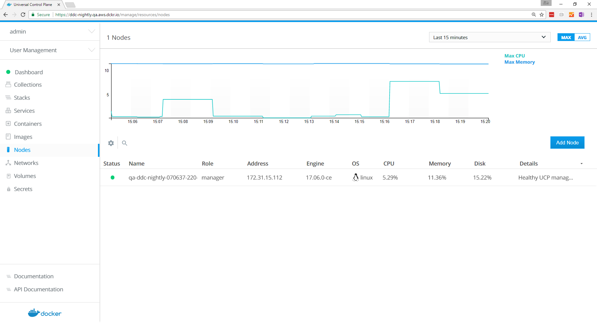
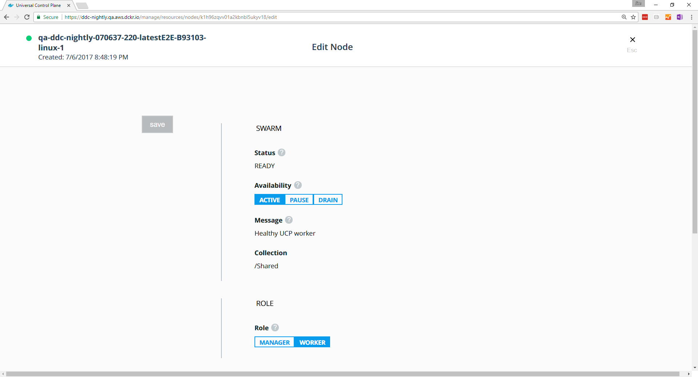

Docker UCP is designed for scaling horizontally as your applications grow in
size and usage. You can add or remove nodes from the UCP cluster to make it
scale to your needs.


Since UCP leverages the clustering functionality provided by Docker Engine,
you use the [docker swarm join](/engine/swarm/swarm-tutorial/add-nodes.md)
command to add more nodes to your cluster. When joining new nodes, the UCP
services automatically start running in that node.

When joining a node to a cluster you can specify its role: manager or worker.

* **Manager nodes**

    Manager nodes are responsible for swarm management functionality and
    dispatching tasks to worker nodes. Having multiple manager nodes allows
    your swarm to be highly-available and tolerate node failures.

    Manager nodes also run all UCP components in a replicated way, so by adding
    additional manager nodes, you're also making UCP highly available.
    [Learn more about the UCP architecture.](../../architecture.md)

* **Worker nodes**

    Worker nodes receive and execute your services and applications. Having
    multiple worker nodes allows you to scale the computing capacity of your
    cluster.

    When deploying Docker Trusted Registry in your cluster, you deploy it to a
    worker node.


## Join nodes to the cluster

To join nodes to the swarm, go to the UCP web UI and navigate to the **Nodes**
page.

{: .with-border}

Click **Add Node** to add a new node.

{: .with-border}

-  Click **Manager** if you want to add the node as a manager.
-  Check the **Use a custom listen address** option to specify the
   IP address of the host that you want to join to the cluster.
-  Check the **Use a custom listen address** option to specify the
   IP address that's advertised to all members of the swarm for API access.

Copy the displayed command, use ssh to log into the host that you want to
join to the cluster, and run the `docker swarm join` command on the host.

To add a Windows node, click **Windows** and follow the instructions in
[Join Windows worker nodes to a swarm](join-windows-worker-nodes.md).

After you run the join command in the node, the node is displayed in the UCP
web UI.

{: .with-border}

## Pause or drain nodes

Once a node is part of the cluster you can change its role making a manager
node into a worker and vice versa. You can also configure the node availability
so that it is:

* Active: the node can receive and execute tasks.
* Paused: the node continues running existing tasks, but doesn't receive new ones.
* Drained: the node can't receive new tasks. Existing tasks are stopped and
  replica tasks are launched in active nodes.

In the UCP web UI, browse to the **Nodes** page and select the node. In the
details pane, click the **Configure** to open the **Edit Node** page.

{: .with-border}

## Promote or demote a node

You can promote worker nodes to managers to make UCP fault tolerant. You can
also demote a manager node into a worker.

To promote or demote a manager node:

1.  Navigate to the **Nodes** page, and click the node that you want to demote.
2.  In the details pane, click **Configure** and select **Details** to open
    the **Edit Node** page.
3.  In the **Role** section, click **Manager** or **Worker**.
4.  Click **Save** and wait until the operation completes.
5.  Navigate to the **Nodes** page, and confirm that the node role has changed.

If you're load-balancing user requests to Docker EE across multiple manager
nodes, don't forget to remove these nodes from your load-balancing pool when
you demote them to workers.

## Remove a node from the cluster

You can remove worker nodes from the cluster at any time:

1.  Navigate to the **Nodes** page and select the node.
2.  In the details pane, click **Actions** and select **Remove**.
3.  Click **Confirm** when you're prompted.

Since manager nodes are important to the cluster overall health, you need to
be careful when removing one from the cluster.

To remove a manager node:

1. Make sure all nodes in the cluster are healthy. Don't remove manager nodes
if that's not the case.
2. Demote the manager node into a worker.
3. Now you can remove that node from the cluster.

## Use the CLI to manage your nodes

You can use the Docker CLI client to manage your nodes from the CLI. To do
this, configure your Docker CLI client with a [UCP client bundle](../../../user-access/cli.md).

Once you do that, you can start managing your UCP nodes:

```bash
docker node ls
```

## Where to go next

* [Use your own TLS certificates](use-your-own-tls-certificates.md)
* [Set up high availability](set-up-high-availability.md)
