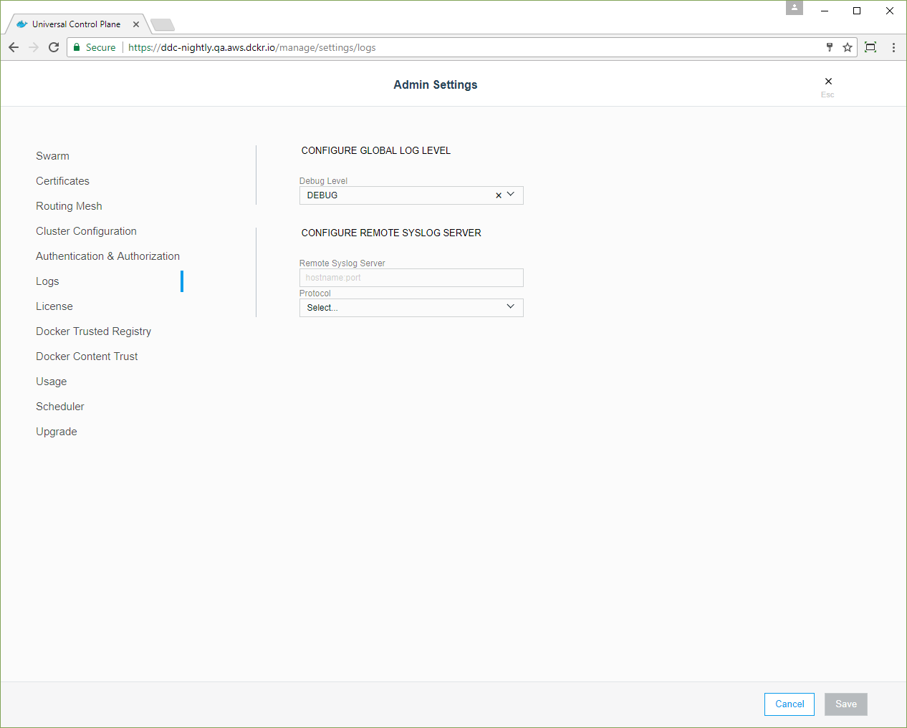

You can configure UCP for sending logs to a remote logging service:

1. Log in to UCP with an administrator account.
2. Navigate to the **Admin Settings** page.
3. Set the information about your logging server, and click
   **Enable Remote Logging**.

{: .with-border}

## Example: Setting up an ELK stack

One popular logging stack is composed of Elasticsearch, Logstash, and
Kibana. The following example demonstrates how to set up an example
deployment which can be used for logging.

```none
docker volume create --name orca-elasticsearch-data

docker container run -d \
    --name elasticsearch \
    -v orca-elasticsearch-data:/usr/share/elasticsearch/data \
    elasticsearch elasticsearch -Enetwork.host=0.0.0.0

docker container run -d \
    -p 514:514 \
    --name logstash \
    --link elasticsearch:es \
    logstash \
    sh -c "logstash -e 'input { syslog { } } output { stdout { } elasticsearch { hosts => [ \"es\" ] } } filter { json { source => \"message\" } }'"

docker container run -d \
    --name kibana \
    --link elasticsearch:elasticsearch \
    -p 5601:5601 \
    kibana
```

Once you have these containers running, configure UCP to send logs to
the IP of the Logstash container. You can then browse to port 5601 on the system
running Kibana and browse log/event entries. You should specify the "time"
field for indexing.

When deployed in a production environment, you should secure your ELK
stack. UCP does not do this itself, but there are a number of 3rd party
options that can accomplish this, like the Shield plug-in for Kibana.

## Where to go next

* [Require all images to be signed](restrict-services-to-worker-nodes.md)
